## unity瓦片地图

##### 1.简单的瓦片地图

1. 在`Hierarchy`面板,右击新建`2D Object -> Tilemap -> Rectangular`,并把`Tilemap Renderer`中的`Order in Layer`改成-10（为了让瓦片地图在最底下）
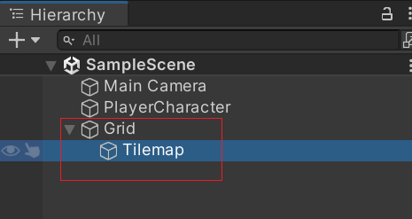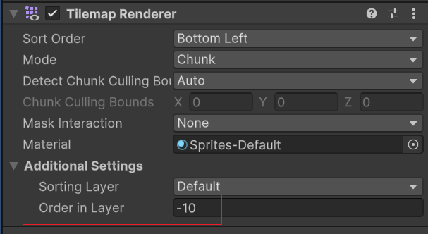

2. 选择菜单`Window -> 2D -> Tile Palette` 调出`Tile Palette`面板，选择`Create New Tile Palette -> Create`

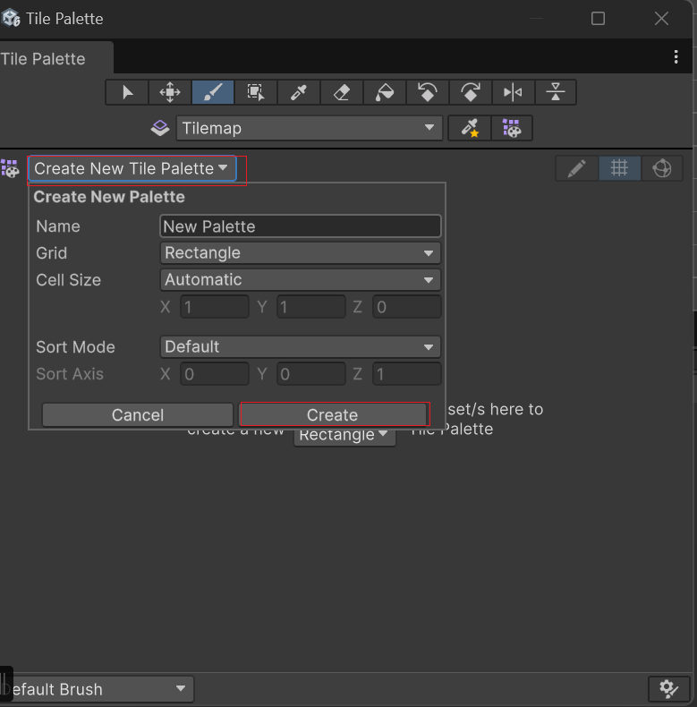

3. 在project视图中`Tlies`文件夹中，右击`Create -> 2D -> Tiles -> Rule Tile`，并起名叫 `BrickTile`

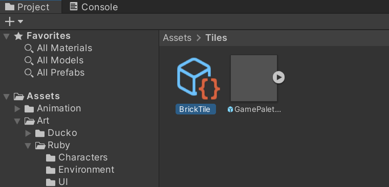

4. 选择`BrickTile`,在`Inspector`面板中，`Default Sprite`选择自己的精灵图，然后把设置好的 `BrickTile`拖到`Tile Palette`绘制地图

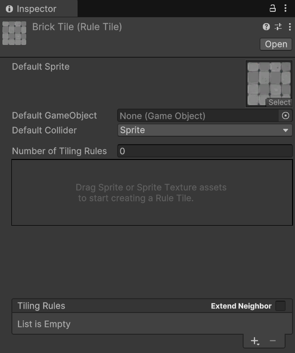

5. 如果出现图片占不满格子的情况，需要找到精灵图把`Pixels Per Unit`设置成图片大小

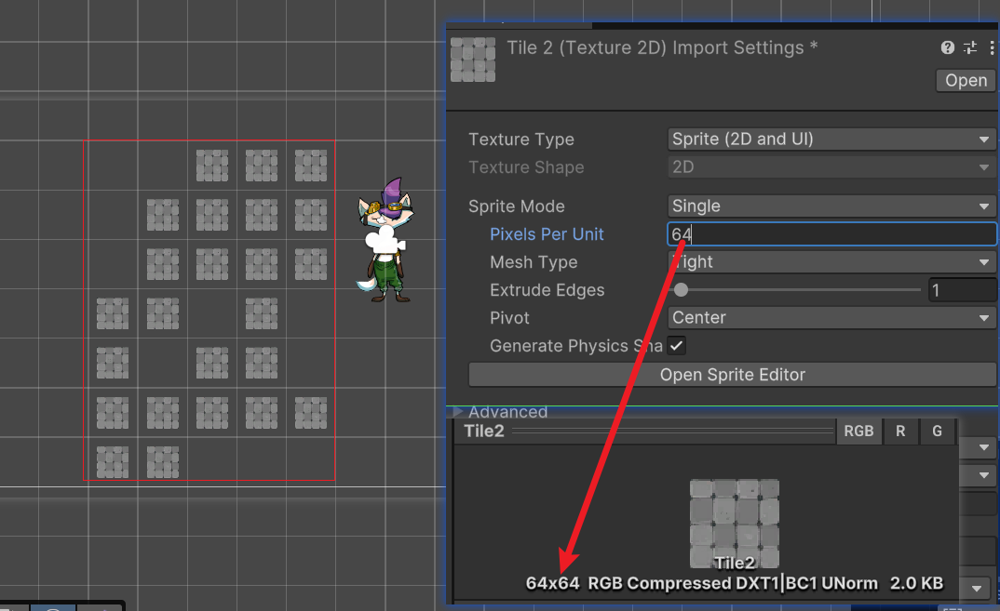

##### 2.瓦片地图的切割

1. 选择图片在`Inspector`把`Sprite Mode`改成`Multiple`,应用后点击`Open Sprite Editor`

   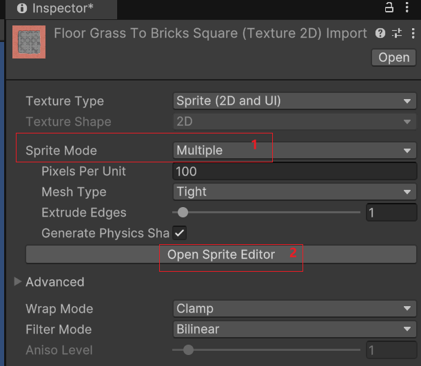

2. 点击`Open Sprite Editor`后在`Slice -> Grid By Cell Siz -> Apply`，这样就分割成功了

   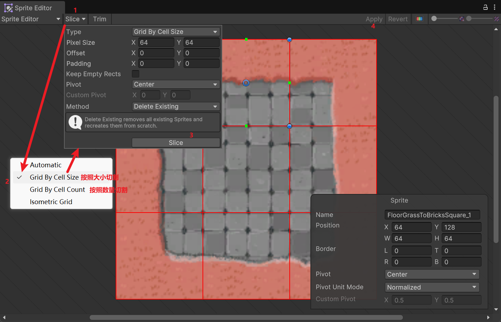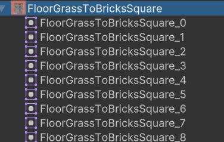

##### 3.`Rule Tile`使用

1. 在project视图中`Tlies`文件夹中，右击`Create -> 2D -> Tiles -> Rule Tile`，并起名叫 `FloorGrassToBricksTile`

   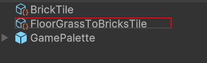
2. 配置`Rule Tile`规则，`Default Sprite`选择好图片，`Tiling Rules`有几个分割好的图片就新建几个，绿箭头代表有格子,红叉代表没有格子
   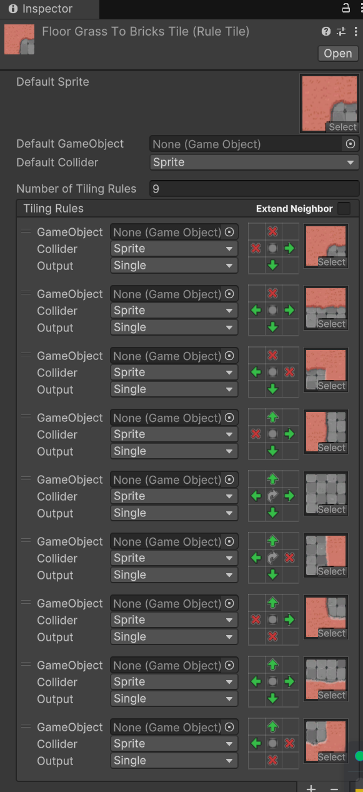

##### 4.瓦片地图刚体

1. 在`Tilemap`中添加三个组件：`Tilemap Collider 2D`、`Rigidbody 2D`、`Composite Collider 2D`、`Geometry Type`,并改如下：

   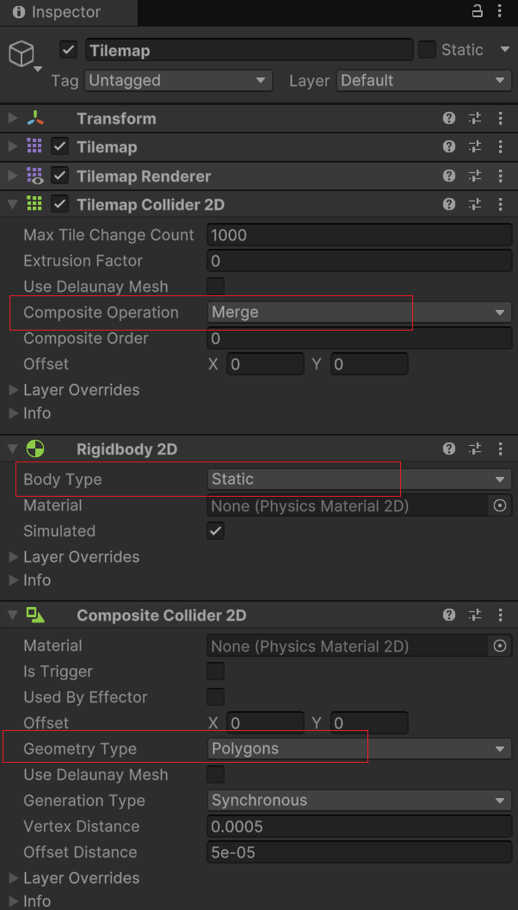

2. 在瓦片地图中设置是否有刚体

   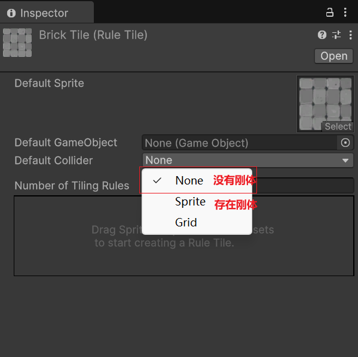

   