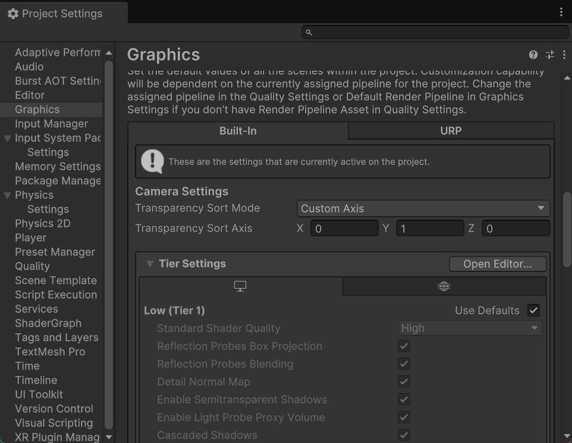
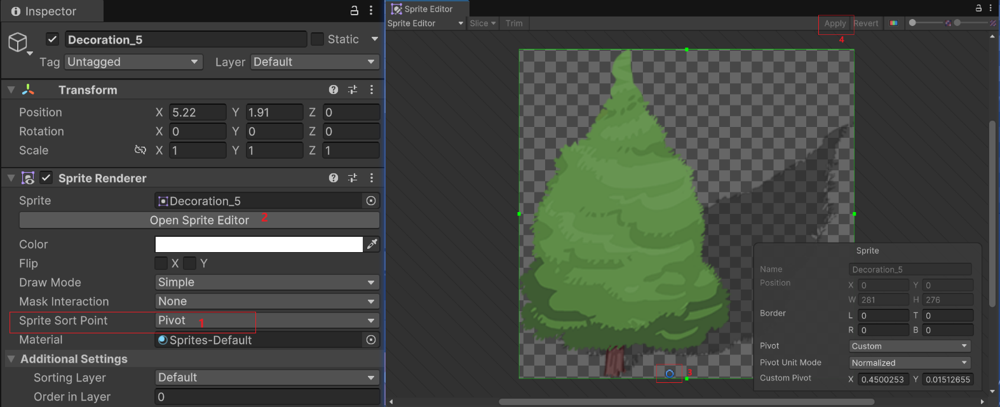
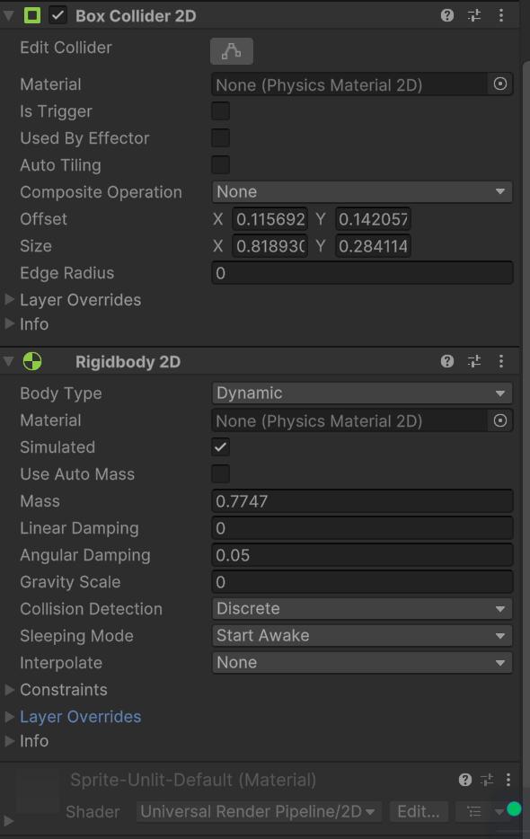

## unity碰撞透视

##### 1.设置透视排序规则

1. 在`Edit -> Project Settings -> Graphics` 找到`Transparency Sort Mode`设置为`Custom Axis`, `Transparency Sort Axis`设置为 x:0 y:1 z:0

   

2. 设置图片中心点位，点击图片在`Inspector`中把`Sprite Sort Point`改成`Pivot`,并点击`Open Sprite Editor`设置中心点位位置,并点击`Apply`

3. 设置碰撞器和刚体

   
