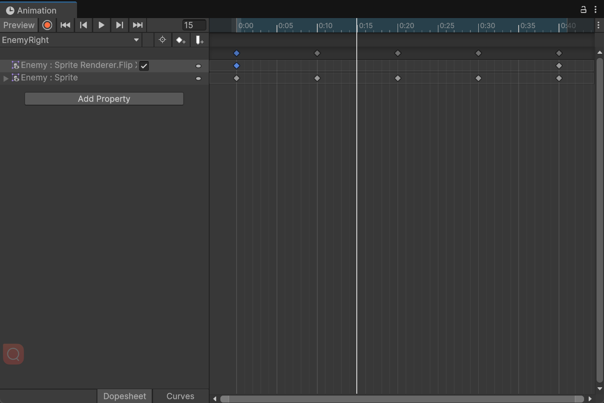
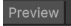
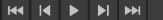
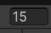
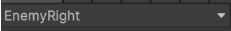
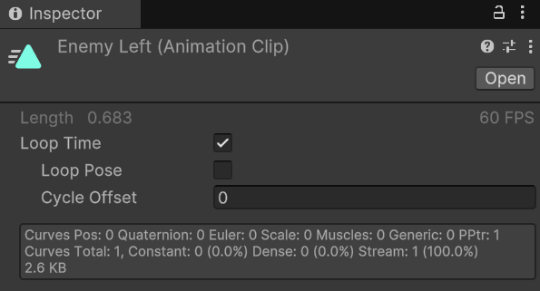

## unity精灵动画

##### 1.Animation

###### 1. 制作界面

> 选中待提添加动画的物体，然后点击 Window ->  Animation -> Animation
>
> 如果选中的物体无Animation/Animator组件，会自动添加Animator组件

预览：启用/禁用场景预览模式。

最后一个关键帧：转到头部、上一个关键帧、暂停/播放、下一个关键帧、最后一个关键帧

当前帧

当前动画名字，下拉可以创建新的Animation动画。

###### 2.制作完成的Animation

| 名称         | 介绍                                 |
| ------------ | ------------------------------------ |
| Length       | 长度（动画时长）                     |
| Loop Time    | 循环                                 |
| Loop Pose    | 循环动作（使循环时头部尾部衔接平滑） |
| Cycle Offset | 平滑度                               |

##### 2.Animator

#####1.
