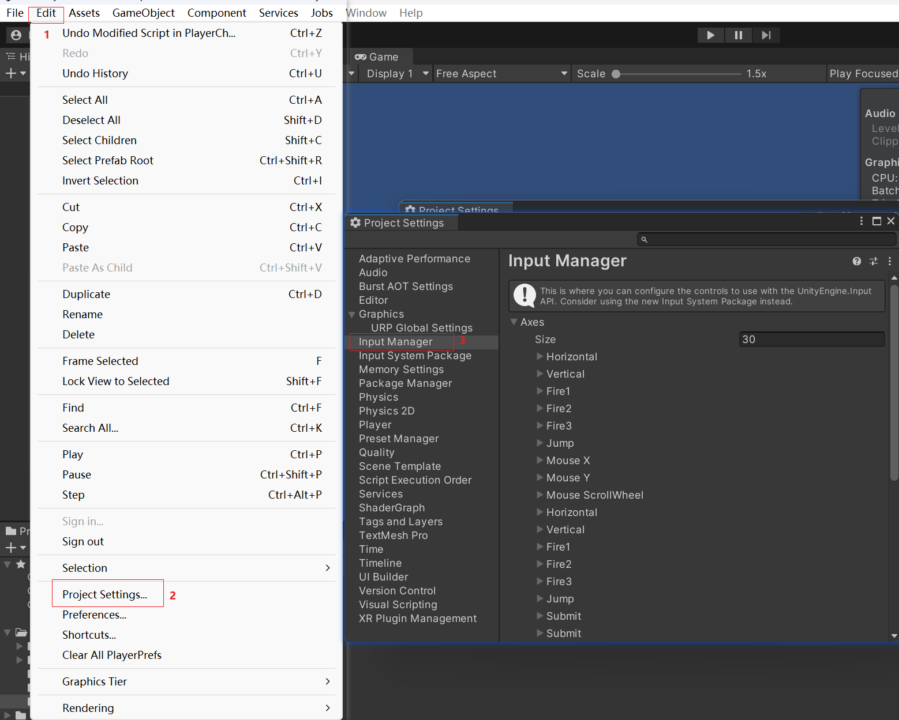

## unity让主角移动


```c#
public class PlayerController : MonoBehaviour
{
    // 暴露出来让unity可编辑
    public float speed = 1;
    void Update()
    {
        // 获取水平输入，按左会获取-1.0f，按向右会获取1.0f
        float vertical = Input.GetAxis("Vertical");
        // 获取垂直输入，按左会获取-1.0f，按向右会获取1.0f
        float horizontal = Input.GetAxis("Horizontal");

        Vector2 position = transform.position;
        // 每帧移动speed
        position.x += speed * horizontal * Time.deltaTime;
        position.y += speed * vertical * Time.deltaTime;
        transform.position = position;
    }
}
```

1.关于`Input.GetAxis`可以在项目中设置，在`Edit -> Project Settings -> Input Manager`中设置



2.`Time.deltaTime`:通常会以每秒帧数（Frames Per Second，FPS）的形式来测量帧的渲染速度。例如，如果你的游戏以 60 FPS 运行，那么每帧的持续时间是 1/60 秒，约等于 0.01667 秒。