## unity后期处理

####  1.介绍

> 近段时间接触使用了Unity的后处理插件Post-Processing。该插件十分强大，能增强画面真实感，产生发光效果，进行调色等。使用也很简单，调节一下参数即可
>
> 官方文档：https://docs.unity.cn/Packages/com.unity.postprocessing@3.1/manual/index.html

#### 2.安装

1. 导入插件。点击**Window > Package Manager**，输入**Post Processing**，安装导入

2. 设置渲染层。在场景Camera上**Add Component > Rendering > Post-process Layer**，只有添加该组件后的相机才会进行后处理效果

   因为可能我们场景会有许多相机，不同相机我们可能希望使用不同的后处理效果，所以我们需要设置相机所在的层。可以新建一个**Layer**，名字随意，我这里新建一个**Post Procesing**层。将相机设为此层，并将组件里的Layer也设为此层。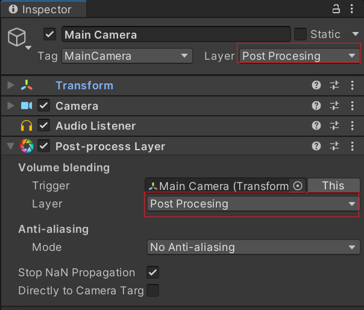

3. 添加效果器。此时可以设置后处理效果了，可以直接继续在Camera下**Add Component > Rendering > Post-process Volume**

   勾选**Is Global**，此时效果会全局生效 (即无论相机在何处都会有效果)。然后点击Profile右侧的**New**可以新建一个预设，之后就可以点**Add effect**添加各种效果了。

   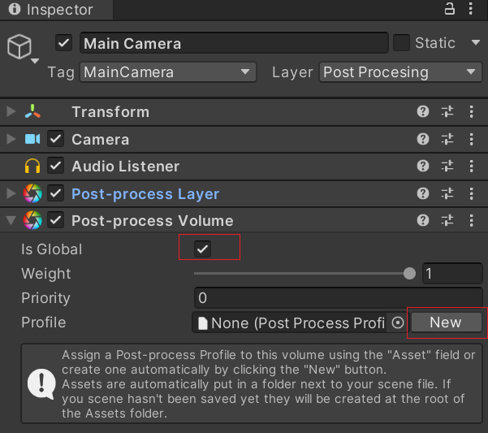

   PS：如果我们想只在场景的特定区域应用效果，就不在相机上添加Post-process Volume组件。在场景中创建一个空物体，设置该物体Layer与相机Layer相同，在该物体上添加Post-process Volume组件，Is Global不勾选。再添加**Box Collider**组件，调整Collider大小。此时相机进入Collider范围内就会有效果，出范围外效果就消失。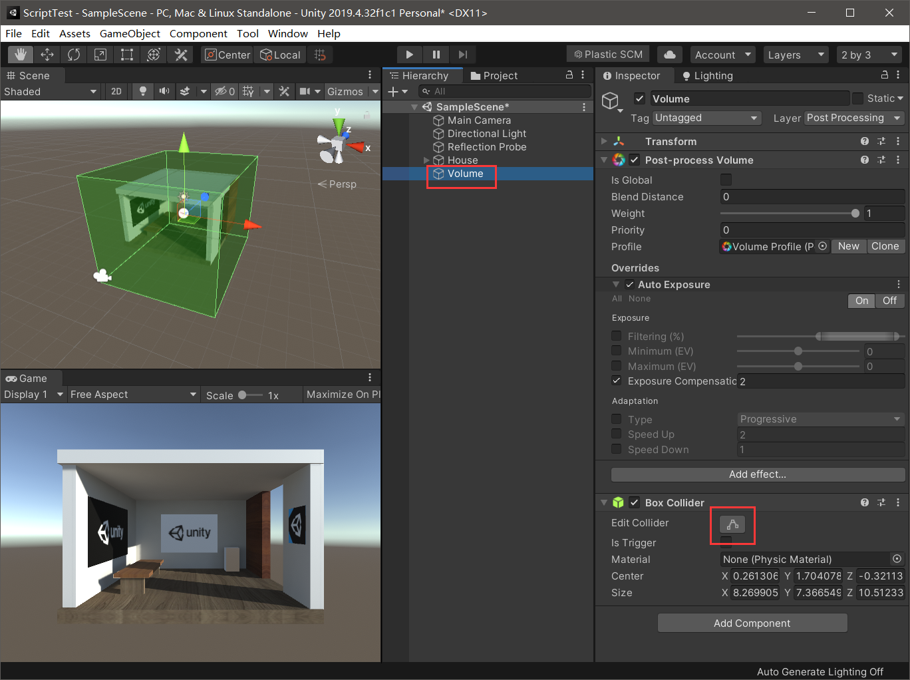


#### 3 效果添加

   根据需要的效果在Post-process Volume中添加对应的模块，并调节参数。有的模块参数比较多，边调边看效果就好，不清楚再看表格的参数说明。共11种效果，1、2为环境光效果，3、4为图像后处理，5-11为相机镜头效果。

   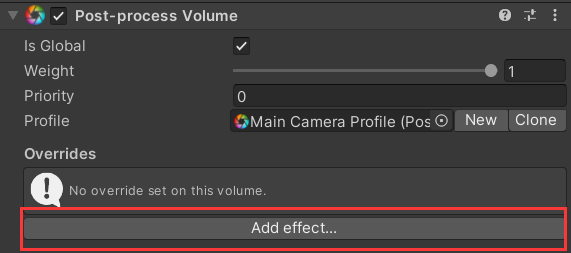

   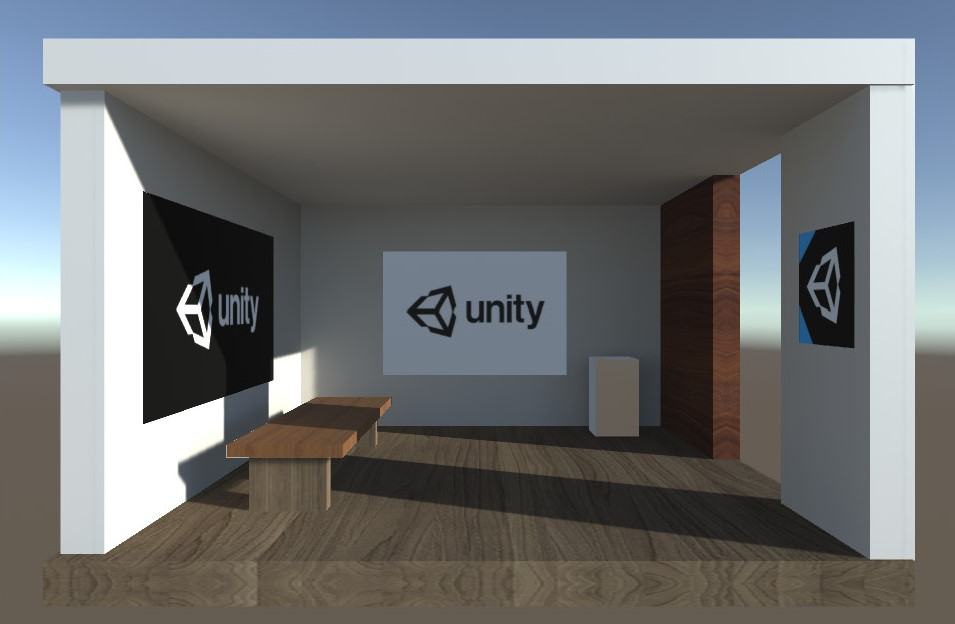

##### 3.1 环境光遮蔽 (Ambient Occlusion)

   – 该效果会使光线无法照射到的区域变暗，如折痕、洞、物体与物体间的空隙部分。

   包含两种模式，其中Scalable Ambient Obscurance (SAO)效果好但性能开销大，Multi-scale Volumetric Occlusion (MVO)速度快 (适用于移动端)。

   | SAO参数      | 说明                                                         |
   | ------------ | ------------------------------------------------------------ |
   | Intensity    | 调整**Ambient Occlusion**产生的黑暗程度。                    |
   | Radius       | 设置采样点的半径，控制暗区的范围。                           |
   | Quality      | 定义样本点的数量，该参数影响最终效果与游戏性能。             |
   | Color        | 设置环境遮挡的色调颜色。                                     |
   | Ambient Only | 启用此复选框使**Ambient Occlusion**效果只影响环境照明。此选项仅在Deferred渲染路径和HDR渲染时可用。 |

   | MVO参数            | 说明                                                         |
   | ------------------ | ------------------------------------------------------------ |
   | Intensity          | 调整**Ambient Occlusion**产生的黑暗程度。                    |
   | Thickness Modifier | 修改遮挡的厚度。该参数能增加暗区，但会在物体周围引入暗晕。   |
   | Color              | 设置环境遮挡的色调颜色。                                     |
   | Ambient Only       | 启用此复选框使**Ambient Occlusion**效果只影响环境照明。此选项仅在Deferred渲染路径和HDR渲染时可用。 |

   启用该效果后，看到墙角等物体交接处产生了黑影，真实感加强。

   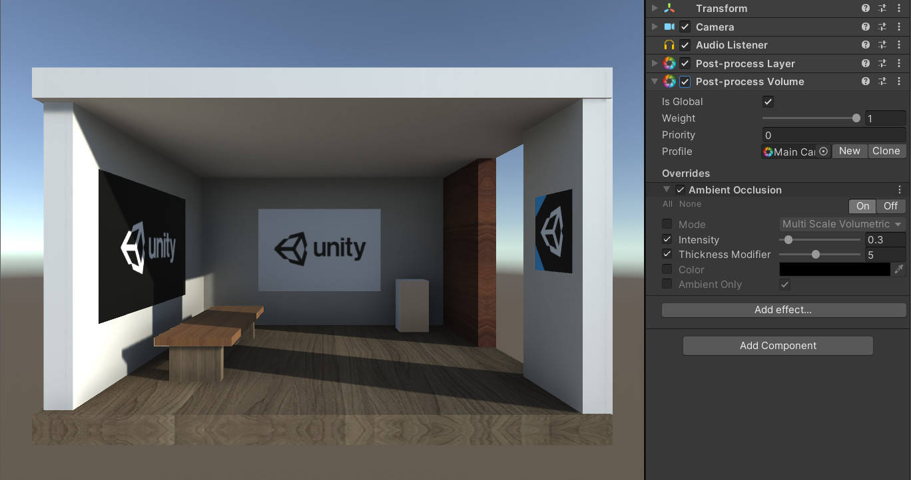

##### 3.2 环境光反射 (Screen Space Reflections)

   – 该效果会创建微妙的反射效果，用以模拟潮湿地板表面或水坑。

   | 反射参数                                       | 说明                                                         |
   | ---------------------------------------------- | ------------------------------------------------------------ |
   | Preset                                         | 可以从下拉菜单中选择质量预设。使用**Custom**可以微调质量。   |
   | Maximum Iteration Count (`Custom` preset only) | 设置射线行进通道的最大步数。值越高，反射越多。               |
   | Thickness (`Custom` preset only)               | 设置射线厚度的值。较低的值可以检测到更小的细节，但会比较消耗资源的。 |
   | Resolution (`Custom` preset only)              | 选择内部缓冲区的大小。选择**Downsample**性能最好。**Supersample**较慢，但效果更好。 |
   | Maximum March Distance                         | 设置在场景中绘制反射的最大距离。                             |
   | Distance Fade                                  | 设置接近反射面的反射淡出距离的值。可以用于消去伪影。         |
   | Vignette                                       | 设置反射图像淡出反射物边缘的范围。                           |

   添加该效果时，出现黄色警告。根据提示，更改Camera组件的**Rendering Path**为**Deferred**即可。更改后，发现画面出现锯齿，可以看到Post-process Layer组件中**Anti-aliasing**的**Mode**为No Anti-aliasing，改为其他任意一个即可。

   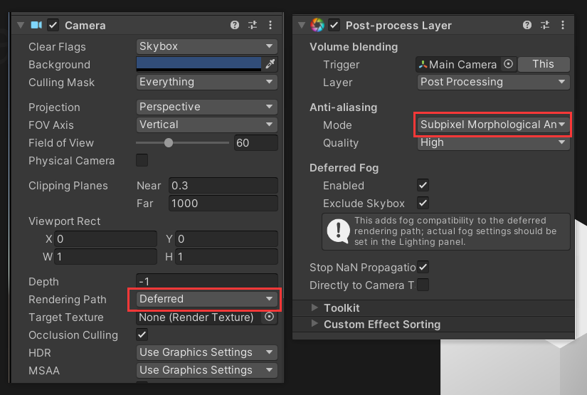

   启用该效果后，看到反射率大于0的物体会出现周围物体的反射像，真实感加强。

   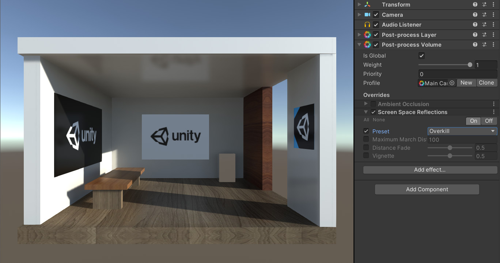

##### 3.3 自动曝光 (Auto Exposure)

   – 该效果会动态调整图像的曝光以匹配其中间色调，用以模拟人眼实时调整亮度的变化。

   | **曝光参数**          | 说明                                                         |
   | --------------------- | ------------------------------------------------------------ |
   | Filtering             | 设置直方图中找到稳定平均亮度的上下两个百分比。超出这个范围的值将被丢弃，并且不会对平均亮度有贡献。 |
   | Minimum               | 设置最小平均亮度，作为曝光值(EV)的参考。                     |
   | Maximum               | 设置最大平均亮度，作为曝光值(EV)的参考。                     |
   | Exposure Compensation | 设置中灰色值来补偿场景的全局曝光。                           |

   | **适应参数** | 说明                                                         |
   | ------------ | ------------------------------------------------------------ |
   | Type         | 选择适配类型。**Progressive**会进行自动曝光。**Fixed**不会进行自动曝光。 |
   | Speed Up     | 设置从暗到亮的适应速度。                                     |
   | Speed Down   | 设置从亮到暗的适应速度。                                     |

   一般夜晚环境可能感觉场景偏暗，又不可能打太多太亮的灯，可以考虑使用这个效果给画面整体提亮。

   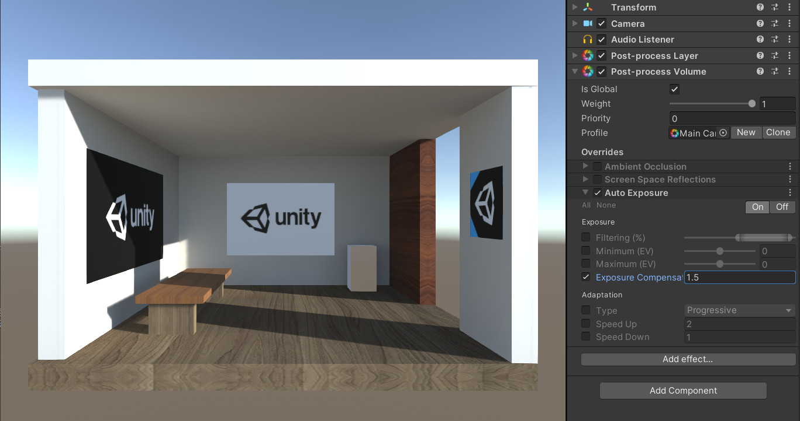

##### 3.4 颜色滤镜 (Color Grading)

   – 该效果可以改变图像的颜色亮度。

   | 全局设置参数   | 说明                                                         |
   | -------------- | ------------------------------------------------------------ |
   | Mode           | 选择**Color Grading**效果模式。                              |
   | Lookup Texture | **LDR:** 选择一个自定义纹理(条带格式，如256x16)应用于颜色滤镜的其他效果之前。如果没有纹理，则无效果。 **External**: 一个自定义纹理(色彩空间为log编码). |
   | Contribution   | **LDR:** 设置纹理效果的比重。                                |

   | 色调映射参数      | 说明                                                         |
   | ----------------- | ------------------------------------------------------------ |
   | Mode              | 仅在**High Definition Range**模式下可用。从下拉菜单中选择色调映射模式。**None**: 无色调映射。**Neutral**: 应用范围重映射与最小的影响色彩色调和饱和度。**ACES**: 应用接近电影色彩的外观 (参考[ACES](http://www.oscars.org/science-technology/sci-tech-projects/aces) )。这种效果相比**Neutral**的色调和饱和度有更多的对比度。当启用该调色器时，所有的色彩操作都在ACES颜色空间中进行，能获得最佳的精度和结果。**Custom**: 一个全参数调色器。这是唯一一个有自设置的调色器。 |
   | Toe Strength      | 设置曲线的底部和中部之间的过渡值。值为0没有过渡，值为1为非常硬的过渡。 |
   | Toe Length        | 设置曲线底部的长度。值越大，我们图像的较暗的部分会更暗。     |
   | Shoulder Strength | 设置曲线中部和顶部之间的过渡值。值为0没有没有，值为1为非常硬的过渡。 |
   | Shoulder Length   | 设置曲线顶部的长度。值越大，我们图像的较亮的部分会更亮。     |
   | Shoulder Angle    | 设置曲线顶部与中部过渡的角度值。                             |
   | Gamma             | 曲线的 gamma 矫正 ，值为1 时不做矫正。                       |

   | 白平衡参数  | 说明                              |
   | ----------- | --------------------------------- |
   | Temperature | 设置白平衡色温。                  |
   | Tint        | 设置白平衡补偿 (绿色或洋红色调)。 |

   | 色调参数      | 说明                                                         |
   | ------------- | ------------------------------------------------------------ |
   | Post-exposure | 仅支持**High Definition Range(HDR)**模式。设置EV单元中场景的整体曝光值。该效果会在HDR效果之后再处理，所以它不会影响前面渲染的结果。 |
   | Color Filter  | 选择渲染的色调。                                             |
   | Hue Shift     | 调整所有颜色的色调。                                         |
   | Saturation    | 调整所有颜色的强度。                                         |
   | Brightness    | 仅支持**Low Definition Range (LDR)**模式。调整图像的亮度。   |
   | Contrast      | 调整色调值的整体范围。                                       |

   | 混合通道参数 | 说明                             |
   | ------------ | -------------------------------- |
   | Channel      | 选择要修改的输出通道(红/绿/蓝)。 |
   | Red          | 调整红色通道在整体混合中的影响。 |
   | Green        | 调整绿色通道在整体混合中的影响。 |
   | Blue         | 调整蓝色通道在整体混合中的影响。 |

   | 轨道球参数 | 说明                 |
   | ---------- | -------------------- |
   | Lift       | 调整暗色调(或阴影)。 |
   | Gamma      | 调整中色调。         |
   | Gain       | 调整亮色调。         |

   添加该效果时，出现黄色警告。根据提示，需要设置色彩空间。点击**Edit > Project Settings > Player**,找到Other Settings中Rendering的**Color Space**，将其改为**Linear**即可。

   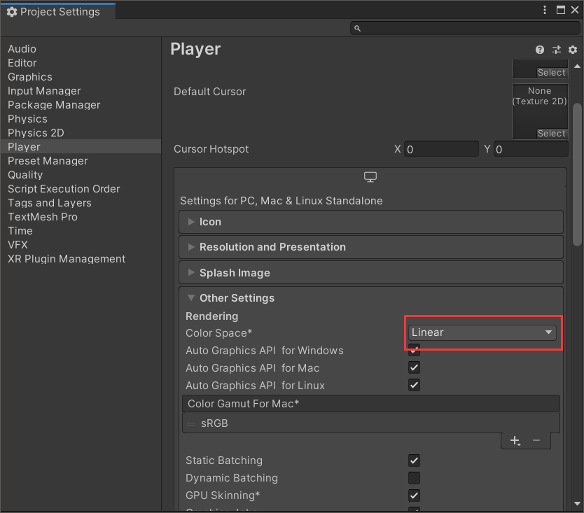

   这个东西跟PR里面的lumetri挺像的，就是个调色盘，参数非常多，能调出各种不同的效果。

   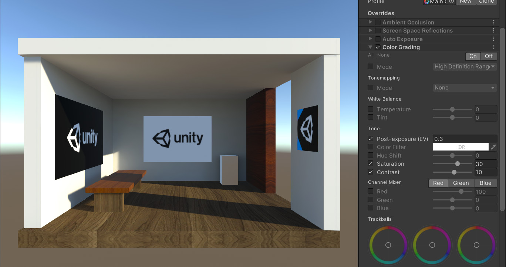

##### 3.5 发光 (Bloom)

   – 该效果会使图像中明亮的区域延伸出光条纹，用以模拟真实世界中相机镜头被光线淹没的效果。

   | Bloom参数        | 说明                                                         |
   | ---------------- | ------------------------------------------------------------ |
   | Intensity        | 设置**Bloom**过滤器的强度。                                  |
   | Threshold        | 设置亮度级别，过滤掉这个级别下的像素。这个值用γ空间表示。    |
   | Soft Knee        | 设置在阈值上下界(0 =硬阈值，1 =软阈值)之间的渐变阈值。       |
   | Clamp            | 设置限制像素的值来控制**Bloom**数量。这个值用γ空间表示。     |
   | Diffusion        | 设置遮蔽效果的范围(与屏幕分辨率无关)。                       |
   | Anamorphic Ratio | 设置比率以垂直(范围[-1,0])或水平(范围[0,1])缩放**Bloom**。模拟变形透镜的效果。 |
   | Color            | 选择**Bloom**滤镜的色调颜色。                                |
   | Fast Mode        | 启用此复选框，通过降低**Bloom**效果质量来提高性能。          |

   | **Dirtiness参数** | 说明                                 |
   | ----------------- | ------------------------------------ |
   | Texture           | 选择一个肮脏纹理添加污点或灰尘镜头。 |
   | Intensity         | 设置镜头的肮脏程度。                 |

   这里我们让墙上的海报发光，制作电子屏幕的效果。首先，设置它们的shader设置为一个不受光照影响的shader，我这里设为Unlit/Texture。

   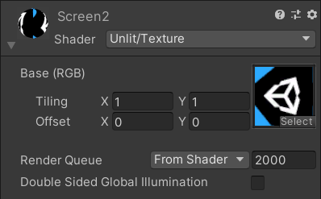

   发光效果只能加一点点，不能加多喽，让光有一点点晕开的感觉就好。参数拉太高会产生光污染，影响游戏体验，非常难受。

   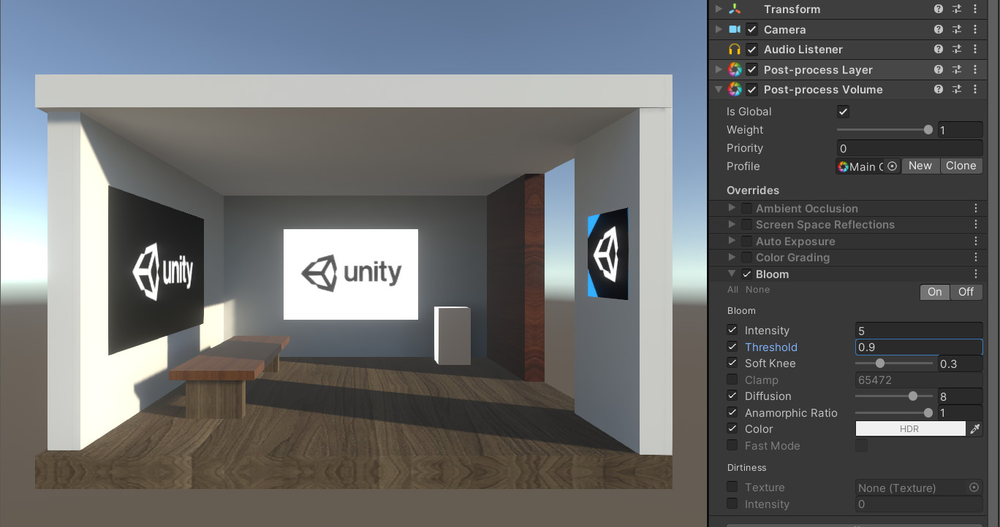

##### 3.6 色差 (Chromatic Aberration)

   – 该效果会分离图像的红绿蓝通道，用以模拟现实世界中相机在光线折射产生的不同波长光分离的效果。

   | Property     | 说明                                                         |
   | ------------ | ------------------------------------------------------------ |
   | Spectral Lut | 选择用于自定义散射颜色的纹理。当为空时，Unity将使用默认纹理。 |
   | Intensity    | 设置**Chromatic Aberration**效果的强度。                     |
   | Fast Mode    | 使用一个更快的**Chromatic Aberration**效果的提高性能。       |

   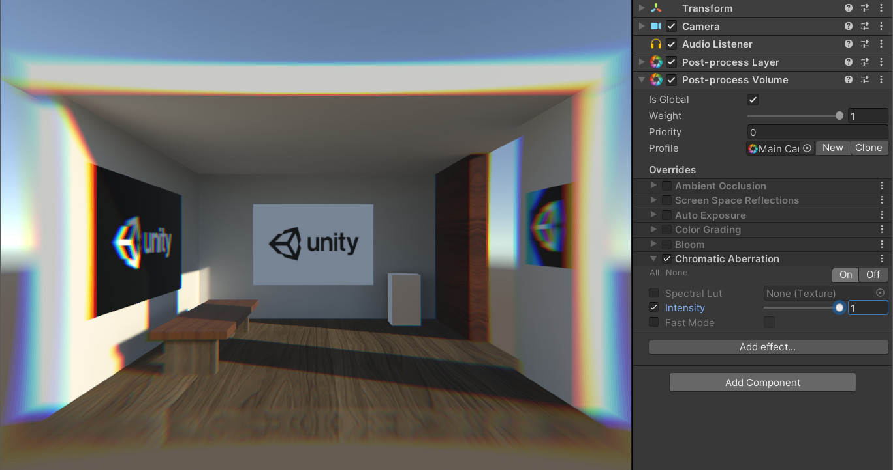

##### 3.7 景深 (Depth of Field)

   – 该效果会模糊图像的背景，用以模拟真实世界相机镜头的焦距特性，产生对焦效果。

   | 景深参数       | 说明                                                         |
   | -------------- | ------------------------------------------------------------ |
   | Focus Distance | 设置到焦点的距离。                                           |
   | Aperture       | 设置光圈的比例(称为f-stop或f-number)。数值越小，景深越浅。   |
   | Focal Length   | 设定镜头和胶卷之间的距离。数值越大，景深越浅。               |
   | Max Blur Size  | 从下拉菜单中选择散景滤镜的卷积内核大小。这个设置决定散景的最大半径。它也会影响性能。内核越大，需要GPU渲染时间越长。 |

   

##### 3.8 镜头噪点 (Grain)

   – 该效果会将胶片噪声叠加到图像上，用以模拟相机胶片上的小颗粒产生的粗糙效果，营造电影效果。

   | 纹理参数               | 说明                                                         |
   | ---------------------- | ------------------------------------------------------------ |
   | Colored                | 启用复选框使用彩色颗粒。                                     |
   | Intensity              | 设置**Grain**的强度。数值越高，可见颗粒越多。                |
   | Size                   | 设置**Grain**的大小。数值越高，颗粒尺寸越大。                |
   | Luminance Contribution | 通过设置该值来控制噪声响应曲线。这个值是基于场景亮度的。数值越低，暗区噪音越小。 |

   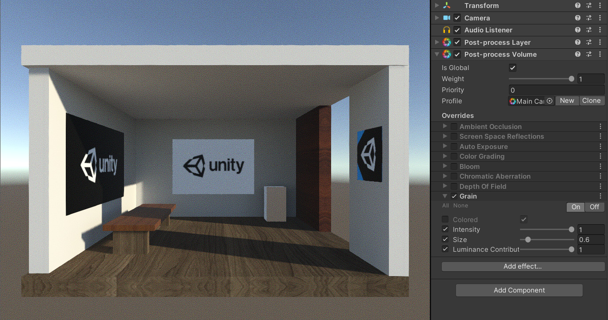

##### 3.9 镜头失真 (Lens Distortion)

   – 该效果会使图像产生畸变 (枕形/桶形)，用以模拟真实世界相机镜头的形状引起的失真。

   | 畸变参数     | 说明                         |
   | ------------ | ---------------------------- |
   | Intensity    | 设置总失真量的值。           |
   | X Multiplier | X方向上失真强度。0为不失真。 |
   | Y Multiplier | Y方向上失真强度。0为不失真。 |
   | Center X     | 设置失真中心点(X轴)。        |
   | Center Y     | 设置失真中心点(Y轴)。        |
   | Scale        | 设置全局屏幕缩放的值。       |

   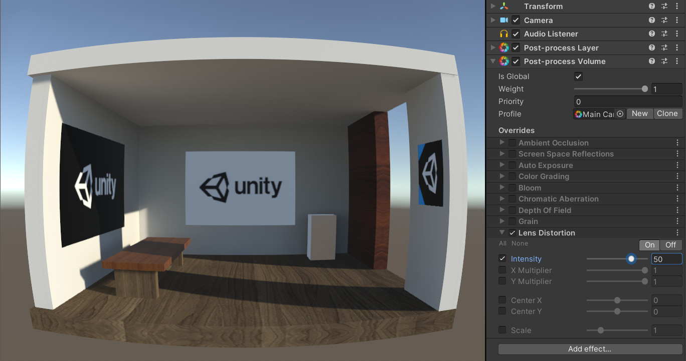

##### 3.10 镜头晕影 (Vignette)

   – 该效果会使图像边缘变暗，用以模拟真实世界中过厚或堆叠过多滤光片、副镜头或不合适镜头笼罩引起的效果。使用此效果能使人的注意力聚焦到图像中心。

   包含两种模式，其中Classic模式是围绕中心的晕影，Msaked模式可以自定义晕影形状纹理。

   | 经典模式参数 | 说明                                                         |
   | ------------ | ------------------------------------------------------------ |
   | Color        | 设置Vignette的颜色。                                         |
   | Center       | 设置Vignette中心点(屏幕中心为[0.5,0.5])。                    |
   | Intensity    | 设置屏幕上渐晕的数量。                                       |
   | Smoothness   | 设置Vignette边框的平滑度。                                   |
   | Roundness    | 将值设置为Vignette的圆滑度。较低的值会使其接近方形。         |
   | Rounded      | 启用此复选框可以使Vignette完全变为圆形。禁用时，Vignette效果依赖于当前的宽高比。 |

   | 遮罩模式参数 | 说明                                            |
   | ------------ | ----------------------------------------------- |
   | Color        | 设置Vignette的颜色。使用alpha通道来增加透明度。 |
   | Mask         | 选择一个黑白蒙版来用作为Vignette。              |
   | Intensity    | 设置遮罩不透明度值。                            |

   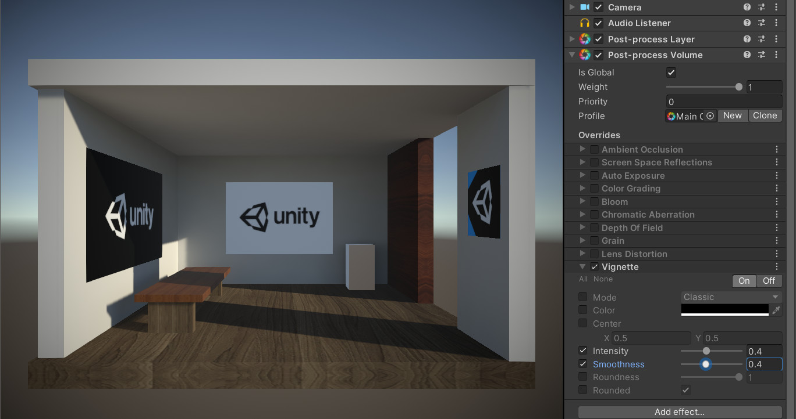

##### 3.11 运动模糊 (Motion Blur)

   – 该效果会使物体在运动方向产生模糊，用以模拟现实中相机光圈打开情况下移动或捕捉移动速度快于相机曝光时间的物体时产生的模糊效果。

   | 模糊参数      | 说明                                                       |
   | ------------- | ---------------------------------------------------------- |
   | Shutter Angle | 设置旋转快门的角度。数值越大，曝光时间越长，模糊效果越强。 |
   | Sample Count  | 设置采样点数量的值。这会影响质量和性能。                   |

#### 4 脚本控制

   有时我们需要镜头效果根据时间产生变化，比如：人从昏迷醒来时视力的慢慢恢复，战斗时受伤死亡的屏幕闪动变化，高光时刻或危险警告等屏幕特效。那么这时就要使用代码控制插件中的参数来实现。

   直接附上官方文档中的代码，可以简单了解下脚本的实时控制。

   ```c#
   using UnityEngine;
   using UnityEngine.Rendering.PostProcessing;
   public class VignettePulse : MonoBehaviour
   {
      PostProcessVolume m_Volume;
      Vignette m_Vignette;
      void Start()
     {
         // Create an instance of a vignette
          m_Vignette = ScriptableObject.CreateInstance<Vignette>();
          m_Vignette.enabled.Override(true);
          m_Vignette.intensity.Override(1f);
         // Use the QuickVolume method to create a volume with a priority of 100, and assign the vignette to this volume
          m_Volume = PostProcessManager.instance.QuickVolume(gameObject.layer, 100f, m_Vignette);
      }
      void Update()
     {
          // Change vignette intensity using a sinus curve
           m_Vignette.intensity.value = Mathf.Sin(Time.realtimeSinceStartup);
     }
      void OnDestroy()
     {
          RuntimeUtilities.DestroyVolume(m_Volume, true, true);
     }
   }
   ```