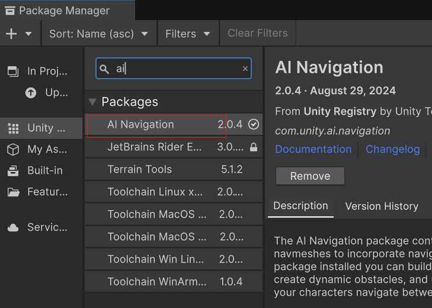
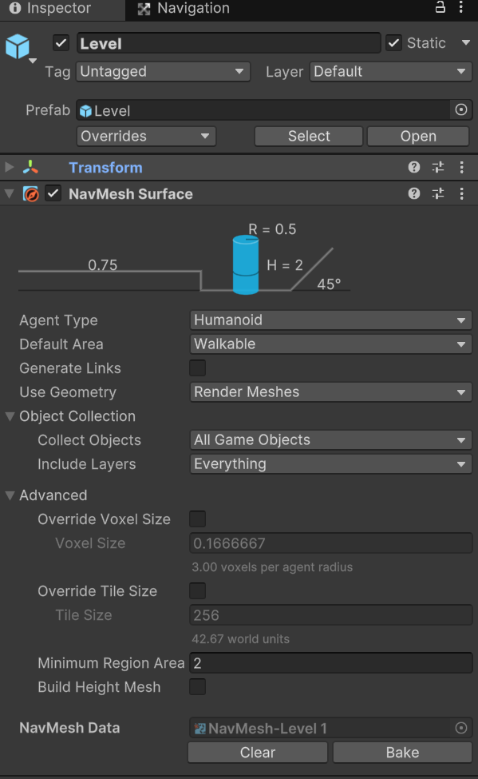
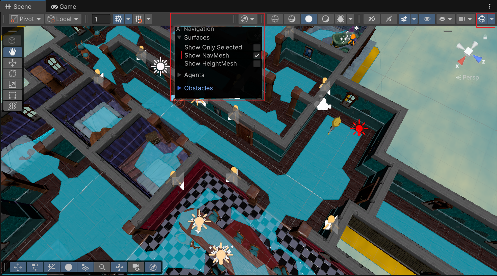
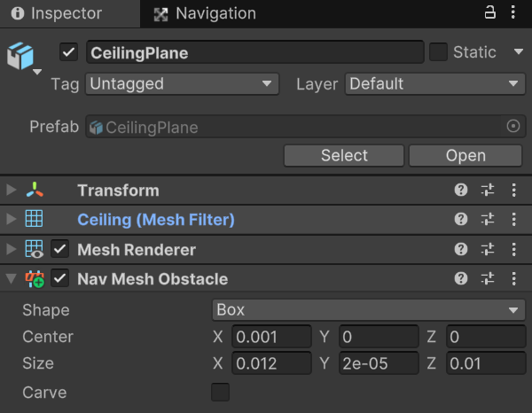
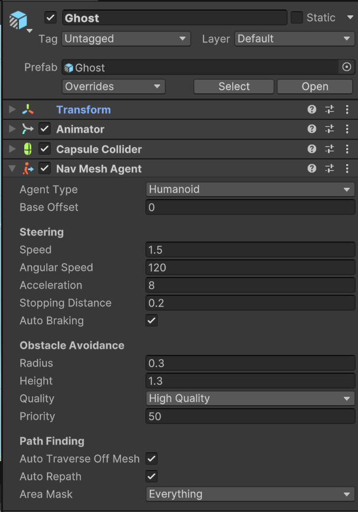

## unity导航系统

##### 1.安装AI Navigation




##### 2.烘焙 场景 游戏对象

1. 在 Hierarchy 中，选择 场景 游戏对象。 

2. 在 Inspector 中，添加**NavMesh Surface**组件

   

   3. 点击**Bake**进行，如图所示蓝色的区域就是可行走的路线，(如果没有蓝色显示，需要打开**Gizmos**和**Show NavMesh**)

       

   4. 如果想添加路障，需要在添加**Nav Mesh Obstacle**

      

##### 3.给主角或敌人导航

1. 给敌人添加**Nav Mesh Agent**

   

   2. 添加导航代码

      ```c#
      /// <summary>
      /// 幽灵移动
      /// </summary>
      public class WaypointPatrol : MonoBehaviour
      {
      
          [Header("节点")]
          public List<Transform> m_List;
      
          NavMeshAgent m_Agent;
      
          int m_Index;
      
          void Start()
          {
              // 获取NavMeshAgent组件
              m_Agent = GetComponent<NavMeshAgent>();
              // 设置第一个导航点
              m_Agent.SetDestination(m_List[0].position);
          }
      
          void Update()
          {
              // pathPending 路径是否正在计算中，为准备返回true
              // remainingDistance 当前与目的地的距离
              // stoppingDistance 允许误差距离
              if (!m_Agent.pathPending && m_Agent.remainingDistance < m_Agent.stoppingDistance)
              {
                  if(m_Index == m_List.Count - 1)
                  {
                      m_Index = 0;
                  }
                  else
                  {
                      m_Index++;
                  }
                  // 导航到下一个点
                  m_Agent.SetDestination(m_List[m_Index].position);
              }
          }
      }
      ```

      
