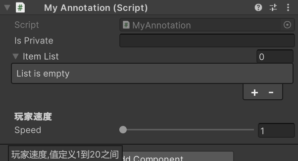
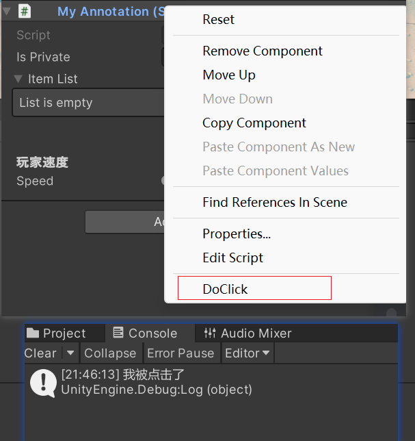

## unity常用注解

- `[SerializeField]`：将私有字段或属性显示在 Unity 编辑器中，使其可以在 Inspector 窗口中进行编辑。
- `[Range(min, max)]`：限制数值字段或属性的范围，在 Inspector 窗口中以滑动条的形式进行编辑。

- `[Header("Text")]`：在 Inspector 窗口中给字段或属性添加标题。
- `[Tooltip("Text")]`：在 Inspector 窗口中给字段或属性添加工具提示，悬停显示文字。
- `[HideInInspector]`：隐藏字段或属性，做了这个标记，在 Inspector 窗口中将不显示该字段或属性。
- `[RequireComponent(typeof(ComponentType))]`：确保脚本所在的 GameObject 上附加了指定的组件,如下添加`MyAnnotation`脚本会自动添加`BoxCollider`组件
- `[Serializable]`：使用`[Serializable]`注解结构体时，可以使得公共类在 Inspector 窗口是可见的
- `[ContextMenu("Text")]`：在 Inspector 窗口中给方法添加上下文菜单。如下

```c#
[RequireComponent(typeof(BoxCollider))]
public class MyAnnotation : MonoBehaviour
{
    [SerializeField]
    private string isPrivate;

    [HideInInspector]
    public string isInit;

    public List<Item> itemList;

    [Tooltip("玩家速度,值定义1到20之间")]
    [Header("玩家速度")]
    [Range(1, 20)]
    public int speed;

    [Serializable]
    public class Item
    {
        public string name;
        public string value;
    }
    
    [ContextMenu("DoClick")]
    public void DoClick()
    {
        Debug.Log("我被点击了");
    }
}
```



