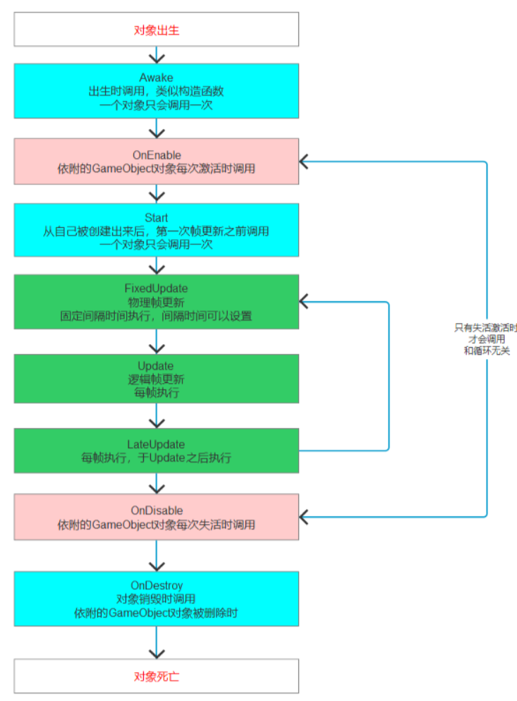
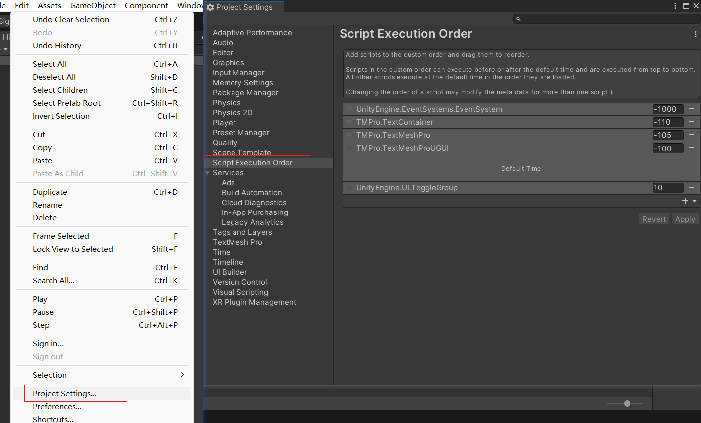
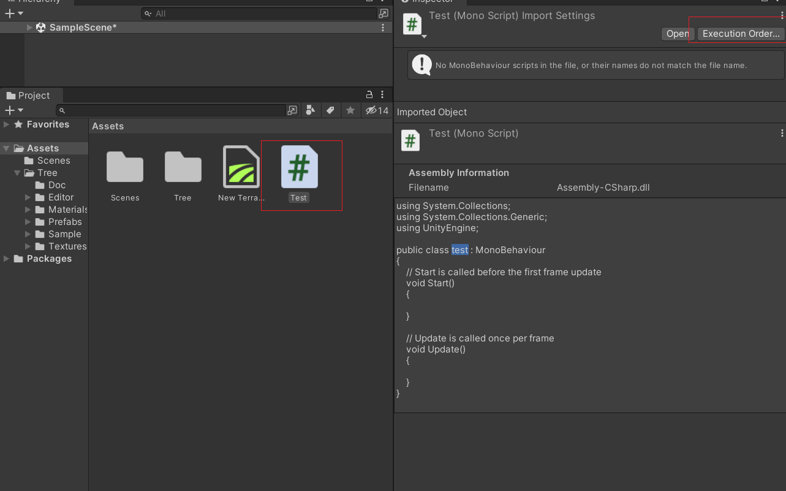

## unity生命周期

> ##### 1.生命周期函数的概念
>
> 所有继承MonoBehavior的脚本 最终都会挂载到GameObject游戏对象上
> 生命周期函数就是该脚本对象依附的GameObject对象从出生到消亡整个生命周期中
> 会通过反射自动调用的一些特殊函数



```c#
using UnityEngine;

public class TestFunction : MonoBehaviour
{
     
    private void Awake()
    {
        Debug.Log("Awake 初始化时调用，在Start函数之前调用，...");
    }
    private void OnEnable()
    {
        Debug.Log("OnEnable 每次对象启用都会被调用...");
    }
    private void Reset()
    {
        Debug.Log("Reset 编辑器模式下才可被调用...Number: " + Number);
    }
    private void Start()
    {
        Debug.Log("Start 仅当启用脚本实例时，才会在第一帧调用...");
    }
    
    // 固定时间调用，FixedUpdate通常比Update更频繁地调用
    private void FixedUpdate()
    {
        Debug.Log("FixedUpdate 固定时间调用...");
    }
    
    // 每帧调用一次
    private void Update()
    {
        Debug.Log("Update 每帧调用一次...");
    }
    
    // 在Update后，每帧调用一次 
    private void LateUpdate()
    {
        Debug.Log("LateUpdate 在Update后，每帧调用一次...");
    }
}
```


##### 2.关于脚本执行顺序

1. 可以在`Edit -> Project Settings -> Script Execution Order`

   

2. 点击C#文件脚本文件 点击`Execution Order`

   
