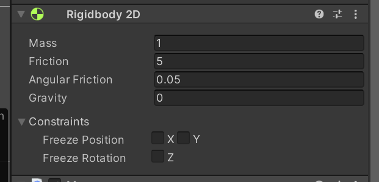
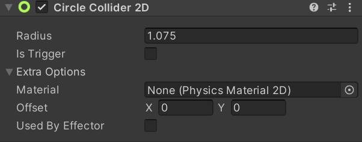

## unity碰撞体2d

##### 1.介绍

> 在 Unity 中，刚体（Rigidbody）和碰撞器（Collider）是非常重要的组件，用于实现物体的物理行为。
>
> 1. 刚体（Rigidbody）
>
>    刚体是用于为对象赋予物理属性的组件，使得对象可以根据力、重力等物理因素来进行运动和交互。
>
> 2. 碰撞器（Collider）
>
>    碰撞器用于定义物体的形状，用来检测物体之间的碰撞。Unity中有多种碰撞器，例如Box Collider（盒型碰撞器）、Sphere Collider（球型碰撞器）等。
>
> 3. 刚体和碰撞器的配合
>
> - **动态物体**：当对象既有刚体又有碰撞器时，它将受到物理引擎的完全控制，表现出真实的物理行为。
>
> - **静态物体**：当对象只有碰撞器没有刚体时，它被视为静态碰撞物体，只用于检测碰撞而不受物理力的影响，如地面、墙壁等





##### 2.关于碰撞

1. 双方的`Collider`必须取消勾选 `Is Trigger`

2. 运动一方必须具有刚体 `Rigidbody`

   ```c#
   public void OnCollisionEnter2D(Collision2D collisionData)
   {
       Debug.Log("'-->'",collisionData.collider.gameObject);
       Debug.Log("触发碰撞");
   }
   ```

##### 3.关于Trigger事件(像是一个物体进入另一个物体)

1. 至少一方勾选 `Is Trigger`

2. 运动一方必须含有刚体`Rigidbody`

   ```c#
   public void OnTriggerEnter2D(Collider2D colliderData)
   {
       Debug.Log("'-->'",colliderData.gameObject);
       Debug.Log("触发Trigger");
   }
   ```

   