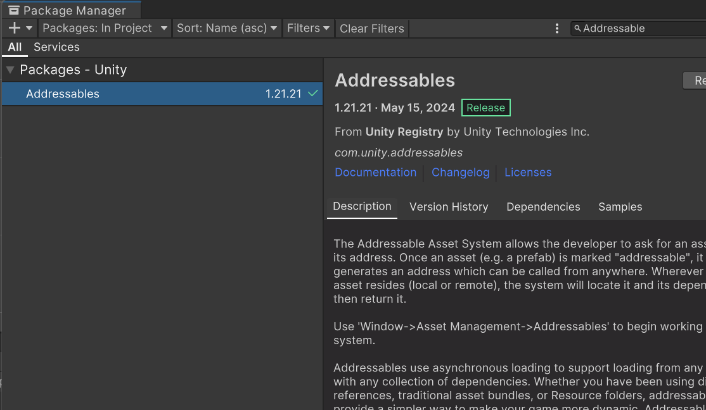
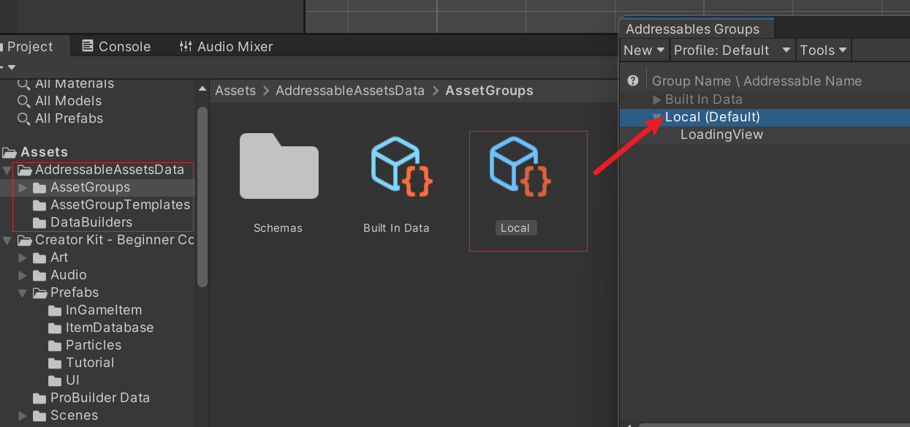
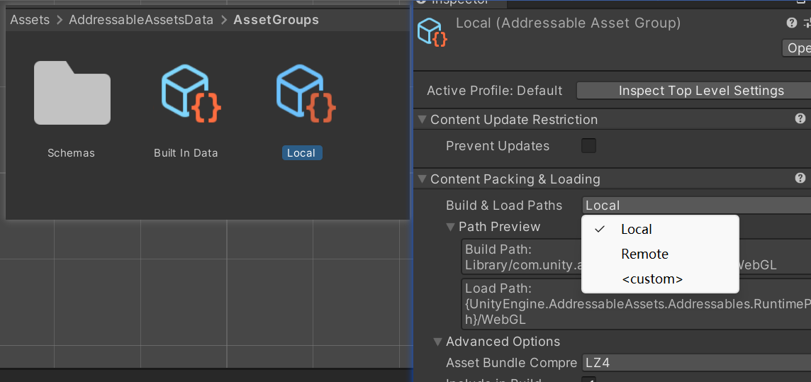
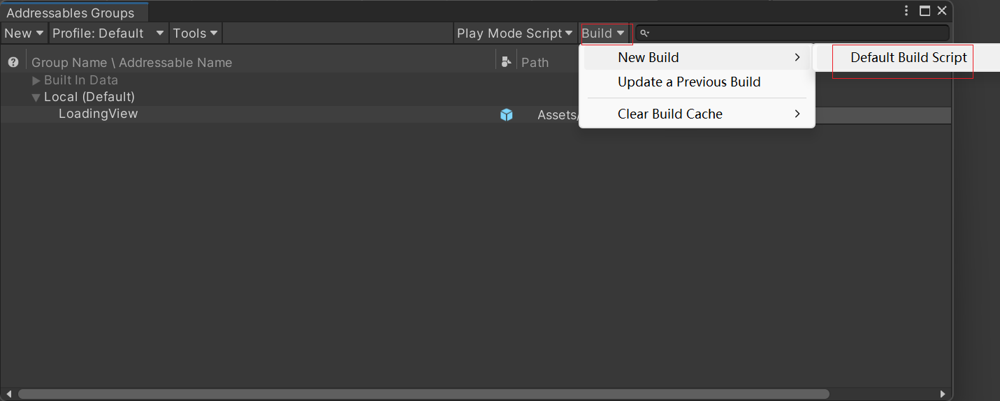
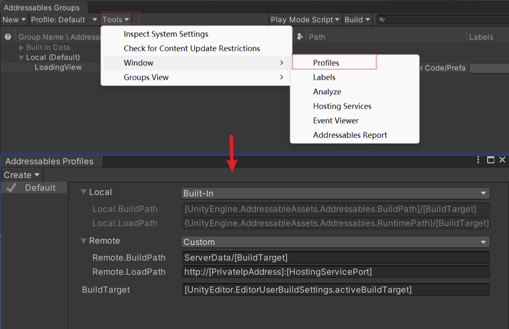
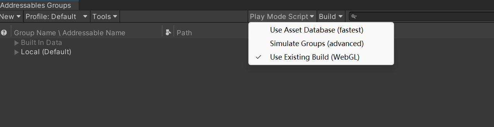
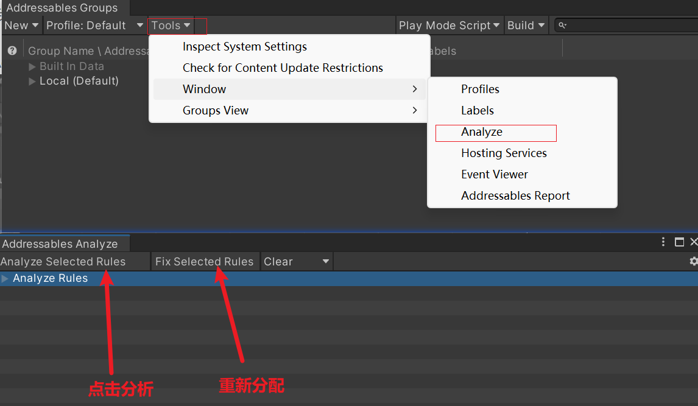

## unity资源管理器Addressable

##### 1.安装Addressables



##### 2.创建Addressables Settings 资产包管理

1. 点击 `Windows > Asset Management > Addressables > Groups`,点击`Create Addressables Settings`默认会生成一个名为`Default Local Group (Default)`组

2. 此时在根目录可以看到生成的名为`AddressableAssetsData`文件夹，在` AddressableAssetsData > AssetGroups`包含所有组的配置文件

   

3. 点击其中一个配置文件可以设置他们的加载方式，`Local:`从本地加载，`Remote:`从服务器加载

   

4. 把资源拖动到其中一个组内，并打包资源

   

5. 设置本地和远程打包路径，在`Tools > Window > Profiles`

   

6. 环境模拟(建议选择`Use Exising Build(WebGL)`)

   **Use Asset Database (fastest)**
   可以直接从AssetDatabase加载资源，避免打包过程，因此加载速度很快。但是这种方式获取的Profiler信息较少，因为Addressables系统不需要打包资源，所以不会产生AssetBundle的缓存信息。因此，在项目开发阶段，建议使用这种非打包方式，以快速加载资源。

   **Simulate Groups (advanced)**
   这种模式下，是通过模拟AssetBundle的操作，以获取与打包方式类似的Profiler信息。但不同于直接从AssetDatabase加载资源，其会模拟出AssetBundle的缓存信息，然后通过分析这些信息来获取Profiler数据。因为不需要打包Addressable资源包，所以也无需执行Build操作。因此，这种模式既快又能够获取丰富的Profiler信息，是一个很好的开发调试方式。

   **Use Exising Build(WebGL)**
   在这种模式下，仍然需要执行Build操作，将资源打包为Addressable资源包。在运行时，Addressables系统会根据Load Path去加载实际的AssetBundle文件并读取资源。与前面两种模式不同的是，这个模式需要打包资源，所以需要先执行Build操作。如果不先Build，运行时会无法加载资源，导致程序报错。因此，这种模式适用于项目发布或上线前的阶段，以确保资源能够被正确加载。

   

7. 查看重复资源，在AddressablesGroup中选择 `Tools > Window > Analyze`

   

   

   ##### 3.关于加载AA包场景工具类

   ```C#
   public class LoadAAScene : MonoBehaviour
   {
   
       private string aaName;
       public event Action<float> onProgressChanged;
       public event Action onFinished;
   
       private static LoadAAScene _instance;
       public static LoadAAScene Instance
       {
           get
           {
               if (_instance == null)
               {
                   GameObject gp = new GameObject("LoadAAScene");
                   gp.AddComponent<LoadAAScene>();
               }
               return _instance;
           }
       }
   
       private void Awake()
       {
           if (_instance != null && _instance != this)
           {
               Debug.LogError("场景存在LoadAAScene");
               Destroy(gameObject);
               return;
           }
           _instance = this;
           DontDestroyOnLoad(gameObject);
       }
   
       public void LoadScene(string aaName, Action<float> onProgressChange = null, Action onFinish = null)
       {
           this.aaName = aaName;
           if (onProgressChange != null) onProgressChanged += onProgressChange;
           if (onFinish != null) onFinished += onFinish;
   
           StartCoroutine(LoadScene());
       }
   
       private IEnumerator LoadScene()
       {
           yield return null;
           AsyncOperationHandle<SceneInstance> asyncOperation = Addressables.LoadSceneAsync(aaName);
           while (!asyncOperation.IsDone)
           {
               yield return new WaitForSeconds(0.1f);
               onProgressChanged?.Invoke(asyncOperation.PercentComplete);
           }
           yield return new WaitForSeconds(0.2f);
   
           // 加载完成
           if (asyncOperation.Status != AsyncOperationStatus.Succeeded)
           {
               Debug.LogError("Failed to load scene: " + asyncOperation.OperationException);
           }
   
           onFinished?.Invoke();
           onProgressChanged = null; // 清理事件，避免多余订阅
           onFinished = null;        // 清理事件，避免多余订阅
       }
   }
   ```