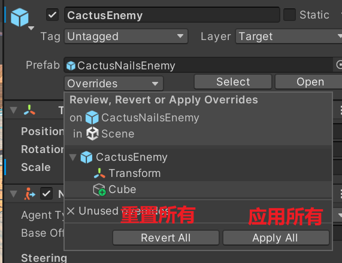
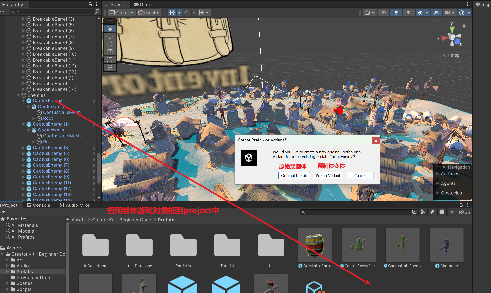

## unity预制体

##### 1.介绍

在Unity中，预制体（Prefab）是一种可重复使用的游戏对象（GameObject）的模板或蓝图。它允许开发者定义和配置游戏对象的属性、组件、子对象等，并在场景中多次实例化这个模板，创建多个相同或类似的对象。

使用预制体的优点：

- **资源共享**：预制体允许多个实例共享同一资源（如纹理、材质等），而不是每个实例都单独存储这些资源

- **一致性**：确保多个实例有相同的设置和行为
- **易于管理**：可以一次性更新所有实例，只需修改预制体文件
- **节省时间**：避免重复创建和配置相同的对象

##### 2.步骤

| 描述                                                         | 图                                                           |
| ------------------------------------------------------------ | ------------------------------------------------------------ |
| 1.选择游戏对象拖到project中，此时已经生成预制体              |  |
| 2.修改场景中的预制体被修改之后，在Inspector面板上就会多出一些选项。重置所有:会重置到预制体原始状态，应用所有:应用所有更改包括预制体 |  |
| 3.  选择`Original(原始预制体)`：这个游戏对象会成为一个新的`预制体B`，与原来的`预制体A`就断绝关系了！   选择`Prefab Variant(预制体变体)`：这个游戏对象也会变成一个`预制体A1`，不同的是这个`预制体A1`就相当于变成了原来`预制体A`的子类 每当原来的`预制体A`发生变化的时候， |  |

##### 3.代码生成预制体

```C#
// 1.使用Instantiate生成(常用)
GameObject instance = Instantiate(prefab, new Vector3(0, 0, 0), Quaternion.identity);


// 2.使用 PrefabUtility 生成
GameObject instance = PrefabUtility.InstantiatePrefab(prefab) as GameObject;
if (instance != null)
{
    instance.transform.position = new Vector3(2, 2, 2);
}

// 3.可以更改位置等操作相当于生成变体
 instance.transform.position = new Vector3(1, 1, 1);
 instance.GetComponent<Renderer>().material.color = Color.red;
```

