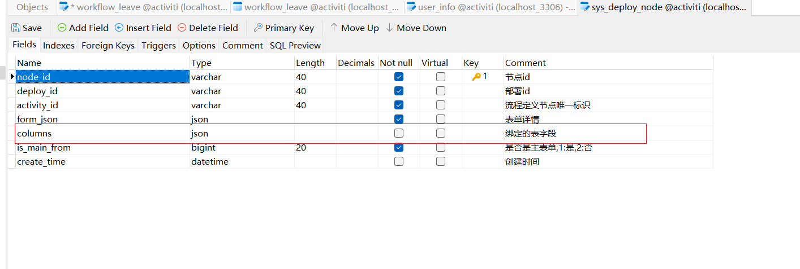
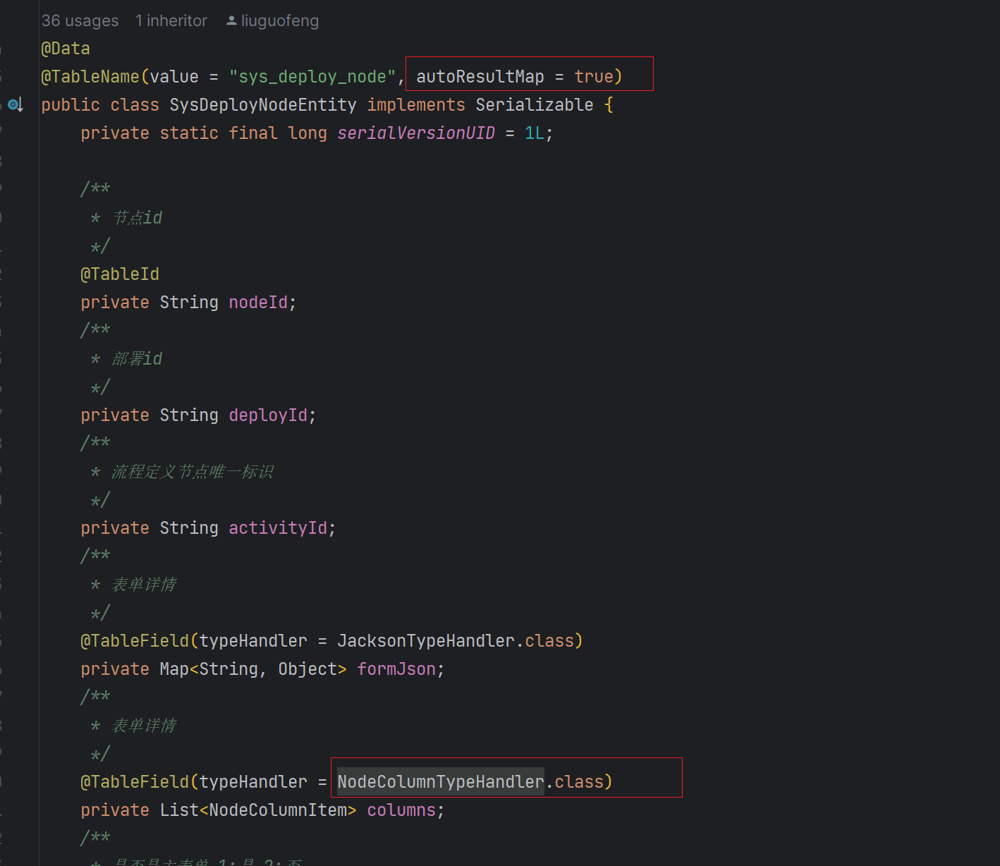

## MyBatis-Plus中json类型转换

#### 1.当数据库中设置的字段是json类型时，可以只有类型转换成自己想要的类型



##### 2.在实体类中添加如下注解

> `@TableName(value = "sys_deploy_node", autoResultMap = true)`
>
> 1.转成map类型:`@TableField(typeHandler = JacksonTypeHandler.class)`
>
> 2.要转成特别类型:`@TableField(typeHandler = NodeColumnTypeHandler.class)`



#### 3.自定义转换器

```java
/**
 * 
 *
 * @author liuguofeng
 * @date 2023/12/15 22:06
 **/
@MappedTypes({List.class})
@MappedJdbcTypes(JdbcType.VARCHAR)
public class NodeColumnTypeHandler  {

    @Override
    public void setNonNullParameter(PreparedStatement preparedStatement, int i, List<NodeColumnItem> nodeColumnItems, JdbcType jdbcType) throws SQLException {
        preparedStatement.setString(i, JSON.toJSONString(nodeColumnItems));
    }

    @Override
    public List<NodeColumnItem> getNullableResult(ResultSet resultSet, String s) throws SQLException {
        String str = resultSet.getString(s);
        return JSON.parseArray(str, NodeColumnItem.class);
    }

    @Override
    public List<NodeColumnItem> getNullableResult(ResultSet resultSet, int i) throws SQLException {
        String str = resultSet.getString(i);
        return JSON.parseArray(str, NodeColumnItem.class);
    }

    @Override
    public List<NodeColumnItem> getNullableResult(CallableStatement callableStatement, int i) throws SQLException {
        String str = callableStatement.getString(i);
        return JSON.parseArray(str, NodeColumnItem.class);
    }
}
```

#### 4.关于Mapper.xml使用自定义TypeHandler

```xml
<?xml version="1.0" encoding="UTF-8"?>
<!DOCTYPE mapper PUBLIC "-//mybatis.org//DTD Mapper 3.0//EN" "http://mybatis.org/dtd/mybatis-3-mapper.dtd">
<mapper namespace="org.jeecg.modules.cases.mapper.CasesInfoMapper">

    <resultMap id="NodeColumnMap" type="com.demo.entity.SysDeployNodeEntity">
        <result column="columns" property="columns"
                typeHandler="com.demo.handler.NodeColumnTypeHandler"/>
    </resultMap>

    <select id="pageList" resultMap="NodeColumnMap">
        select * from node_column
    </select>
</mapper>
```

