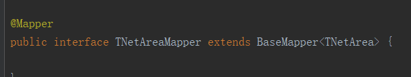
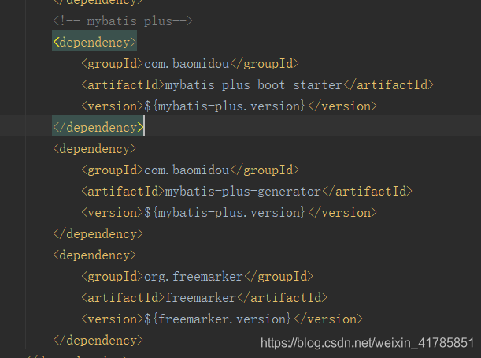
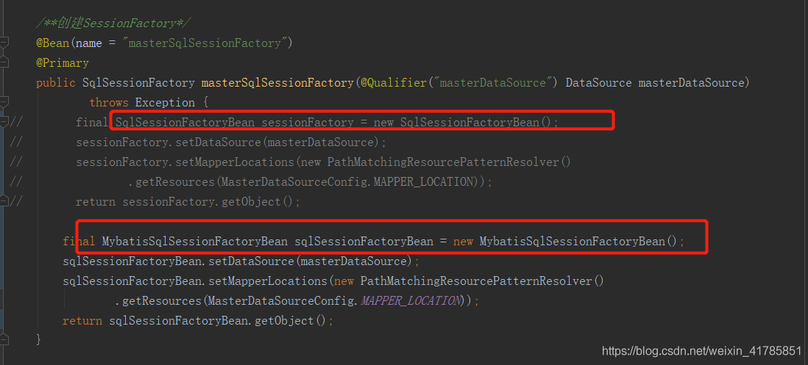

## mybatis 替换为 mybatisPush 后 出现 Invalid bound statement (not found) selectList

> spring boot+mybatis-plus，引用mybatis-plus  执行发现自己写的sql可以执行，执行basemapper里的方法就会出错

解决方案：

##### 1.写自己的UserMapper时继承了BaseMapper 但没有添加泛型。

##### 2.包引入问题，引入的依赖应该为

import com.baomidou.mybatisplus.core.mapper.BaseMapper;

##### 3、自定义了配置文件，需要将mybatis的sqlSessionFactory替换成mybatis-plusd的MybatisSqlSessionFactoryBean

