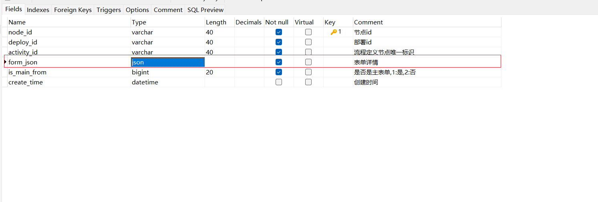
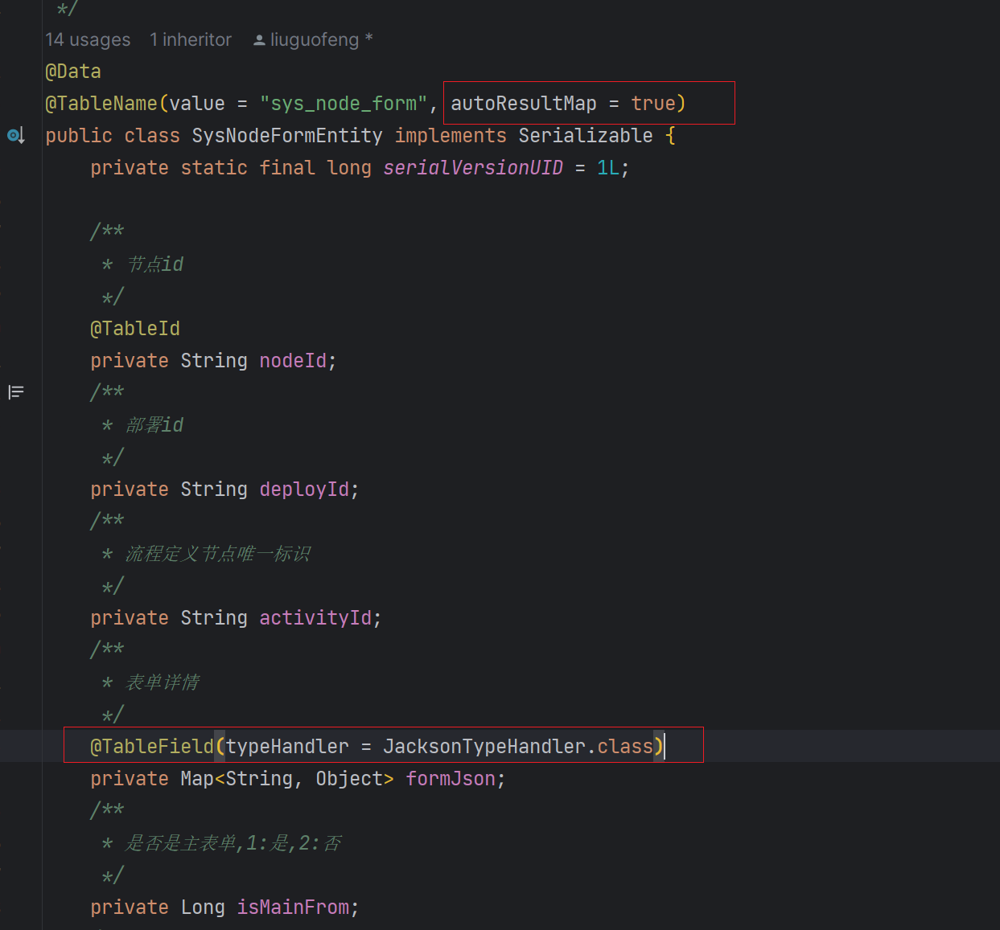

## mybatis-plus 实体json互相转化

#### 1. 数据库的类型设置的是 `json` 时，



#### 2.在实体类 TableName注解添加属性值 `autoResuleMap = true`，字段加`TableField`注解，添加属性值`typeHandler = JacksonTypeHandler.class`，此时才能正常保存和查询



```java
@TableName(value = "sys_node_form", autoResultMap = true)
public class SysNodeFormEntity implements Serializable {
    private static final long serialVersionUID = 1L;

    /**
     * 表单详情
     */
    @TableField(typeHandler = JacksonTypeHandler.class)
    private Map<String, Object> formJson;

}

```

