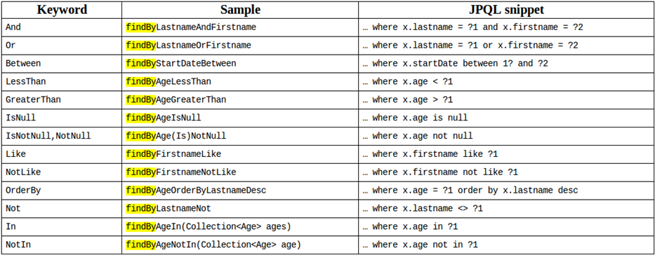

## springBoot 整合 JPA

#### 1. Pomxml

```csharp
<!--继承Spring Boot父工程-->
<parent>
   <groupId>org.springframework.boot</groupId>
   <artifactId>spring-boot-starter-parent</artifactId>
   <version>2.1.1.RELEASE</version>
   <relativePath/>
</parent>
<!--使用jdk1.8-->
<properties>
   <java.version>1.8</java.version>
</properties>    
<dependencies>
    <!--spring Boot启动器-->
    <dependency>
        <groupId>org.springframework.boot</groupId>
        <artifactId>spring-boot-starter-web</artifactId>
    </dependency>
    <!--spring Boot整合freemarker-->
    <dependency>
        <groupId>org.springframework.boot</groupId>
        <artifactId>spring-boot-starter-freemarker</artifactId>
    </dependency>
    <!--jstl-->
    <dependency>
        <groupId>javax.servlet</groupId>
        <artifactId>jstl</artifactId>
    </dependency>
    <!--jasper-->
    <dependency>
        <groupId>org.apache.tomcat.embed</groupId>
        <artifactId>tomcat-embed-jasper</artifactId>
        <scope>provided</scope>
    </dependency>
    <!-- springBoot jpa -->
    <dependency>
        <groupId>org.springframework.boot</groupId>
        <artifactId>spring-boot-starter-data-jpa</artifactId>
    </dependency>
    <!-- 测试工具的启动器 -->
    <dependency>
        <groupId>org.springframework.boot</groupId>
        <artifactId>spring-boot-starter-test</artifactId>
    </dependency>
    <!-- mysql -->
    <dependency>
        <groupId>mysql</groupId>
        <artifactId>mysql-connector-java</artifactId>
    </dependency>
    <!-- druid 连接池 -->
    <dependency>
        <groupId>com.alibaba</groupId>
        <artifactId>druid</artifactId>
        <version>1.0.9</version>
    </dependency>
    <!-- Spring Boot 缓存支持启动器 -->
    <dependency>
        <groupId>org.springframework.boot</groupId>
        <artifactId>spring-boot-starter-cache</artifactId>
    </dependency>
<!-- Spring Boot 整合mybatis -->
<dependency>
    <groupId>org.mybatis.spring.boot</groupId>
    <artifactId>mybatis-spring-boot-starter</artifactId>
    <version>1.1.1</version>
</dependency>
</dependencies>
```

#### 2.在resources下新建application.properties

```csharp
spring.datasource.url=jdbc:mysql://localhost:3306/shiro?useUnicode=true&characterEncoding=utf-8&serverTimezone=UTC
spring.datasource.username=root
spring.datasource.password=123
spring.datasource.type=com.alibaba.druid.pool.DruidDataSource
#正向工程
spring.jpa.hibernate.ddl-auto=update
#在控制台输出sql语句
spring.jpa.show-sql=true
```

#### 3. 添加启动类

```csharp
@SpringBootApplication
public class APP {
    public static void main(String[] args) {
        SpringApplication.run(APP.class,args);
    }
}
```

#### 4.新建实体类

```csharp
1. /*
 * 刘国峰
 * 2019.8.10
 * */
@Entity
@Table(name="t_users")
public class Users implements Serializable {
    @Id
    @GeneratedValue(strategy=GenerationType.IDENTITY)
    @Column(name="id")
    private Integer id;

    @Column(name="name")
    private String name;

    @Column(name="age")
    private Integer age;

    @Column(name="address")
    private String address;
    
    public Integer getId() {
        return id;
    }
    public void setId(Integer id) {
        this.id = id;
    }
    public String getName() {
        return name;
    }
    public void setName(String name) {
        this.name = name;
    }
    public Integer getAge() {
        return age;
    }
    public void setAge(Integer age) {
        this.age = age;
    }
    public String getAddress() {
        return address;
    }
    public void setAddress(String address) {
        this.address = address;
    }
}
```

#### 5.如果id为string类型则添加@GenericGenerator生成策略

1、native 对于orcale采用Sequence方式，对于MySQL和SQL Server采用identity(处境主键生成机制)，native就是将主键的生成工作交给数据库本身

2、uuid 采用128位的uuid算法生成主键，uuid被编码为一个32位16进制数字的字符串。占用空间大（字符串类型）。

3、hilo 要在数据库中建立一张额外的表，默认表名为hibernate_unque_key，默认字段为integer类型，名称是next_hi（比较少用）

4、assigned 在插入数据的时候主键由程序处理（很常用），这是<generator>元素没有指定时的默认生成策略。等同于JPA中的AUTO。

5、identity 使用SQL Server和MySQL的自增字段，这个方法不能放到Oracle中，Oracle不支持自增字段，要设定sequence(MySQL和SQL Server中很常用)

6、select 使用触发器生成主键（主要用于早期的数据库主键生成机制，少用）

7、sequence 调用谨慎数据库的序列来生成主键，要设定序列名，不然hibernate无法找到。

8、seqhilo 通过hilo算法实现，但是主键历史保存在Sequence中，适用于支持Sequence的数据库，如Orcale(比较少用）

9、increment 插入数据的时候hibernate会给主键添加一个自增的主键，但是一个hibernate实例就维护一个计数器，所以在多个实例运行的时候不能使用这个方法。

#### 6.继承接口

```csharp
public interface Users extends Repository<Users,String> {
//方法命名
    Users findAllById(String id);
    //注解查询如果更新操作加@Modifying
    @Query(value = "select * from users where id = ?",nativeQuery = true)
    StudentExamantionjktjEntity selectId(String id);
}
public interface Users extends CrudRepository<Users,String> {
    //内部定义了crud的操作
}
public interface Users extends PagingAndSortingRepository<Users,String> {
    //内部定义了分页和排序
}
public interface Users extends JPARepository<Users,String> {
    //继承了前三个接口
}
```

#### 7.接口的使用



#### 8.常用方法

1.Repository：

.save(uaer);向数据库添加一个实体类

.count();查询数据库里的条数

.deleteAll();

.findAll();查询所有

.existsById(1);查看数据是否存在

 

2. CrudRepository：

.save(uaer);向数据库添加一个实体类

.count();查询数据库里的条数

.deleteAll();

.findAll();查询所有

.existsById(1);查看数据是否存在

 

 

@Query(value = "insert into t_user(username,age) values(?,?)",nativeQuery = true)

@Modifying

void upate(String name,String age);

 

3.pagingAndSortingRepository：用于分页和排序

4.JPARepository：继承前三个接口