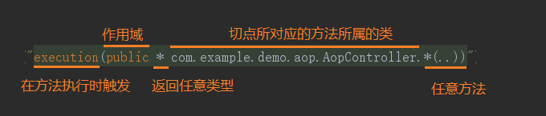

## springboot aop

@Aspect 注解 使之成为切面类

@Component 注解 把切面类加入到IOC容器中

```java
@Component
@Aspect
public class DomeAspect {
    // @Pointcut定义切面点 
    @Pointcut("execution(public * com.workorder.controller.TestController.*(..))")
    public void DomeAspect(){}

    @After("DomeAspect()")
    public void after(){
        System.out.println("前置after");
    }
    @Before("DomeAspect()")
    public void before(){
        System.out.println("后置before");
    }

    @AfterReturning("DomeAspect()")
    public void afterReturning(){
        System.out.println("返回通知afterReturning");
    }
    @AfterThrowing("DomeAspect()")
    public void afterThrowing(){
        System.out.println("异常通知afterThrowing");
    }
}
```




```java
//使用环绕通知
@Around("DomeAspect()")
public Object around(ProceedingJoinPoint point) throws Throwable {
    try {
        System.out.println("after");
        Object object = point.proceed();
        System.out.println("before");
        return object;//返回值
    }catch (Throwable t){
        System.out.println("afterThrowing");
        return point.proceed();
    }
}
```


```java
@Around("DomeAspect()")
public Object around(ProceedingJoinPoint joinPoint) throws Throwable {
    String name = joinPoint.getTarget().getClass().getName();
    String name2 = joinPoint.getSignature().getName();
    Class<?> aClass = Class.forName(name);
    Class[] parameterTypes = ((MethodSignature) joinPoint.getSignature()).getParameterTypes();
    Method method = aClass.getMethod(name2, parameterTypes);
    Dome annotation = method.getAnnotation(Dome.class);
    if(annotation != null){
        System.out.println(annotation.value());
    }
    return joinPoint.proceed();
}
```


```java
AnnotationUtils.findAnnotation(method, RateLimiter.class);
```

