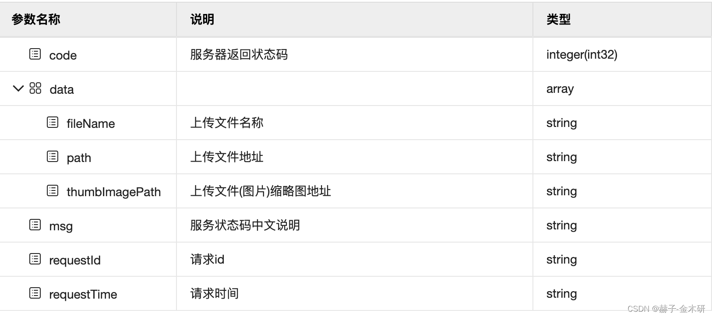
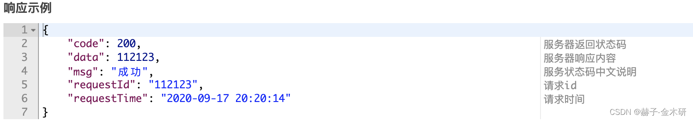
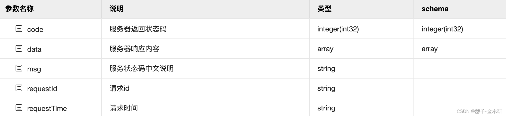

## springboot 使用 Swagger2 统一返回结果不显示字段说明


swagger(三)：统一返回结果不显示字段说明


1. 正常显示情况



 

正常情况下,不管是调试还是文档说明都会显示以上字段说明。

2. 非正常情况

2.1 返回Object 不显示



 

响应参数不显示字段属性：



 2.2 返回Map不显示

为何返回Map不显示,大家都知道Map是Java里面的集合接口,不管是Map本身还是诸如HashMap等子实现,这类数据对于Swagger来说都是未定义结构的数据

Swagger只认识定义好的类-属性，所以接口返回Map,对于Swagger来说是没有字段展示的,这种情况同样适用与返回Object这个顶级父类.这也是为何要适用泛型T的原因

2.3 返回范型T不显示

很多朋友会说我已经使用泛型T了,可是文档上还是不显示,这里主要的原因有以下几点

- 属性定义必须是泛型T，如下：

```java
private T data;//返回属性T
```

- 返回T类型的get方法必须是返回T，有时候自动生成get、setter方法插件等会将我们的代码生成返回Object，例如：

```java
public Object getData(){
    return data;
}
```

以上是错误的形式,尽管属性中已经定义为T了，正确的方式

```java
public T getData(){
    return data;
}
```

- 最重要的一步,以上步骤完全正确,代码也没有问题,可是ui还是不显示属性，必须在接口层强指定泛型类型(可能是Swagger要求我们写代码要规范吧~~~),如下：

友情提示

在2.0.6等后面的高版本中,由于升级了Springfox基础组件，如果开发者使用类似JRebel这类热加载插件的时候，会出现类字段没有的情况，目前没有办法解决springfox项目与JRebel插件的冲突，建议是不用JRebel

2.4 属性注解添加方式不正确也不会显示

一般在完成以上情况后,字段说明都会显示,这里再提醒一下大家,如果已经在泛型中强制约束了返回类型后,就无需在注解@ApiOperation中设置response属性值，比如如下代码

```java
@ApiOperation(value = "查询所有",response=AlarmReponse.class)
@GetMapping("/queryAll")
public Rest<List<AlarmResponse>> queryAll(){
    //more..
}
```

以上代码返回了泛型Rest类型的List-AlarmResponse集合,但是却ApiOperation注解中加了response属性为AlarmResponse.class，这种情况会造成Ui只显示AlarmReponse类的属性说明，这显然是不对的，因为它把Rest的属性给忽略了,所以:

一般情况下,是不写注解@ApiOperation中的response属性值,能少写就少写,将剩下的交给springfox-swagger这个框架,由它自动解析生成接口返回类型

3.正确的返回封装类

```java
@Data
public class Rest<T> {
    @ApiModelProperty(value = "服务器返回状态码", name = "code", example = "200", required = true)
    private Integer code;
    @ApiModelProperty(value = "服务状态码中文说明", name = "msg", example = "成功", required = true)
    private String msg;
 
    private T data;
    @ApiModelProperty(value = "请求id", name = "requestId", example = "112123", required = true)
    private String requestId;
 
    @ApiModelProperty(value = "请求时间", name = "requestTime", example = "2020-09-17 20:20:14", required = true)
    private String requestTime;
 
    public Rest(Integer code, String msg, String requestId, String requestTime, T o) {
        this.code = code;
        this.msg = msg;
        this.data = o;
        this.requestTime = requestTime;
        this.requestId = requestId;
    }
 
    public static Rest ok() {
        return ok("操作成功");
    }
 
    public static <T> Rest <T> ok(T data) {
        return new R<T>(200, "操作成功", UUID.randomUUID().toString().replace("-",""), DateUtil.getCurrentTime(), data);
    }
 
    public static <T> Rest <T> ok(StatusCode data) {
        return new R<T>(data.getCode(), data.getMsg(), UUID.randomUUID().toString().replace("-",""), DateUtil.getCurrentTime(), null);
    }
 
    public static Rest fail(int code, String msg) {
        return new R<>(code, msg, UUID.randomUUID().toString().replace("-",""), DateUtil.getCurrentTime(), null);
    }
 
    public static Rest fail(StatusCode statusCode) {
        return new R<>(statusCode.getCode(), statusCode.getMsg(), UUID.randomUUID().toString().replace("-",""), DateUtil.getCurrentTime(), null);
    }
 
}
```

