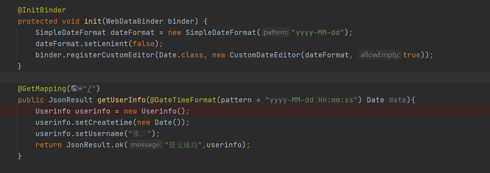

## springboot 参数含有Date格式报错

### 全局解决方案

```java
@InitBinder
protected void init(WebDataBinder binder) {
    SimpleDateFormat dateFormat = new SimpleDateFormat("yyyy-MM-dd");
    dateFormat.setLenient(false);
    binder.registerCustomEditor(Date.class, new CustomDateEditor(dateFormat, true));
}

@InitBinder
public void initBinder(WebDataBinder binder){
    binder.registerCustomEditor(Date.class,new PropertyEditorSupport(){
        @SneakyThrows
        @Override
        public void setAsText(String text) throws IllegalArgumentException {
            SimpleDateFormat format = new SimpleDateFormat("yyyy-MM-dd HH:mm:ss");
            Date parse = format.parse(text);
            setValue(parse);
        }
    });
}
```

### 局部解决方案

```java
@DateTimeFormat(pattern = "yyyy-MM-dd HH:mm:ss") Date date
```




