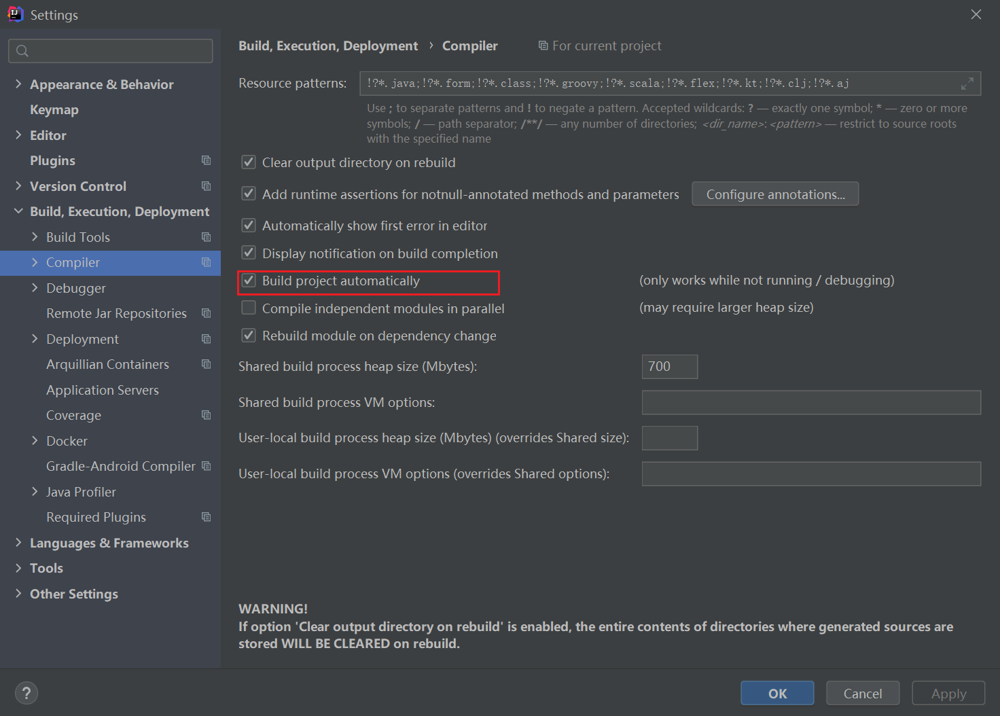
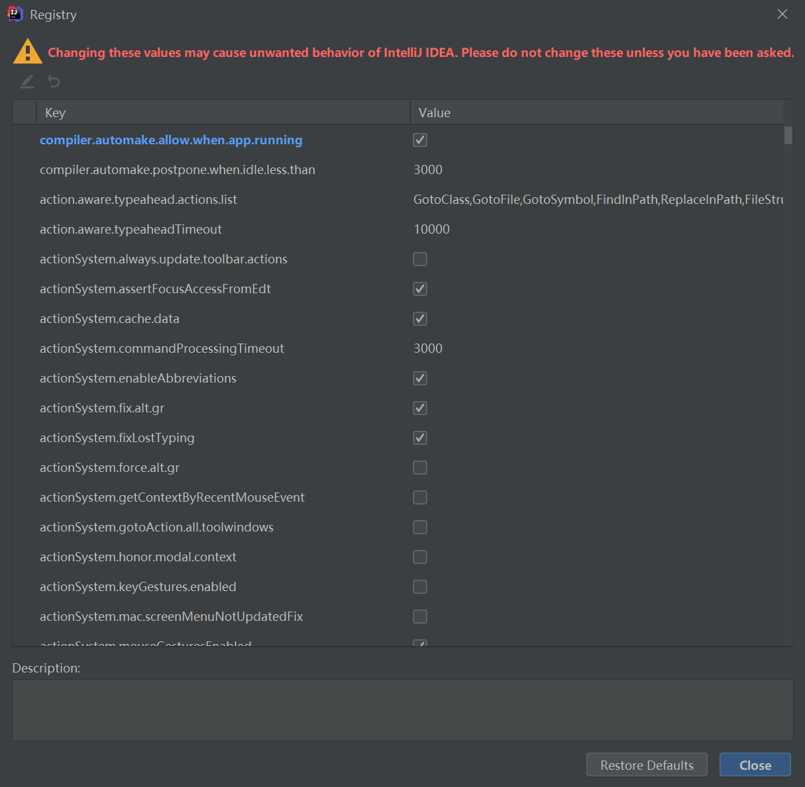
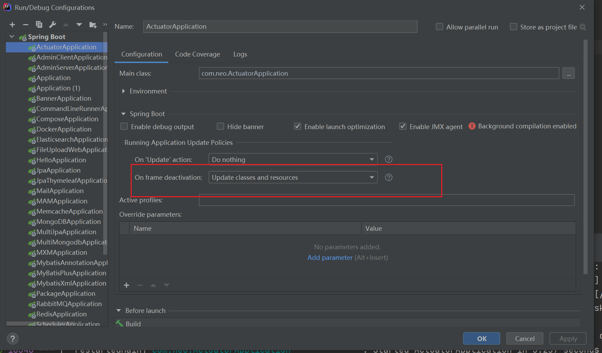

## springboot热部署idea

#### 1.添加依赖

```java
<!--devtools热部署-->
<dependency>
   <groupId>org.springframework.boot</groupId>
   <artifactId>spring-boot-devtools</artifactId>
   <optional>true</optional>
</dependency>

<build>
   <plugins>
      <plugin>
         <groupId>org.springframework.boot</groupId>
         <artifactId>spring-boot-maven-plugin</artifactId>
         <configuration>
            <fork>true</fork>
         </configuration>
      </plugin>
   </plugins>
</build>
```

#### 2、File->setting：



#### 3.ctrl+alt+shift+/ 就会出来Registry...



#### 4.如果不成功，请检查一下是否勾选



