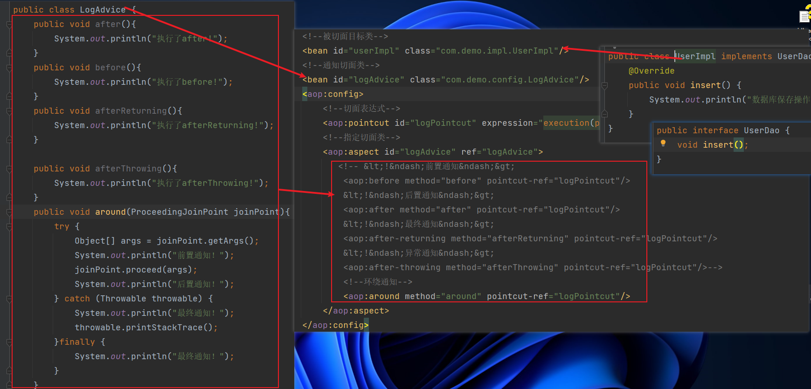
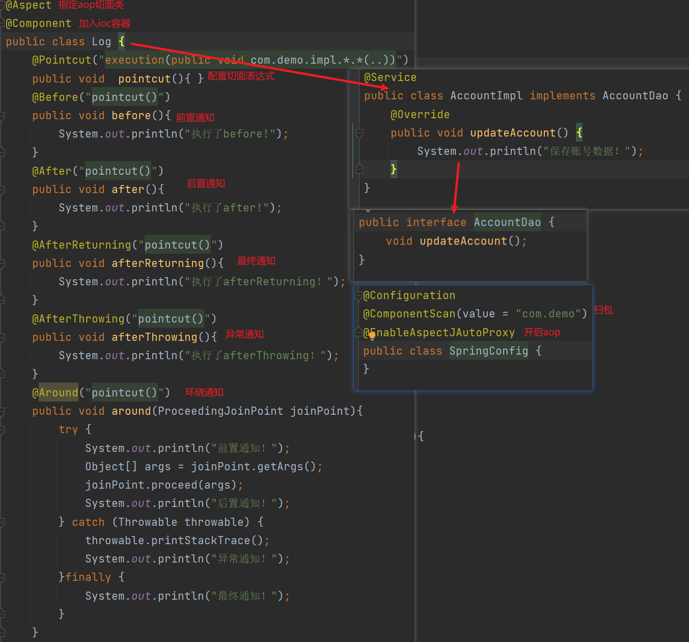

## spring 配置aop

#### 1.引入maven坐标

```java
//解析切面表达式
<dependency>
    <groupId>org.aspectj</groupId>
    <artifactId>aspectjweaver</artifactId>
    <version>1.9.6</version>
</dependency>
<dependency>
    <groupId>org.springframework</groupId>
    <artifactId>spring-context</artifactId>
    <version>5.3.5</version>
</dependency>
```

#### 2.aop概念

Aspect（切面）： Aspect 声明类似于 Java 中的类声明，在 Aspect 中会包含着一些 Pointcut 以及相应的 Advice。

Joint point（连接点）：表示在程序中明确定义的点，典型的包括方法调用，对类成员的访问以及异常处理程序块的执行等等，它自身还可以嵌套其它 joint point。

Pointcut（切点）：表示一组 joint point，这些 joint point 或是通过逻辑关系组合起来，或是通过通配、正则表达式等方式集中起来，它定义了相应的 Advice 将要发生的地方。

Advice（增强）：Advice 定义了在 Pointcut 里面定义的程序点具体要做的操作，它通过 before、after 和 around 来区别是在每个 joint point 之前、之后还是代替执行的代码。

Target（目标对象）：织入 Advice 的目标对象.。

Weaving（织入）：将 Aspect 和其他对象连接起来, 并创建 Adviced object 的过程

#### 3.切入表达式

execution(修饰符  返回值  包.类.方法名(参数) throws异常)

public void com.demo.impl.AccountImpl.updateAccount(int)

public * com.demo.impl.AccountImpl.*(..)


#### 4.通知类型


before: 在方法执行前执行

after：在方法执行后执行

after-returning : 不管发生什么异常都要执行

after-throwing : 发生异常后执行

around: 包含before、after、after-returning after-throwing


#### 5.基于xml配置



```java
<!--被切面目标类-->
<bean id="userImpl" class="com.demo.impl.UserImpl"/>
<!--通知切面类-->
<bean id="logAdvice" class="com.demo.config.LogAdvice"/>
<aop:config>
    <!--切面表达式-->
    <aop:pointcut id="logPointcut" expression="execution(public * com.demo.impl.UserImpl.*(..))"/>
    <!--指定切面类-->
    <aop:aspect id="logAdvice" ref="logAdvice">
       <!-- &lt;!&ndash;前置通知&ndash;&gt;
        <aop:before method="before" pointcut-ref="logPointcut"/>
        &lt;!&ndash;后置通知&ndash;&gt;
        <aop:after method="after" pointcut-ref="logPointcut"/>
        &lt;!&ndash;最终通知&ndash;&gt;
        <aop:after-returning method="afterReturning" pointcut-ref="logPointcut"/>
        &lt;!&ndash;异常通知&ndash;&gt;
        <aop:after-throwing method="afterThrowing" pointcut-ref="logPointcut"/>-->
        <!--环绕通知-->
        <aop:around method="around" pointcut-ref="logPointcut"/>
    </aop:aspect>
</aop:config>
```

#### 6.基于注解配置



```java
@Aspect
@Component
public class Log {
    @Pointcut("execution(public void com.demo.impl.*.*(..))")
    public void  pointcut(){ }
    @Before("pointcut()")
    public void before(){
        System.out.println("执行了before!");
    }
    @After("pointcut()")
    public void after(){
        System.out.println("执行了after!");
    }
    @AfterReturning("pointcut()")
    public void afterReturning(){
        System.out.println("执行了afterReturning！");
    }
    @AfterThrowing("pointcut()")
    public void afterThrowing(){
        System.out.println("执行了afterThrowing！");
    }
    @Around("pointcut()")
    public void around(ProceedingJoinPoint joinPoint){
        try {
            System.out.println("前置通知！");
            Object[] args = joinPoint.getArgs();
            joinPoint.proceed(args);
            System.out.println("后置通知！");
        } catch (Throwable throwable) {
            throwable.printStackTrace();
            System.out.println("异常通知！");
        }finally {
            System.out.println("最终通知！");
        }
    }
}
```

