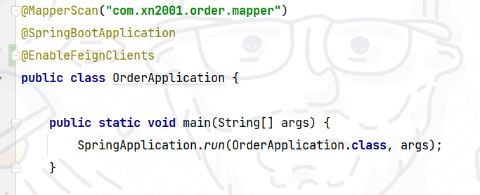
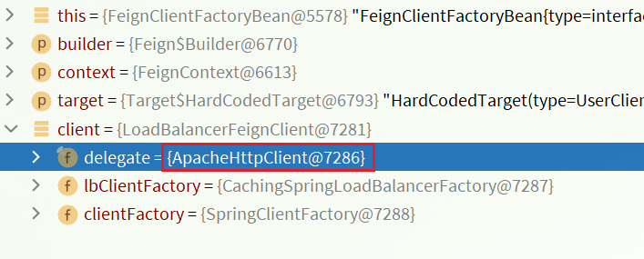

## Feign远程调用

我们以前利用 RestTemplate 发起远程调用的代码：


- 代码可读性差，编程体验不统一

- 参数复杂URL难以维护

Feign 是一个声明式的 http 客户端，官方地址：https://github.com/OpenFeign/feign

其作用就是帮助我们优雅的实现 http 请求的发送，解决上面提到的问题。

Feign使用

引入依赖

我们在 order-service 引入 feign 依赖：

```java
<dependency>
    <groupId>org.springframework.cloud</groupId>
    <artifactId>spring-cloud-starter-openfeign</artifactId>
</dependency>
```

添加注解

在 order-service 启动类添加注解开启 Feign



请求接口

在 order-service 中新建一个接口，内容如下

```java
package cn.itcast.order.client;

import cn.itcast.order.pojo.User;
import org.springframework.cloud.openfeign.FeignClient;
import org.springframework.web.bind.annotation.GetMapping;
import org.springframework.web.bind.annotation.PathVariable;

@FeignClient("userservice")
public interface UserClient {
    @GetMapping("/user/{id}")
    User findById(@PathVariable("id") Long id);
}
```

@FeignClient("userservice")：其中参数填写的是微服务名

@GetMapping("/user/{id}")：其中参数填写的是请求路径

这个客户端主要是基于 SpringMVC 的注解 @GetMapping 来声明远程调用的信息

Feign 可以帮助我们发送 http 请求，无需自己使用 RestTemplate 来发送了。

测试

```java
@Autowired
private UserClient userClient;

public Order queryOrderAndUserById(Long orderId) {
    // 1.查询订单
    Order order = orderMapper.findById(orderId);
    // TODO: 2021/8/20 使用feign远程调用
    User user = userClient.findById(order.getUserId());
    // 3. 将用户信息封装进订单
    order.setUser(user);
    // 4.返回
    return order;
}
```

自定义配置

Feign 可以支持很多的自定义配置，如下表所示：

| 类型 | 作用 | 说明 |
| - | - | - |
| feign.Logger.Level | 修改日志级别 | 包含四种不同的级别：NONE、BASIC、HEADERS、FULL |
| feign.codec.Decoder | 响应结果的解析器 | http远程调用的结果做解析，例如解析json字符串为java对象 |
| feign.codec.Encoder | 请求参数编码 | 将请求参数编码，便于通过http请求发送 |
| feign.Contract | 支持的注解格式 | 默认是SpringMVC的注解 |
| feign.Retryer | 失败重试机制 | 请求失败的重试机制，默认是没有，不过会使用Ribbon的重试 |


一般情况下，默认值就能满足我们使用，如果要自定义时，只需要创建自定义的 @Bean 覆盖默认 Bean 即可。下面以日志为例来演示如何自定义配置。

基于配置文件修改 feign 的日志级别可以针对单个服务：

```java
feign:  
  client:
    config: 
      userservice: # 针对某个微服务的配置
        loggerLevel: FULL #  日志级别 
```

也可以针对所有服务：

```java
feign:  
  client:
    config: 
      default: # 这里用default就是全局配置，如果是写服务名称，则是针对某个微服务的配置
        loggerLevel: FULL #  日志级别 
```

而日志的级别分为四种：

- NONE：不记录任何日志信息，这是默认值。

- BASIC：仅记录请求的方法，URL以及响应状态码和执行时间

- HEADERS：在BASIC的基础上，额外记录了请求和响应的头信息

- FULL：记录所有请求和响应的明细，包括头信息、请求体、元数据

也可以基于 Java 代码来修改日志级别，先声明一个类，然后声明一个 Logger.Level 的对象

```java
public class DefaultFeignConfiguration  {
    @Bean
    public Logger.Level feignLogLevel(){
        return Logger.Level.BASIC; // 日志级别为BASIC
    }
}
```

如果要全局生效，将其放到启动类的 @EnableFeignClients 这个注解中：

```java
@EnableFeignClients(defaultConfiguration = DefaultFeignConfiguration .class) 
```

如果是局部生效，则把它放到对应的 @FeignClient 这个注解中：

```java
@FeignClient(value = "userservice", configuration = DefaultFeignConfiguration .class) 
```

性能优化

Feign 底层发起 http 请求，依赖于其它的框架。其底层客户端实现有：

- URLConnection：默认实现，不支持连接池

- Apache HttpClient ：支持连接池

- OKHttp：支持连接池

因此提高 Feign 性能的主要手段就是使用连接池代替默认的 URLConnection

另外，日志级别应该尽量用 basic/none，可以有效提高性能。

这里我们用 Apache 的HttpClient来演示连接池。

在 order-service 的 pom 文件中引入 HttpClient 依赖

```java
<!--httpClient的依赖 -->
<dependency>
    <groupId>io.github.openfeign</groupId>
    <artifactId>feign-httpclient</artifactId>
</dependency>
```

配置连接池

在 order-service 的 application.yml 中添加配置

```java
feign:
  client:
    config:
      default: # default全局的配置
        loggerLevel: BASIC # 日志级别，BASIC就是基本的请求和响应信息
  httpclient:
    enabled: true # 开启feign对HttpClient的支持
    max-connections: 200 # 最大的连接数
    max-connections-per-route: 50 # 每个路径的最大连接数
```

在 FeignClientFactoryBean 中的 loadBalance 方法中打断点


Debug 方式启动 order-service 服务，可以看到这里的 client，底层就是 HttpClient



最佳实践

继承方式

一样的代码可以通过继承来共享：

2）Feign 客户端、Controller 都集成该接口


优点

- 简单

- 实现了代码共享

缺点

- 服务提供方、服务消费方紧耦合

- 参数列表中的注解映射并不会继承，因此 Controller 中必须再次声明方法、参数列表、注解