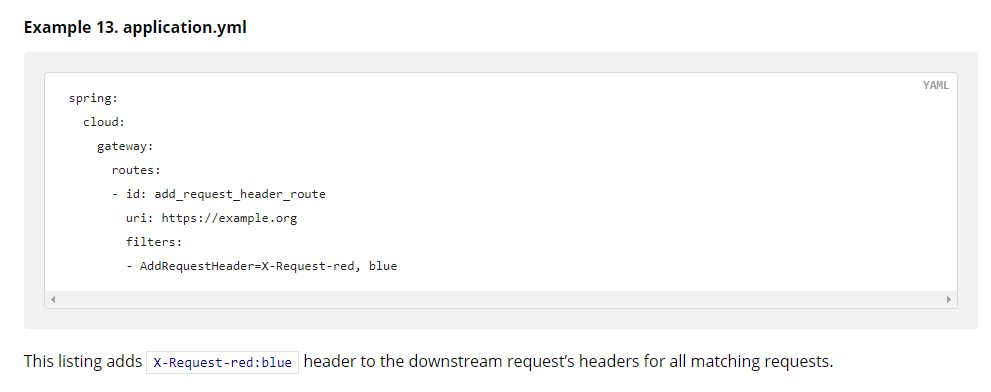

## Gateway网关

入门使用

1. 创建 SpringBoot 工程 gateway，引入网关依赖

1. 编写启动类

1. 编写基础配置和路由规则

1. 启动网关服务进行测试

```xml
<!--网关-->
<dependency>
    <groupId>org.springframework.cloud</groupId>
    <artifactId>spring-cloud-starter-gateway</artifactId>
</dependency>
<!--nacos服务发现依赖-->
<dependency>
    <groupId>com.alibaba.cloud</groupId>
    <artifactId>spring-cloud-starter-alibaba-nacos-discovery</artifactId>
</dependency>
```

创建 application.yml 文件，内容如下：

```xaml
server:
  port: 10010 # 网关端口
spring:
  application:
    name: gateway # 服务名称
  cloud:
    nacos:
      server-addr: localhost:8848 # nacos地址
    gateway:
      routes: # 网关路由配置
        - id: user-service # 路由id，自定义，只要唯一即可
          # uri: http://127.0.0.1:8081 # 路由的目标地址 http就是固定地址
          uri: lb://userservice # 路由的目标地址 lb就是负载均衡，后面跟服务名称
          predicates: # 路由断言，也就是判断请求是否符合路由规则的条件
            - Path=/user/** # 这个是按照路径匹配，只要以/user/开头就符合要求
          filters:
        	- RewritePath=/red/?(?<segment>.*), /$\{segment}
```

我们将符合Path 规则的一切请求，都代理到 uri参数指定的地址。

上面的例子中，我们将 /user/** 开头的请求，代理到 lb://userservice，其中 lb 是负载均衡(LoadBalance)，根据服务名拉取服务列表，实现负载均衡。

重启网关，访问 http://localhost:10010/user/1 时，符合 /user/** 规则，请求转发到 uri：http://userservice/user/1


多个 predicates 的话，要同时满足规则，下文有例子。

流程图


路由配置包括：

1. 路由id：路由的唯一标示

1. 路由目标（uri）：路由的目标地址，http代表固定地址，lb代表根据服务名负载均衡

1. 路由断言（predicates）：判断路由的规则

1. 路由过滤器（filters）：对请求或响应做处理

断言工厂

我们在配置文件中写的断言规则只是字符串，这些字符串会被 Predicate Factory 读取并处理，转变为路由判断的条件。

例如 Path=/user/** 是按照路径匹配，这个规则是由

org.springframework.cloud.gateway.handler.predicate.PathRoutePredicateFactory 类来处理的，像这样的断言工厂在 Spring Cloud Gateway 还有十几个

| 名称 | 说明 | 示例 |
| - | - | - |
| After | 是某个时间点后的请求 | - After=2037-01-20T17:42:47.789-07:00[America/Denver] |
| Before | 是某个时间点之前的请求 | - Before=2031-04-13T15:14:47.433+08:00[Asia/Shanghai] |
| Between | 是某两个时间点之前的请求 | - Between=2037-01-20T17:42:47.789-07:00[America/Denver], 2037-01-21T17:42:47.789-07:00[America/Denver] |
| Cookie | 请求必须包含某些cookie | - Cookie=chocolate, ch.p |
| Header | 请求必须包含某些header | - Header=X-Request-Id, d+ |
| Host | 请求必须是访问某个host（域名） | - Host=\*\*.somehost.org, \*\*.anotherhost.org |
| Method | 请求方式必须是指定方式 | - Method=GET,POST |
| Path | 请求路径必须符合指定规则 | - Path=/red/{segment},/blue/\*\* |
| Query | 请求参数必须包含指定参数 | - Query=name, Jack或者- Query=name |
| RemoteAddr | 请求者的ip必须是指定范围 | - RemoteAddr=192.168.1.1/24 |
| Weight | 权重处理 |  |


官方文档：https://docs.spring.io/spring-cloud-gateway/docs/current/reference/html/#gateway-request-predicates-factories

一般的，我们只需要掌握 Path，加上官方文档的例子，就可以应对各种工作场景了。

```java
predicates:
  - Path=/order/**
  - After=2031-04-13T15:14:47.433+08:00[Asia/Shanghai]
```

像这样的规则，现在是 2021年8月22日01:32:42，很明显 After 条件不满足，可以不会转发，路由不起作用。

过滤器工厂

GatewayFilter 是网关中提供的一种过滤器，可以对进入网关的请求和微服务返回的响应做处理。


Spring提供了31种不同的路由过滤器工厂。

官方文档：https://docs.spring.io/spring-cloud-gateway/docs/current/reference/html/#gatewayfilter-factories

| 名称 | 说明 |
| - | - |
| AddRequestHeader | 给当前请求添加一个请求头 |
| RemoveRequestHeader | 移除请求中的一个请求头 |
| AddResponseHeader | 给响应结果中添加一个响应头 |
| RemoveResponseHeader | 从响应结果中移除有一个响应头 |
| RequestRateLimiter | 限制请求的流量 |


下面我们以 AddRequestHeader 为例：



需求：给所有进入 userservice 的请求添加一个请求头：sign=xn2001.com is eternal

只需要修改 gateway 服务的 application.yml文件，添加路由过滤即可。

```java
spring:
  cloud:
    gateway:
      routes: # 网关路由配置
        - id: user-service # 路由id，自定义，只要唯一即可
          # uri: http://127.0.0.1:8081 # 路由的目标地址 http就是固定地址
          uri: lb://userservice # 路由的目标地址 lb就是负载均衡，后面跟服务名称
          predicates: # 路由断言，也就是判断请求是否符合路由规则的条件
            - Path=/user/** # 这个是按照路径匹配，只要以/user/开头就符合要求
          filters:
            - AddRequestHeader=sign, xn2001.com is eternal # 添加请求头
```

如何验证，我们修改 userservice 中的一个接口

```java
@GetMapping("/{id}")
public User queryById(@PathVariable("id") Long id, @RequestHeader(value = "sign", required = false) String sign) {
    log.warn(sign);
    return userService.queryById(id);
}
```

重启两个服务，访问：http://localhost:10010/user/1

可以看到控制台打印出了这个请求头


当然，Gateway 也是有全局过滤器的，如果要对所有的路由都生效，则可以将过滤器工厂写到 default-filters 下：

```java
spring:
  cloud:
    gateway:
      default-filters:
        - AddRequestHeader=sign, xn2001.com is eternal # 添加请求头
```

全局过滤器

上面介绍的过滤器工厂，网关提供了 31 种，但每一种过滤器的作用都是固定的。如果我们希望拦截请求，做自己的业务逻辑则没办法实现。

全局过滤器的作用也是处理一切进入网关的请求和微服务响应，与 GatewayFilter 的作用一样。区别在于 GlobalFilter 的逻辑可以写代码来自定义规则；而 GatewayFilter 通过配置定义，处理逻辑是固定的。

需求：定义全局过滤器，拦截请求，判断请求的参数是否满足下面条件

- 参数中是否有 authorization

- authorization 参数值是否为 admin

如果同时满足则放行，否则拦截。

```java
@Component
public class AuthorizeFilter implements GlobalFilter, Ordered {

    // 测试：http://localhost:10010/order/101?authorization=admin
    @Override
    public Mono<Void> filter(ServerWebExchange exchange, GatewayFilterChain chain) {
        // 获取第一个 authorization 参数
        String authorization = exchange.getRequest().getQueryParams().getFirst("authorization");
        if ("admin".equals(authorization)){
            // 放行
            return chain.filter(exchange);
        }
        // 设置拦截状态码信息
        exchange.getResponse().setStatusCode(HttpStatus.UNAUTHORIZED);
        // 设置拦截
        return exchange.getResponse().setComplete();
    }

    // 设置过滤器优先级，值越低优先级越高
    // 也可以使用 @Order 注解
    @Override
    public int getOrder() {
        return 0;
    }
}
```

过滤器顺序

请求进入网关会碰到三类过滤器：DefaultFilter、当前路由的过滤器、GlobalFilter；

请求路由后，会将三者合并到一个过滤器链（集合）中，排序后依次执行每个过滤器.


排序的规则是什么呢？

- 每一个过滤器都必须指定一个 int 类型的 order 值，order 值越小，优先级越高，执行顺序越靠前。

- GlobalFilter 通过实现 Ordered 接口，或者使用 @Order 注解来指定 order 值，由我们自己指定。

- 路由过滤器和 defaultFilter 的 order 由 Spring 指定，默认是按照声明顺序从1递增。

- 当过滤器的 order 值一样时，会按照 defaultFilter > 路由过滤器 > GlobalFilter 的顺序执行。

跨域问题

不了解跨域问题的同学可以百度了解一下；在 Gateway 网关中解决跨域问题还是比较方便的。

```java
spring:
  cloud:
    gateway:
      globalcors: # 全局的跨域处理
        add-to-simple-url-handler-mapping: true # 解决options请求被拦截问题
        corsConfigurations:
          '[/**]':
            allowedOrigins: # 允许哪些网站的跨域请求 allowedOrigins: “*” 允许所有网站
              - "http://localhost:8090"
            allowedMethods: # 允许的跨域ajax的请求方式
              - "GET"
              - "POST"
              - "DELETE"
              - "PUT"
              - "OPTIONS"
            allowedHeaders: "*" # 允许在请求中携带的头信息
            allowCredentials: true # 是否允许携带cookie
            maxAge: 360000 # 这次跨域检测的有效期
```

