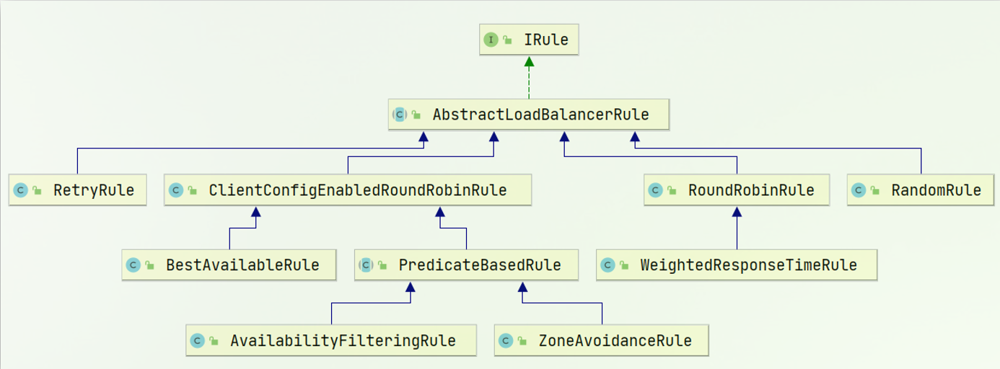
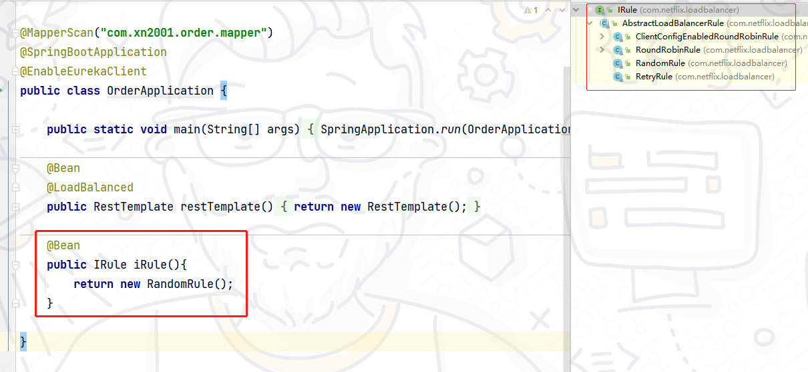
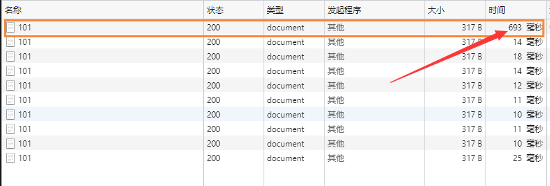

## Ribbon 负载均衡

我们添加了 @LoadBalanced 注解，即可实现负载均衡功能

SpringCloud 底层提供了一个名为 Ribbon 的组件，来实现负载均衡功能。


SpringCloud Ribbon 底层采用了一个拦截器，拦截了 RestTemplate 发出的请求，对地址做了修改。

基本流程如下：

- 拦截我们的 RestTemplate 请求 http://userservice/user/1

- RibbonLoadBalancerClient 会从请求url中获取服务名称，也就是 user-service

- DynamicServerListLoadBalancer 根据 user-service 到 eureka 拉取服务列表

- eureka 返回列表，localhost:8081、localhost:8082

- IRule 利用内置负载均衡规则，从列表中选择一个，例如 localhost:8081

- RibbonLoadBalancerClient 修改请求地址，用 localhost:8081 替代 userservice，得到 http://localhost:8081/user/1，发起真实请求

负载均衡策略

负载均衡的规则都定义在 IRule 接口中，而 IRule 有很多不同的实现类：



不同规则的含义如下：

| 内置负载均衡规则类 | 规则描述 |
| - | - |
| RoundRobinRule | 简单轮询服务列表来选择服务器。它是Ribbon默认的负载均衡规则。 |
| AvailabilityFilteringRule | 对以下两种服务器进行忽略：（1）在默认情况下，这台服务器如果3次连接失败，这台服务器就会被设置为&quot;短路”状态。短路状态将持续30秒，如果再次连接失败，短路的持续时间就会几何级地增加。 （2）并发数过高的服务器。如果一个服务器的并发连接数过高，配置了AvailabilityFilteringRule 规则的客户端也会将其忽略。并发连接数的上限，可以由客户端设置。 |
| WeightedResponseTimeRule | 为每一个服务器赋予一个权重值。服务器响应时间越长，这个服务器的权重就越小。这个规则会随机选择服务器，这个权重值会影响服务器的选择。 |
| ZoneAvoidanceRule | 以区域可用的服务器为基础进行服务器的选择。使用Zone对服务器进行分类，这个Zone可以理解为一个机房、一个机架等。而后再对Zone内的多个服务做轮询。 |
| BestAvailableRule | 忽略那些短路的服务器，并选择并发数较低的服务器。 |
| RandomRule | 随机选择一个可用的服务器。 |
| RetryRule | 重试机制的选择逻辑 |


默认的实现就是 ZoneAvoidanceRule，是一种轮询方案。

自定义策略

通过定义 IRule 实现可以修改负载均衡规则，有两种方式：

1 代码方式在 order-service 中的 OrderApplication 类中，定义一个新的 IRule：



2 配置文件方式：在 order-service 的 application.yml 文件中，添加新的配置也可以修改规则：

```java
userservice: # 给需要调用的微服务配置负载均衡规则，orderservice服务去调用userservice服务
  ribbon:
    NFLoadBalancerRuleClassName: com.netflix.loadbalancer.RandomRule # 负载均衡规则 
```

注意：一般用默认的负载均衡规则，不做修改。

饥饿加载

当我们启动 orderservice，第一次访问时，时间消耗会大很多，这是因为 Ribbon 懒加载的机制。



Ribbon 默认是采用懒加载，即第一次访问时才会去创建 LoadBalanceClient，拉取集群地址，所以请求时间会很长。

而饥饿加载则会在项目启动时创建 LoadBalanceClient，降低第一次访问的耗时，通过下面配置开启饥饿加载：

```java
ribbon:
  eager-load:
    enabled: true
    clients: userservice # 项目启动时直接去拉取userservice的集群，多个用","隔开
```

