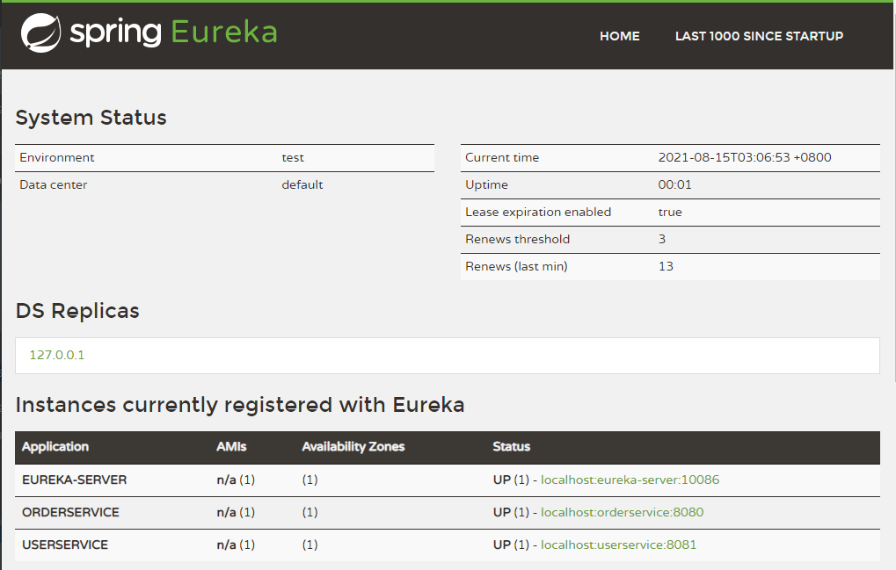
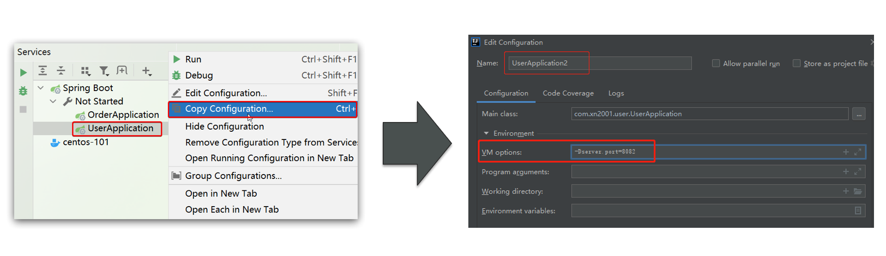
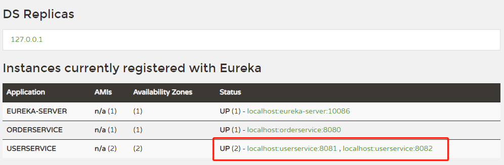

## 搭建 eureka

引入 SpringCloud 为 eureka 提供的 starter 依赖，注意这里是用 server

```java
<dependency>
    <groupId>org.springframework.cloud</groupId>
    <artifactId>spring-cloud-starter-netflix-eureka-server</artifactId>
</dependency>
```

编写启动类

注意要添加一个 @EnableEurekaServer 注解，开启 eureka 的注册中心功能

```java
package com.xn2001.eureka;

import org.springframework.boot.SpringApplication;
import org.springframework.boot.autoconfigure.SpringBootApplication;
import org.springframework.cloud.netflix.eureka.server.EnableEurekaServer;

@SpringBootApplication
@EnableEurekaServer
public class EurekaApplication {
    public static void main(String[] args) {
        SpringApplication.run(EurekaApplication.class, args);
    }
}
```

编写配置文件

编写一个 application.yml 文件，内容如下：

```java
server:
  port: 10086
spring:
  application:
    name: eureka-server
eureka:
  client:
    service-url: 
      defaultZone: http://127.0.0.1:10086/eureka
```

其中 default-zone 是因为前面配置类开启了注册中心所需要配置的 eureka 的地址信息，因为 eureka 本身也是一个微服务，这里也要将自己注册进来，当后面 eureka 集群时，这里就可以填写多个，使用 “,” 隔开。

启动完成后，访问 http://localhost:10086/


服务注册

将 user-service、order-service 都注册到 eureka

引入 SpringCloud 为 eureka 提供的 starter 依赖，注意这里是用 client

```java
<dependency>
    <groupId>org.springframework.cloud</groupId>
    <artifactId>spring-cloud-starter-netflix-eureka-client</artifactId>
</dependency>
```

在启动类上添加注解：@EnableEurekaClient

在 application.yml 文件，添加下面的配置：

```java
spring:
  application:
      #name：orderservice
    name: userservice
eureka:
  client:
    service-url: 
      defaultZone: http:127.0.0.1:10086/eureka
```

3个项目启动后，访问 http://localhost:10086/



这里另外再补充个小技巧，我们可以通过 idea 的多实例启动，来查看 Eureka 的集群效果。



4个项目启动后，访问 http://localhost:10086/



