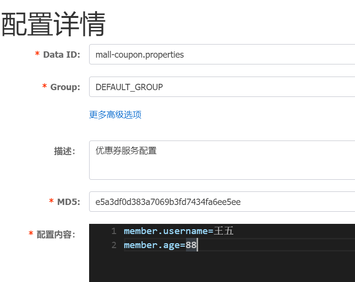

## nacos注册中心

#### 1.maven依赖

```xml
<dependency>
   <groupId>com.alibaba.cloud</groupId>
   <artifactId>spring-cloud-starter-alibaba-nacos-config</artifactId>
</dependency>
```

#### 2.新建/resources/bootstrap.application

```properties
spring.application.name=mall-coupon
spring.cloud.nacos.config.server-addr=127.0.0.1:8848
```

#### 3.在nacos server上配置`Data ID`=`mall-coupon` + `.properties`的配置文件

​	

#### 4.更多配置项

| 配置项                   | key                                       | 默认值                     | 说明                                                         |
| ------------------------ | ----------------------------------------- | -------------------------- | ------------------------------------------------------------ |
| 服务端地址               | spring.cloud.nacos.config.server-addr     |                            | 服务器ip和端口                                               |
| DataId前缀               | spring.cloud.nacos.config.prefix          | ${spring.application.name} | DataId的前缀，默认值为应用名称                               |
| Group                    | spring.cloud.nacos.config.group           | DEFAULT_GROUP              | 分组信息                                                     |
| DataId后缀及内容文件格式 | spring.cloud.nacos.config.file-extension  | properties                 | DataId的后缀，，支持 properties和yml                         |
| 配置内容的编码方式       | spring.cloud.nacos.config.encode          | UTF-8                      | 配置的编码                                                   |
| 获取配置的超时时间       | spring.cloud.nacos.config.timeout         | 3000                       | 单位为 ms                                                    |
| 配置的命名空间           | spring.cloud.nacos.config.namespace       |                            | 常用场景之一是不同环境的配置的区分隔离，例如开发测试环境和生产环境的资源隔离等。 |
| AccessKey                | spring.cloud.nacos.config.access-key      |                            |                                                              |
| SecretKey                | spring.cloud.nacos.config.secret-key      |                            |                                                              |
| 相对路径                 | spring.cloud.nacos.config.context-path    |                            | 服务端 API 的相对路径                                        |
| 接入点                   | spring.cloud.nacos.config.endpoint        |                            | 地域的某个服务的入口域名，通过此域名可以动态地拿到服务端地址 |
| 是否开启监听和自动刷新   | spring.cloud.nacos.config.refresh-enabled | true                       |                                                              |
| 集群服务名               | spring.cloud.nacos.config.cluster-name    |                            |                                                              |

