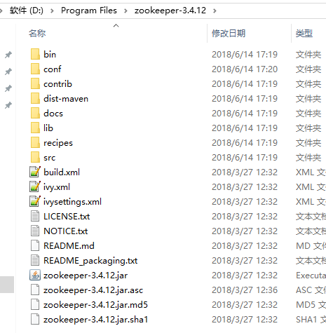
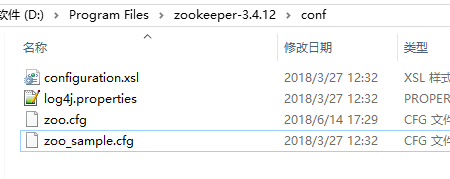
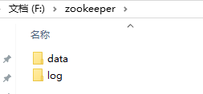
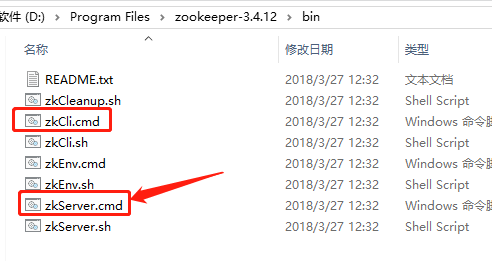
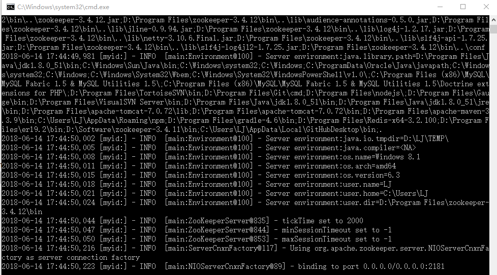
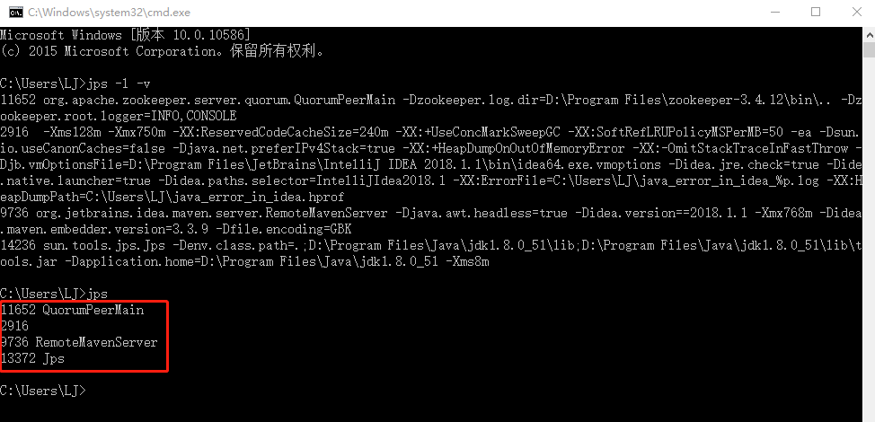
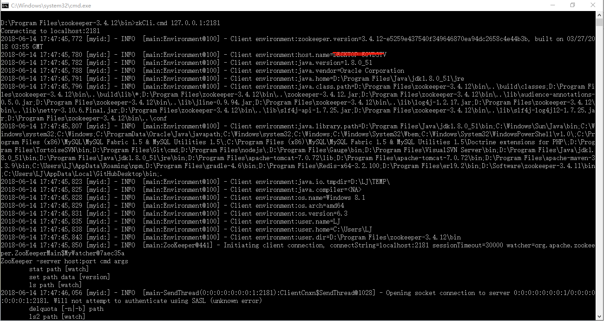

## zookeeper 安装

Spring cloud系列之win10 下安装 ZooKeeper 的方法

ZooKeeper 下载地址： 

https://mirrors.tuna.tsinghua.edu.cn/apache/zookeeper/

1.将下载的文件解压到指定的目录中

2.进入conf文件夹,里面有个zoo_sample.cfg,复制一份改名为zoo.cfg

3.编辑zoo.cfg文件,填入如下内容：

tickTime=2000
initLimit=10
syncLimit=5
dataDir=\data
dataLogDir=\log
clientPort=2181
server.1=localhost:2287:3387

配置文件简单解析

- 1、tickTime：这个时间是作为 Zookeeper 服务器之间或客户端与服务器之间维持心跳的时间间隔，也就是每个 tickTime 时间就会发送一个心跳

- 2、dataDir：顾名思义就是 Zookeeper 保存数据的目录，默认情况下，Zookeeper 将写数据的日志文件也保存在这个目录里

- 3、dataLogDir：顾名思义就是 Zookeeper 保存日志文件的目录

- 4、clientPort：这个端口就是客户端连接 Zookeeper 服务器的端口，Zookeeper 会监听这个端口，接受客户端的访问请求

 

4.进入bin目录，并且双击zkServer.cmd，这个脚本中会启动一个java进程

5.另打开一个cmd,输入jps -l -v ;查看进程

6.可以启动客户端连接一下

zkCli.cmd 127.0.0.1:2181

 