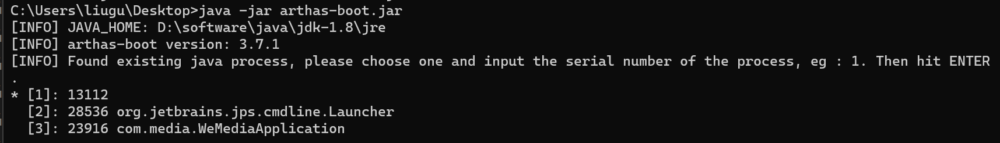
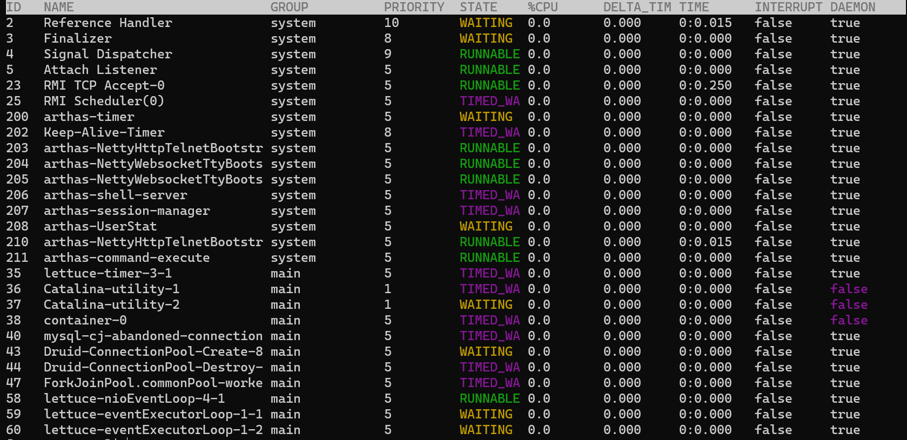
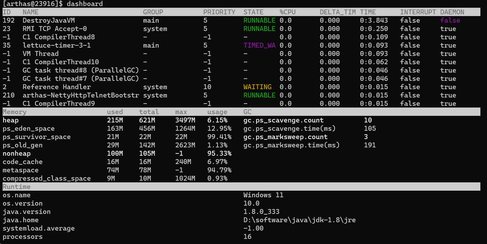
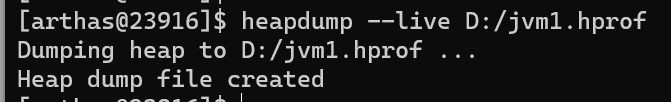

## Arthas(阿尔萨斯)

#### 1.Arthas 介绍

> Arthas 是Alibaba开源的Java诊断工具。安装在系统所在服务器。可以帮助开发人员或者运维人员查找问题，分析性能，bug追踪。
>
> 开源地址：https://github.com/alibaba/arthas
> 官方文档：https://alibaba.github.io/arthas

#### 2.下载

``` sh
# github下载
curl -O https://alibaba.github.io/arthas/arthas-boot.jar

# 码云 Gitee 下载
curl -O https://arthas.gitee.io/arthas-boot.jar
```

#### 3.启动

```sh
java -jar arthas-boot.jar 
```



选择序号并回车

#### 4.常用命令

1. 查看线程的信息

   ```sh
   thread
   ```

   

2. 查看内存使用情况

   ```sh
   dashboard
   ```

   

3. 导出.hprof

   > 可以使用 Memory Analyzer 打开
   >
   > 下载地址: https://eclipse.dev/mat/downloads.php

   ```sh
   heapdump --live D:/jvm.hprof
   ```

   