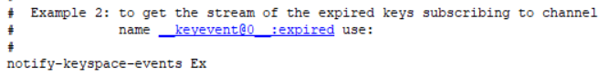

## Redis 通知


> 捕获Redis中过期的Key，解锁新姿势。比如有个用户会员的模块，那么可以在redis添加一个用户会员的有效时Key，然后在Java项目中捕获，处理相关的逻辑。

#### 1.开启Redis Key过期通知的配置

这个配置需要手动开启，Redis默认是关闭的。Redis有两种方式开启该配置：

##### 1.修改配置文件

打开Redis目录下的redis.conf，找到notify-keyspace-events “” ,改成notify-keyspace-events Ex。这里一定要改正确了！




通过上面的注释就可以发现，下方的配置是关于过期key通知的。

##### 2.在redis-cli中更改配置

```java
config set notify-keyspace-events Ex
```

#### 2.修改好配置后在redis-cli.exe中测试是否可以监听过期key

##### 1.打开一个redis-cli.exe，输入命令:

```java
127.0.0.1:6379> PSUBSCRIBE __keyevent@0__:expired
Reading messages... (press Ctrl-C to quit)
1) "psubscribe"
2) "__keyevent@0__:expired"
3) (integer) 1
```

##### 2.再打开一个redis-cli.exe，创建一个过期的key

```java
127.0.0.1:6379> setex t_key 2 t_value
OK
127.0.0.1:6379>
```

如果在监听过期key中的redis-cli里多了过期的key，那么意味着配置正确。

```java
127.0.0.1:6379> PSUBSCRIBE __keyevent@0__:expired
Reading messages... (press Ctrl-C to quit)
1) "psubscribe"
2) "__keyevent@0__:expired"
3) (integer) 1
1) "pmessage"
2) "__keyevent@0__:expired"
3) "__keyevent@0__:expired"
4) "t_key"
```

如果没有这个"t_key"，就要回头看看redis.conf是否配置正确。配置文件中ctrl+f，是否能找到notify-keyspace-events Ex。如果有还没成功，检查配置文件中是否有多余的notify-keyspace-events “”，有则删掉。

#### 3.在java项目中编写一个监听类

```java
/**
 * 监听redis key 过期
 */
public class RedisMessageListener extends KeyExpirationEventMessageListener {

    @Autowired
    private RedisTemplate<String, String> redisTemplate;

    public RedisMessageListener(RedisMessageListenerContainer listenerContainer) {
        super(listenerContainer);
    }

    @Override
    public void onMessage(Message message, byte[] pattern) {

        String redisKey = (String) redisTemplate.getValueSerializer().deserialize(message.getBody());
        //针对特定的key进行处理
        System.out.println(redisKey);
    }
}
```

这里要继承KeyExpirationEventMessageListener 类，然后重写其中的onMessage方法，形参中的message便是是过期的key的Message对象。

```java
@Configuration
public class RedisConfig {
    @Bean
    public RedisMessageListenerContainer redisMessageListenerContainer(RedisConnectionFactory redisConnectionFactory) {
        RedisMessageListenerContainer redisMessageListenerContainer = new RedisMessageListenerContainer();
        redisMessageListenerContainer.setConnectionFactory(redisConnectionFactory);
        return redisMessageListenerContainer;
    }
    
    @Bean
    public RedisMessageListener keyExpiredListener(RedisConnectionFactory redisConnectionFactory) {
        return new RedisMessageListener(this.redisMessageListenerContainer(redisConnectionFactory));
    }
}
```
