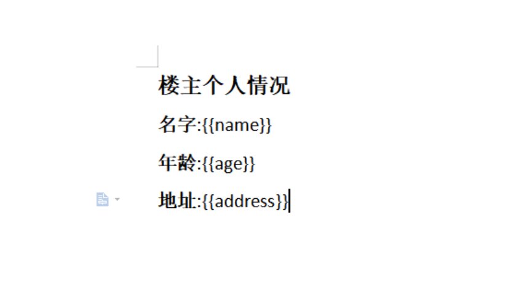
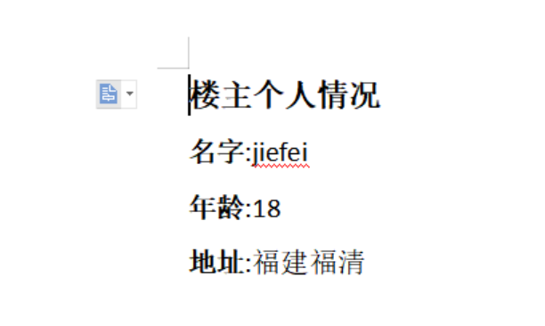
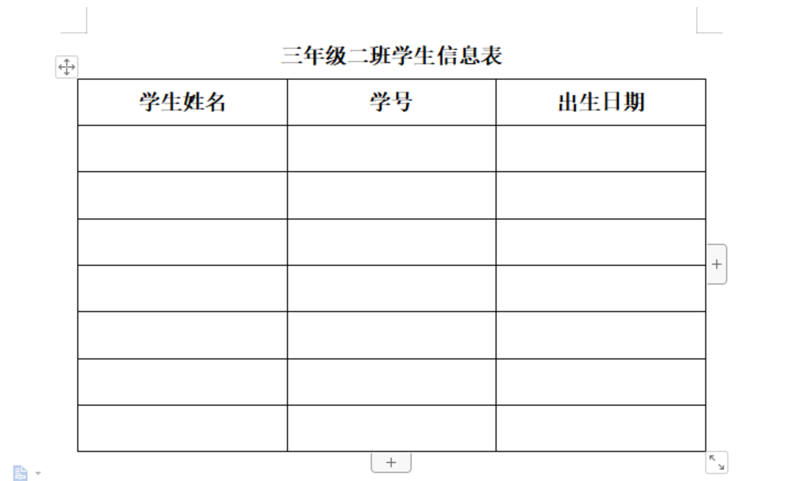
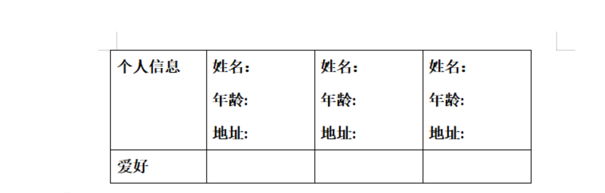
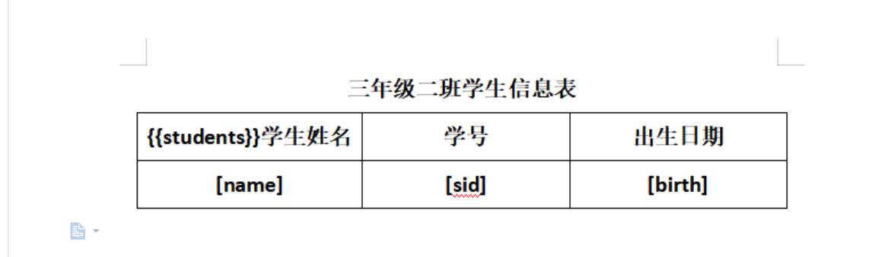
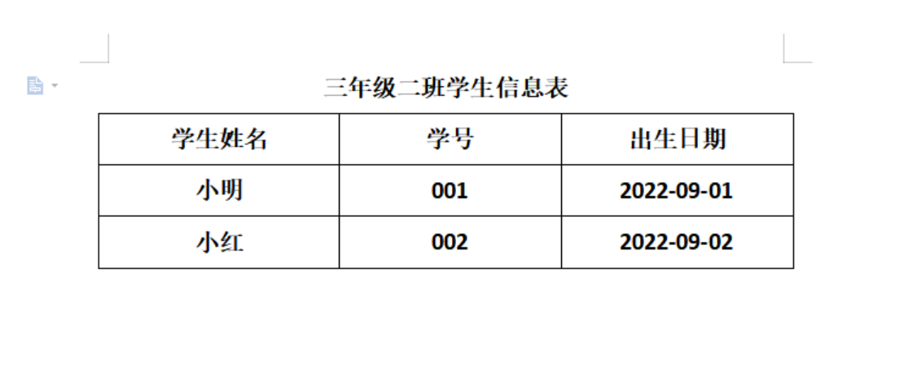
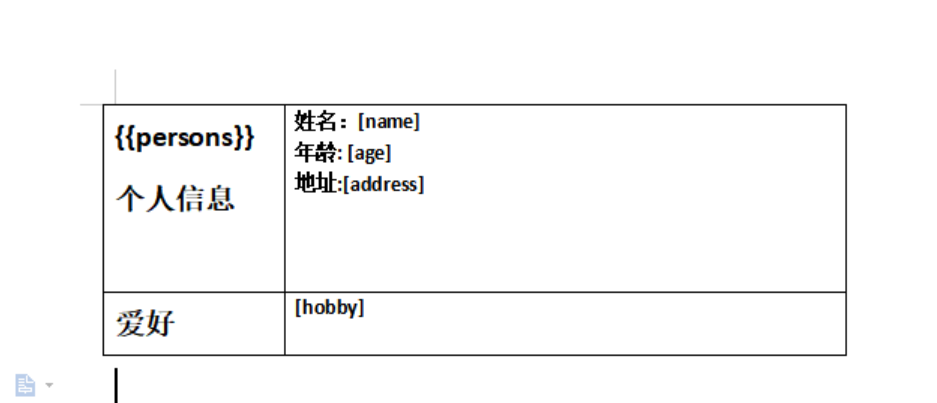
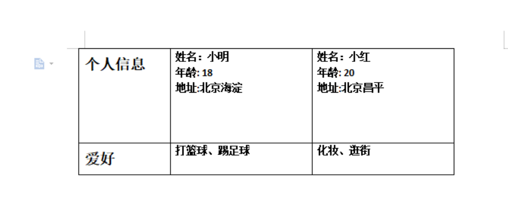
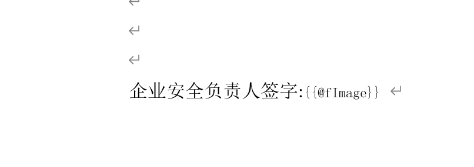
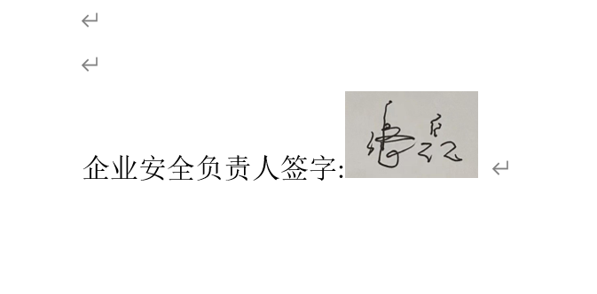

## poi-tl导出Word模板

#### 前言

最近做项目的时候会遇到要求要导出以[docx](https://so.csdn.net/so/search?q=docx&spm=1001.2101.3001.7020)格式结尾的报告文件，于是我就在思考有没有一个比较好用的第三方类库能解决在word上渲染数据的问题。之前也尝试用过`poi`,感觉不大好用，代码比较复杂且没有什么特别好的支持。于是乎在网上搜索了很久，找到了一个第三方组件库还挺好用的，那就是`poi-tl`。

> **poi-tl**是一个基于Apache [POI](https://so.csdn.net/so/search?q=POI&spm=1001.2101.3001.7020)的Word模板引擎，也是一个免费开源的Java类库，你可以非常方便的加入到你的项目中，并且拥有着让人喜悦的特性。

#### 优点

| 方案           | 移植性                       | 功能性                                                  | 易用性                            |
| -------------- | ---------------------------- | ------------------------------------------------------- | --------------------------------- |
| **Poi-tl**     | Java跨平台                   | Word模板引擎，基于Apache POI，提供更友好的API           | 低代码，准备文档模板和数据即可    |
| Apache POI     | Java跨平台                   | Apache项目，封装了常见的文档操作，也可以操作底层XML结构 | 文档不全                          |
| Freemarker     | XML跨平台                    | 仅支持文本，很大的局限性                                | 不推荐，XML结构的代码几乎无法维护 |
| OpenOffice     | 部署OpenOffice，移植性较差   | -                                                       | 需要了解OpenOffice的API           |
| HTML浏览器导出 | 依赖浏览器的实现，移植性较差 | HTML不能很好的兼容Word的格式，样式糟糕                  | -                                 |
| Jacob、winlib  | Windows平台                  | -                                                       | 复杂，完全不推荐使用              |

#### 缺点

只能操作`.docx`格式的word，不能操作`.doc`格式的word。

#### 使用

开发文档参考如下,各种例子都有，比较好上手。

> http://deepoove.com/poi-tl/#example-article

这边我挑几个常用的例子拿出来实践一下，复杂的需要跟着文档学习稍微观摩思考。

##### 引入依赖

要参考官网说明，不然会造成版本不一致，运行的时候会报错。

```xml
<!-- POI -->		
<dependency>
    <groupId>org.apache.poi</groupId>
    <artifactId>poi</artifactId>
    <version>4.1.2</version>
</dependency>
<dependency>
    <groupId>org.apache.poi</groupId>
    <artifactId>poi-ooxml</artifactId>
    <version>4.1.2</version>
</dependency>
<dependency>
    <groupId>org.apache.poi</groupId>
    <artifactId>poi-ooxml-schemas</artifactId>
    <version>4.1.2</version>
</dependency>

<!-- poi-tl -->
<dependency>
    <groupId>com.deepoove</groupId>
    <artifactId>poi-tl</artifactId>
    <version>1.10.0</version>
</dependency>
1234567891011121314151617181920212223
```

##### 渲染普通占位符

这里新建一个很普通的`template1.docx`，内容就是几个简单的占位符，符合场景是工作中有些模板就是固定渲染占位符即可，不需要做任何的改动。



这里我们简单分析一下模板文档可以得到由三个占位符组成，`{{name}}`,`{{age}}`,`{{address}}`。我们很快可以想到要么创建一个`实体类`或者一个`Map`来组装这三个参数，接下来直接看代码。

```java
//===================使用Map的方式================================
//创建目标文件
File sourceFile = new File("c:/test/poi-tl/template1.docx");
//构建数据
Map<String, Object> data = new HashMap();
data.put("name", "jiefei");
data.put("age", "18");
data.put("address", "福建福清");
//创建输出流
OutputStream os = new FileOutputStream("c:/test/poi-tl/template1_out.docx");
//最终编译渲染并输出
XWPFTemplate.compile(sourceFile).render(data).writeAndClose(os);
123456789101112
```



个人觉得这代码量非常少了，而且api的使用非常通俗易懂，另外最关键的是即使你的数据model中没有覆盖模板中的占位符，最终输出的文件里也不会再带有`{{}}`，而是跟`Vue`框架那样，页面不展示任何东西而已。

上面我只是用`Map`演示,你也可以创建一个有`name`,`age`,`address`三个属性的实体类，然后render调用也是可以的。

##### 表格渲染

在实际开发中其实我们会遇见两种表格情况的渲染，一种是`行循环`,一种是`列循环`，很多小伙伴可能一下子不太懂啥意思，接下来我画个图来演示这两种情况。





`行循环`情况其实会比`列循环`情况多，我在项目中很少遇见`列循环`有用到的话最多一列。这里我举的例子可能不那么合乎情理，可以参考官网的例子看一下。

- **行循环实现**

  先创建一个模板

  

```java
@Data
@AllArgsConstructor
public class Student {

    //姓名
    private String name;

    //学号
    private String sid;

    //出生日期
    private String birth;
}
12345678910111213
//创建行循环策略
LoopRowTableRenderPolicy rowTableRenderPolicy = new LoopRowTableRenderPolicy();
//告诉模板引擎，要在students做行循环,绑定行循环策略
Configure configure = Configure.builder().bind("students", rowTableRenderPolicy).build();
//创建目标文件
File sourceFile = new File("c:/test/poi-tl/template2.docx");
//构建数据
Map<String, Object> data = new HashMap();

//1.学生数据
List<Student> students = new ArrayList<>();
Student s1 = new Student("小明", "001", "2022-09-01");
Student s2 = new Student("小红", "002", "2022-09-02");
students.add(s1);
students.add(s2);
//2.设置到students字段中
data.put("students", students);

//创建输出流
OutputStream os = new FileOutputStream("c:/test/poi-tl/template2_out.docx");
//最终编译渲染并输出
XWPFTemplate.compile(sourceFile,configure).render(data).writeAndClose(os);
12345678910111213141516171819202122
```



- **列循环实现**

  先创建列循环模板

  

```java
@AllArgsConstructor
@Data
public class Person {

    //姓名
    private String name;

    //年龄
    private int age;

    //地址
    private String address;

    //爱好
    private String hobby;
}

1234567891011121314151617
//创建行循环策略
LoopColumnTableRenderPolicy rowTableRenderPolicy = new LoopColumnTableRenderPolicy();
//告诉模板引擎，要在students做行循环,绑定行循环策略
Configure configure = Configure.builder().bind("persons", rowTableRenderPolicy).build();
//创建目标文件
File sourceFile = new File("c:/test/poi-tl/template3.docx");
//构建数据
Map<String, Object> data = new HashMap();

//1.学生数据
List<Person> persons = new ArrayList();
Person person1 = new Person("小明",18,"北京海淀", StringUtils.join(Arrays.asList("打篮球","踢足球"),"、"));
Person person2 = new Person("小红",20,"北京昌平", StringUtils.join(Arrays.asList("化妆","逛街"),"、"));
persons.add(person1);
persons.add(person2);

//2.设置到students字段中
data.put("persons", persons);

//创建输出流
OutputStream os = new FileOutputStream("c:/test/poi-tl/template3_out.docx");
//最终编译渲染并输出
XWPFTemplate.compile(sourceFile,configure).render(data).writeAndClose(os);
1234567891011121314151617181920212223
```



- **导出图片**

  ```java
  PictureRenderData pictureRenderData = Pictures.ofBufferedImage(image, PictureType.PNG)
                      .size(100, 100).create();
              data.put("fImage", pictureRenderData);
  ```

  




