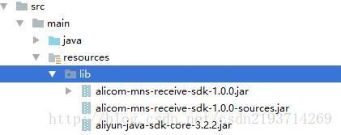

## springboot maven引入本地jar包

问题描述

最近尝试引入阿里云的jar包，idea是可以直接跑调用是没问题的。但是打成jar包部署的时候，项目能跑，但是到关键的调用短信sdk的时候就爆ClassNofFoundException错误。看了很多网上的帖子，很多都说用plugin 中resource来弄，对我的项目一点鸟用也没有。最后还是在stackoverflow上找到了答案，所以做了以下总结。

---

解决

如何引入本地jar包

1.在resources下面新建lib文件夹，并把jar包文件放到这个目录下 

 

2.在pom文件定义几个依赖指向刚才引入的文件

1. <dependency>

1.             <groupId>com.aliyun.alicom</groupId>

1.             <artifactId>alicom-mns-receive-sdk</artifactId>

1.             <version>0.0.1-SNAPSHOT</version>

1.             <scope>system</scope>

1.             <systemPath>${project.basedir}/src/main/resources/lib/alicom-mns-receive-sdk-1.0.0.jar</systemPath>

1.         </dependency>

1.         <dependency>

1.             <groupId>com.aliyun.mns</groupId>

1.             <artifactId>aliyun-sdk-mns</artifactId>

1.             <version>1.1.8</version>

1.             <scope>system</scope>

1.             <systemPath>${project.basedir}/src/main/resources/lib/aliyun-sdk-mns-1.1.8.jar</systemPath>

1.         </dependency>

注意：重点是systemPath这个路径必须得是你jar的路径。其他的按照套路填就行，要求不是太严格。${project.basedir}只是一个系统自己的常量，不用管它

---

如何把项目打成jar，同时把本地jar包也引入进去

直接在maven的pom里给springboot的打包插件引入一下参数就行

<includeSystemScope>true</includeSystemScope>

总体是这样的

1. <build>

1.         <plugins>

1.             <plugin>

1.                 <groupId>org.springframework.boot</groupId>

1.                 <artifactId>spring-boot-maven-plugin</artifactId>

1.                 <configuration>

1.                     <includeSystemScope>true</includeSystemScope>

1.                 </configuration>

1.             </plugin>

1.         </plugins>

1.     </build>