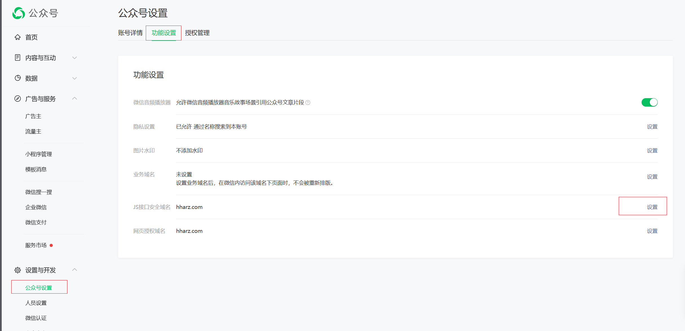
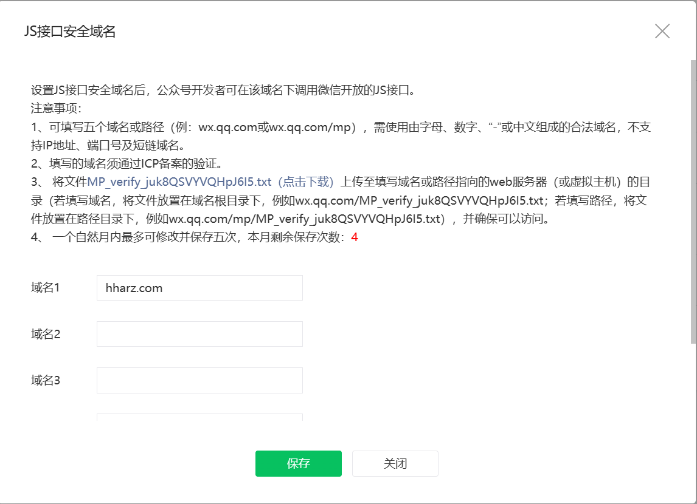

## h5之JS-SDK说明文档.md

> 微信公众号文档 https://developers.weixin.qq.com/doc/offiaccount/OA_Web_Apps/JS-SDK.html


#### 1.微信公众号配置网页授权域名并把 .txt 放在服务器根目录

> 登录公众号 https://mp.weixin.qq.com





#### 2.获取相关权限

1. 集成wxJava

   **参考 集成wxJava配置公众号**

2. 后端接口

   ```java
   @Autowired
   private WxMpService wxMpService;
   
   /**
    * 获取加密信息
    * @param url 当前index.html 全路径
    */
   @ResponseBody
   @RequestMapping("getWxJsapiSignature")
   public R getWxJsapiSignature(String url) throws WxErrorException {
       WxJsapiSignature jsapiSignature = wxMpService.createJsapiSignature(url);
       return R.ok().put("data", jsapiSignature);
   }
   ```

3. index.html

   ```html
   <!DOCTYPE html>
   <html lang="en">
   
   <head>
       <meta charset="UTF-8">
       <meta name="viewport" content="width=device-width, initial-scale=1.0">
       <title>Document</title>
   </head>
   
   <body>
   -- http://res.wx.qq.com/open/js/jweixin-1.6.0.js
   <script src="js/jweixin-1.6.0.js"></script>
   -- http://ajax.aspnetcdn.com/ajax/jQuery/jquery-1.8.0.js
   <script src="js/jquery-1.8.0.js"></script>
   
   <script>
       // 请求上面的controller
       $.ajax({
           url: "https://xxxx.com/app/wx/getWxJsapiSignature?url=https://xxxx.com/wx/index.html",
           type: "get",
           contentType: "application/json",
           error: function (err) {
               console.log('ajaxerr->' + err);
           },
           success: function (res) {
               console.log(res);
               var data = res.data
               wx.config({
                   debug: true, // 开启调试模式,调用的所有api的返回值会在客户端alert出来，若要查看传入的参数，可以在pc端打开，参数信息会通过log打出，仅在pc端时才会打印。
                   appId: data.appId, // 必填，公众号的唯一标识
                   timestamp: data.timestamp, // 必填，生成签名的时间戳
                   nonceStr: data.nonceStr, // 必填，生成签名的随机串
                   signature: data.signature,// 必填，签名
                   jsApiList: ['scanQRCode'] // 必填，需要使用的JS接口列表
               });
               wx.ready(() => {
                   console.log('wx ready')
               });
               wx.error(function (res) {
                   console.log('wxerr', res)
               });
   
           }
       });
   </script>
   
   </body>
   
   </html>
   ```

   