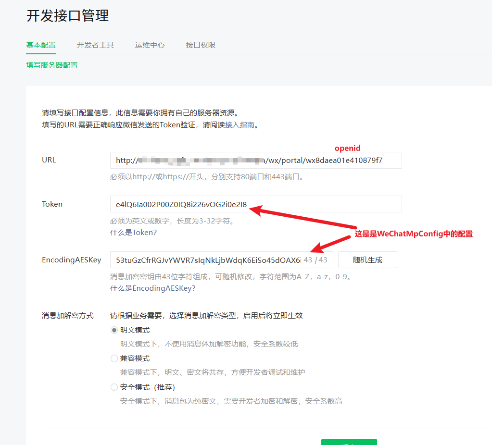

## 公众号被关注事件

##### 1.处理公众号消息Controller

```java
/**
 * 处理公众号消息
 *
 * @author liuguofeng
 * @date 2025/04/22 16:33
 */
@RestController
@RequestMapping("/wx/portal/{appid}")
public class WxPortalController {
    @Autowired
    private WxMpService wxService;

    @Autowired
    private WxMpMessageRouter messageRouter;

    @GetMapping(produces = "text/plain;charset=utf-8")
    public String authGet(@PathVariable String appid,
                          @RequestParam(name = "signature", required = false) String signature,
                          @RequestParam(name = "timestamp", required = false) String timestamp,
                          @RequestParam(name = "nonce", required = false) String nonce,
                          @RequestParam(name = "echostr", required = false) String echostr) {

        System.out.printf("\n接收到来自微信服务器的认证消息：[{%s}, {%s}, {%s}, {%s}]%n", signature,
                timestamp, nonce, echostr);
        if (StringUtils.isAnyBlank(signature, timestamp, nonce, echostr)) {
            throw new IllegalArgumentException("请求参数非法，请核实!");
        }

        if (!this.wxService.switchover(appid)) {
            throw new IllegalArgumentException(String.format("未找到对应appid=[%s]的配置，请核实！", appid));
        }

        if (wxService.checkSignature(timestamp, nonce, signature)) {
            return echostr;
        }

        return "非法请求";
    }

    @PostMapping(produces = "application/xml; charset=UTF-8")
    public String post(@PathVariable String appid,
                       @RequestBody String requestBody,
                       @RequestParam("signature") String signature,
                       @RequestParam("timestamp") String timestamp,
                       @RequestParam("nonce") String nonce,
                       @RequestParam("openid") String openid,
                       @RequestParam(name = "encrypt_type", required = false) String encType,
                       @RequestParam(name = "msg_signature", required = false) String msgSignature) {
        System.out.printf("\n接收微信请求：[openid=[{%s}], [signature=[{%s}], encType=[{%s}], msgSignature=[{%s}],"
                        + " timestamp=[{%s}], nonce=[{%s}], requestBody=[\n{%s}\n] ",
                openid, signature, encType, msgSignature, timestamp, nonce, requestBody);

        if (!this.wxService.switchover(appid)) {
            throw new IllegalArgumentException(String.format("未找到对应appid=[%s]的配置，请核实！", appid));
        }

        if (!wxService.checkSignature(timestamp, nonce, signature)) {
            throw new IllegalArgumentException("非法请求，可能属于伪造的请求！");
        }

        String out = null;
        if (encType == null) {
            // 明文传输的消息
            WxMpXmlMessage inMessage = WxMpXmlMessage.fromXml(requestBody);
            WxMpXmlOutMessage outMessage = this.route(inMessage);
            if (outMessage == null) {
                return "";
            }

            out = outMessage.toXml();
        } else if ("aes".equalsIgnoreCase(encType)) {
            // aes加密的消息
            WxMpXmlMessage inMessage = WxMpXmlMessage.fromEncryptedXml(requestBody, wxService.getWxMpConfigStorage(),
                    timestamp, nonce, msgSignature);
            System.out.printf("\n消息解密后内容为：\n{} ", inMessage.toString());
            WxMpXmlOutMessage outMessage = this.route(inMessage);
            if (outMessage == null) {
                return "";
            }

            out = outMessage.toEncryptedXml(wxService.getWxMpConfigStorage());
        }

        System.out.printf("\n组装回复信息：{%s}", out);
        return out;
    }

    private WxMpXmlOutMessage route(WxMpXmlMessage message) {
        try {
            return this.messageRouter.route(message);
        } catch (Exception e) {
            e.printStackTrace();
            System.out.printf("路由消息时出现异常！");
        }

        return null;
    }

}
```

##### 2.处理公众号被关注

```java
/**
 * 处理公众号被关注
 *
 * @author liuguofeng
 * @date 2025/04/22 16:56
 **/
@Component
public class SubscribeHandler implements WxMpMessageHandler {

    @Override
    public WxMpXmlOutMessage handle(WxMpXmlMessage wxMessage,
                                    Map<String, Object> context, WxMpService weixinService,
                                    WxSessionManager sessionManager) throws WxErrorException {
        System.out.println("新关注用户 OPENID: " + wxMessage.getFromUser());
        // 获取微信用户基本信息
        try {
            WxMpUser userWxInfo = weixinService.getUserService()
                    .userInfo(wxMessage.getFromUser(), null);
            if (userWxInfo != null) {
                // TODO 可以添加关注用户到本地数据库
            }
        } catch (WxErrorException e) {
            if (e.getError().getErrorCode() == 48001) {
                System.out.println("该公众号没有获取用户信息权限！");
            }
        }
        
        // 发送消息
        return new NewsBuilder().build("", wxMessage, weixinService);
    }

}
```

##### 3.公众号消息抽象类

```java
/**
 * 公众号消息抽象类
 */
public abstract class AbstractBuilder {

    public abstract WxMpXmlOutMessage build(String content,
                                            WxMpXmlMessage wxMessage, WxMpService service);
}
```

##### 4.被动回复的图文消息xml

```java
/**
 * 被动回复的图文消息xml
 * @author liuguofeng
 * @date 2025/04/22 16:35
 **/
public class NewsBuilder extends AbstractBuilder {

    @Override
    public WxMpXmlOutMessage build(String content, WxMpXmlMessage wxMessage,
                                   WxMpService service) {
        WxMpXmlOutNewsMessage.Item item1 = new WxMpXmlOutNewsMessage.Item();
        item1.setUrl("http://weather.h5.hibaysoft.com:35043/#/realTimeWeather");
        item1.setPicUrl("http://weather.h5.hibaysoft.com:35043/weather/%E6%99%B4.png");
        item1.setDescription("我是介绍，虽然我没有用到");
        item1.setTitle("我是标题1");

        WxMpXmlOutNewsMessage.Item item2 = new WxMpXmlOutNewsMessage.Item();
        item2.setUrl("http://weather.h5.hibaysoft.com:35043/#/realTimeWeather");
        item2.setPicUrl("http://weather.h5.hibaysoft.com:35043/weather/%E6%99%B4.png");
        item2.setDescription("我是介绍，虽然我没有用到");
        item2.setTitle("我是标题2");

        WxMpXmlOutNewsMessage.Item item3 = new WxMpXmlOutNewsMessage.Item();
        item3.setUrl("http://weather.h5.hibaysoft.com:35043/#/realTimeWeather");
        item3.setPicUrl("http://weather.h5.hibaysoft.com:35043/weather/%E6%99%B4.png");
        item3.setDescription("我是介绍，虽然我没有用到");
        item3.setTitle("我是标题3");

        return WxMpXmlOutMessage.NEWS().addArticle(item1, item2, item3)
                .fromUser(wxMessage.getToUser())
                .toUser(wxMessage.getFromUser())
                .build();
    }
}
```

##### 5.配置的服务器地址(URL)

> 配置的服务器地址(URL)应该是 `https://本机地址/app/wx/portal/{appid}`，该地址外网一定是可以访问的

