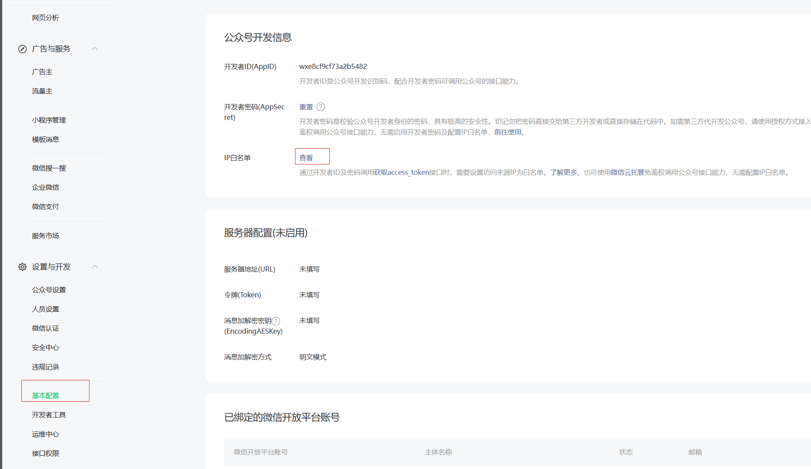
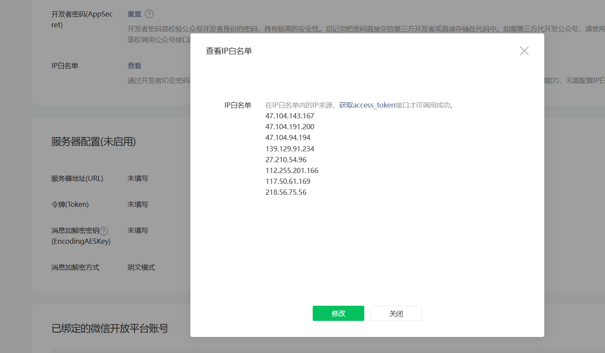
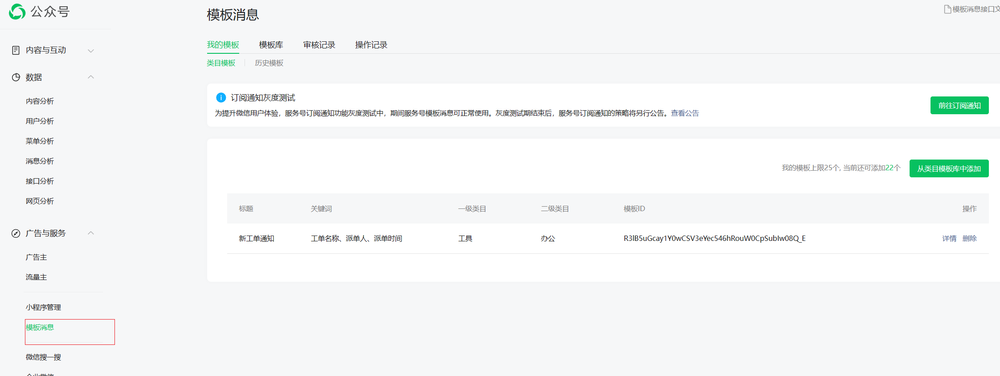
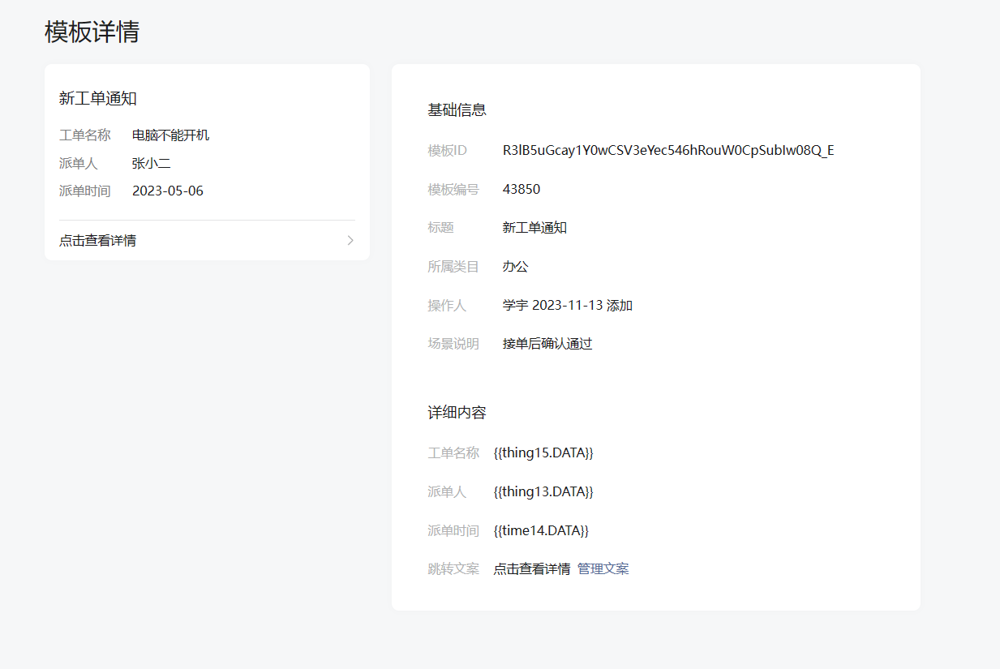

## 服务器发送公众号模板消息推送给用户

#### 1.修改白名单，把要调用的ip添加的白名单中





#### 2.申请模板消息



#### 4.发送消息

> 集成wxJava **参考 集成wxJava配置公众号**



```java
@Autowired
private WxMpService wxMpService; 

WxMpTemplateMessage templateMessage = WxMpTemplateMessage.builder()
                .toUser(openid)
                .templateId("R3lB5uGcay1Y0wCSV3eYec546hRouW0CpSubIw08Q_E") //刚刚申请的模板id 
                .url(" ") // 要跳转的链接
                .build();

// 设置内容
templateMessage
    .addData(new WxMpTemplateData("thing15", "工单名称", "#FF00FF"))
    .addData(new WxMpTemplateData("thing13", "派单人", "#FF00FF"))
    .addData(new WxMpTemplateData("time14", "2023-11-14", "#FF00FF"));
String msgId = wxMpService.getTemplateMsgService().sendTemplateMsg(templateMessage);
log.warn("msgId:" + msgId);
```


