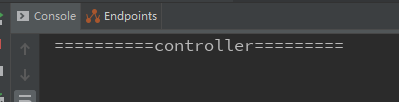

## @ConditionalOnProperty

在spring boot中有时候需要控制配置类是否生效,可以使用@ConditionalOnProperty注解来控制@Configuration是否生效

配置类代码:

```java
@Configuration
@ConditionalOnProperty(prefix = "filter",name = "loginFilter",havingValue = "true")
public class FilterConfig {
	//prefix为配置文件中的前缀,
	//name为配置的名字
	//havingValue是与配置的值对比值,当两个值相同返回true,配置类生效.
    @Bean
    public FilterRegistrationBean getFilterRegistration() {
        FilterRegistrationBean filterRegistration  = new FilterRegistrationBean(new LoginFilter());
        filterRegistration.addUrlPatterns("/*");
        return filterRegistration;
    }
}
```


配置文件中的代码

```java
filter.loginFilter=true
```


测试

当配置文件中值为true时:输出了"过滤器"三个字,说明loginFilter生效了,说明配置类生效了.


当配置文件中值为false时:没有输出了"过滤器"三个字,说明loginFilter没有生效,说明配置类没有生效.



总结:

通过@ConditionalOnProperty控制配置类是否生效,可以将配置与代码进行分离,实现了更好的控制配置.

@ConditionalOnProperty实现是通过havingValue与配置文件中的值对比,返回为true则配置类生效,反之失效.