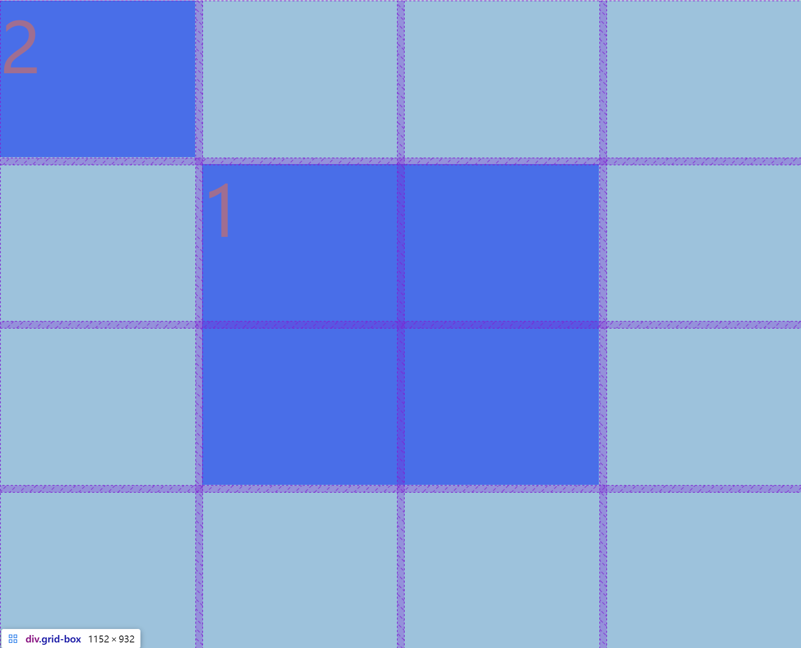

## css之Grid布局

##### 1. 定义Grid容器的属性：

1. `display: grid`：将元素声明为网格容器。

2. `grid-template-columns` 和 `grid-template-rows`：定义网格的列和行。例如：

   ```css
   grid-template-columns: 200px 1fr 100px; /* 定义三列，第一列200px，第二列自适应，第三列100px */
   grid-template-rows: 100px auto; /* 定义两行，第一行100px，第二行自适应 */
   
   /** 直接使用 repeat函数定义 */
   grid-template-columns: repeat(3, 1fr); /* 定义3列，等宽 */
   ```

3. `gap` 或 `grid-gap`：设置行与列之间的间距。例如：

   ```css
   gap: 10px; /* 行和列的间距都是10px */
   ```

4. `grid-column-start` 和 `grid-column-end`：定义Grid项目在列方向上的起止位置。例如：

   ```css
   grid-column-start: 1; /** 开始位置 */
   grid-column-end: 3; /** 结束位置 */
   
   grid-column: 1 / 3; /* 项目跨两列 */
   ```

##### 2.简单例子:

```html
<style>

  .grid-box {
    display: grid;
	/** 定义行4个格子，相同宽度 */
    grid-template-rows: repeat(4,1fr);
    /** 定义列4个格子，相同高度 */
    grid-template-columns: repeat(4,1fr);
    /** 他们之间间距是10px */
    gap: 10px;
  }

  .item-1{
    /* 定义列，开始位置是2(包含第2个),结束位置是4(不包含4) */
    grid-column: 2/4;
    /* 定义行，开始位置是2(包含第2个),结束位置是4(不包含4) */
    grid-row: 2/4;
  }
</style>
```

