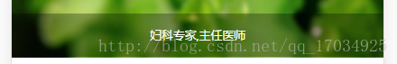

## html子元素不继承父元素（opacity）的解决方法

给父元素设置了背景颜色加透明

```css
opacity: 0.5;
```


发现效果是子元素也继承了父元素的属性


字也变的透明，如果不希望这样，可以把上面的代码用下面的代码来代替

```css
background: rgba(0,0,0,.3);
```

效果如下图



这样字体就不会继承父元素的属性变的透明了。