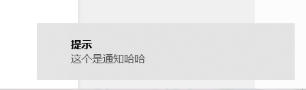

## electron 通知 

Electron 应用程序， 添加以下内容到 index.html

```javascript
<!DOCTYPE html>
<html lang="en">
<head>
  <meta charset="UTF-8">
  <meta name="viewport" content="width=device-width, initial-scale=1.0">
  <title>Document</title>
</head>
<body>
  <input type="text" class="input">
  <button class="but">按钮</button>
  <script src="renderer.js"></script>
</body>
</html>
```

并添加 renderer.js 文件：

```javascript
document.querySelector('.but').addEventListener('click',()=>{
  new Notification('提示', {
    body: `这个是通知`
  })
})
```

当点击按钮时



- 如果想在主线程中启动通知

```javascript
const { app, BrowserWindow ,Notification } = require('electron')
function showNotification (){
  const notification = {
    title: '提示',
    body: '程序启动中'
  }
  new Notification(notification).show()
}

app.whenReady().then(createWindow).then(showNotification)
```

