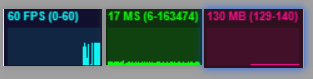

## 4.Three.js性能监视器

>  在 `Three.js` 中也有一款检测帧数(FPS)的工具，叫做 Stats.js




1. 导入

   ```js
   import Stats from 'three/examples/jsm/libs/stats.module.js'
   ```

2. 使用

   ```js
   const stats = new Stats();
   // 设置初始面板 `stats.setMode(0)` 。传入面板id（`0: fps`, `1: ms`, `2: mb`）
   stats.setMode(0)
   // 设置到dom
   container.appendChild( stats.dom );
   
   
   function animate() {
   
       // 在动画中刷新帧数
       stats.update();
   
   }
   ```

5. 除了使用 `update` 更新监听到的数据变化之外，还可以使用 `begin` 和 `end` 组合。

   ```js
   function animate() {
       stats.begin()
       // 中间夹着要监听的动画或其他代码
       stats.end()
   }
   ```

   

