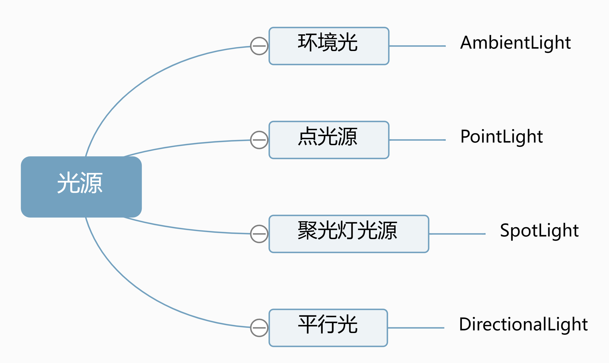

## Three.js光源




##### 1.环境光`AmbientLight`

> 环境光会均匀的照亮场景中的所有物体。环境光不能用来投射阴影，因为它没有方向。

```js
// 0x404040: 一个表示颜色的 Color 的实例，默认为一个白色的 Color 对象。
// 0.5: 光照的强度。默认值为 1。
const light = new THREE.AmbientLight(0x404040,0.5); // 柔和的白光
scene.add( light );
```

##### 2.平行光`DirectionalLight`

> 平行光是沿着特定方向发射的光, 常常用平行光来模拟太阳光的效果

```js
// 0xffffff: 光源颜色
// 0.5: 光照的强度。默认值为 1
const directionalLight = new THREE.DirectionalLight(0xffffff, 0.5);
// 设置光源的方向：通过光源position属性和目标指向对象的position属性计算
directionalLight.position.set(80, 100, 50);
// 方向光指向对象网格模型mesh，可以不设置，默认的位置是0,0,0
directionalLight.target = mesh;
scene.add(directionalLight);
```

1. 属性

   - `castShadow: Boolean`: 此属性设置为 `true` 灯光将投射阴影 ,默认值为 `false`
   - `position: Vector3`: 设置光源位置
   - `target: Object3D`: 设置光源的方向

2. 平行光辅助工具`DirectionalLightHelper`

   ```js
   // directionalLight: 是DirectionalLight对象,
   // 5: 是辅助工具大小,
   // 0xff0000: 是设置辅助工具颜色
   const dirLightHelper = new THREE.DirectionalLightHelper(directionalLight, 5,0xff0000);
   scene.add(dirLightHelper);
   ```

##### 3.点光源`PointLight`

> 从一个点向各个方向发射的光源。一个常见的例子是模拟一个灯泡发出的光。

```js
// 0xff0000: 光源颜色,
// 1: 光照强度默认值为 1,
// 100: 光源照射的最大距离。默认值为 0无限远,
// 2: 光线随着距离增加变暗的衰减量。默认值为 2
const light = new THREE.PointLight(0xff0000, 1, 100, 2);
light.position.set( 50, 50, 50 );
scene.add( light );
```

1. 属性

   - `castShadow: Boolean`: 此属性设置为 `true` 灯光将投射阴影 ,默认值为 `false`
   - `decay: Float`: 光线随着距离增加变暗的衰减量。默认值为 `2`
   - `distance: Float`: 光源照射的最大距离。默认值为 0无限远
   - `intensity : Float`: 光源的强度。默认值为 `1`, 单位是坎德拉（cd）
   - `power: Float`光源的功率,单位为流明（lm）。

2. 点光源辅助观察`PointLightHelper`

   ```js
   // pointLight 点光源实例,10 辅助工具大小,0xff0000: 辅助工具颜色
   const pointLightHelper = new THREE.PointLightHelper(pointLight, 10, 0xff0000);
   scene.add(pointLightHelper);
   ```

##### 3.聚光灯`SpotLight`

> 光线从一个点沿一个方向射出，随着光线照射的变远，光线圆锥体的尺寸也逐渐增大。

```js
// 0xffffff: 颜色 
// 1: 光照强度。默认值为 1。
// 100: 光源照射的最大距离。默认值为 0（无限远）。
// Math.PI/3: 光线照射范围的角度。默认值为 Math.PI/3。
// 0: 聚光锥的半影衰减百分比。默认值为 0。
// 2: 沿着光照距离的衰减量。默认值为 2。
const spotLight = new THREE.SpotLight(0xffffff, 1, 100, Math.PI / 3, 0, 2);
// 设置位置
spotLight.position.set(1.5, 1.5, 0);
// 开启灯光将投射阴影
spotLight.castShadow = true;
// 加载纹理
spotLight.map = new THREE.TextureLoader().load("/test.jpg")
scene.add(spotLight);
```

1. 属性

   - `position: Vector3`: 设置光源位置
   - `target: Object3D`: 设置光源的方向
   - `angle: Float` : 光线照射范围的角度，用弧度表示。不应超过 `Math.PI/2`。默认值为 `Math.PI/3`
   - `castShadow: Boolean`: 此属性设置为 `true` 灯光将投射阴影 ,默认值为 `false`
   - `intensity : Float`: 光源的强度。默认值为 `1`, 单位是坎德拉（cd）
   - `power: Float`光源的功率,单位为流明（lm）
   - `decay: Float`: 光线随着距离增加变暗的衰减量。默认值为 `2`
   - `distance: Float`: 光源照射的最大距离。默认值为 0无限远
   - `penumbra: Float`: 该属性设置照明区域在边缘附近的平滑衰减速度,取值范围在 0 到 1 之间。默认值为 `0.0`
   - `map: Texture`: 用于调节光线颜色的纹理`Texture`，聚光灯颜色会与该纹理的RGB值混合

2. 辅助工具

   ```js
   // spotLight聚光灯实例,0xff0000: 辅助工具颜色
   const spotLightHelper = new THREE.SpotLightHelper(spotLight, 0xff0000);
   scene.add( spotLightHelper );
   ```

   
