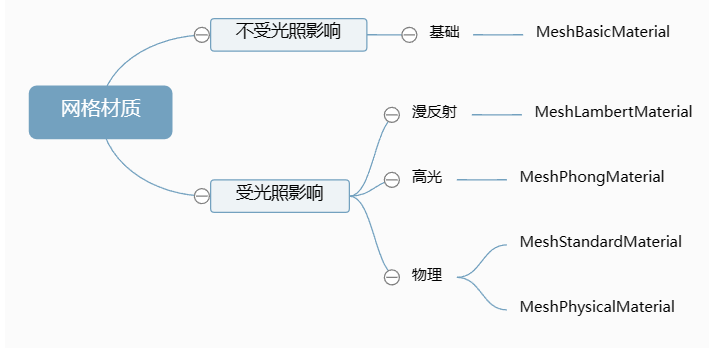

## Three.js材质



##### 1.所有材质都有的属性

-  材质半透明

  ```js
  material.transparent = true;//开启透明
  material.opacity = 0.5;//设置透明度
  ```

-  `side: Integer`:  定义将要渲染哪一面 - 正面，背面或两者。 默认为`THREE.FrontSide`正面, 可以设置`THREE.BackSide`反面 和 `THREE.DoubleSide`双面

  | THREE.FrontSide  | 背面 |
  | ---------------- | ---- |
  | THREE.BackSide   | 前面 |
  | THREE.DoubleSide | 双面 |

- `visible: Boolean`: 此材质是否可见。默认为**true**。

- `color: Color`: 材质的颜色`Color`，默认值为白色 (0xffffff)
- `wireframe: Boolean`: 线框模式 当此属性设为 true 时，物体将显示为线框。这对调试非常有利
- `map: Texture`: 纹理贴图

##### 2.基础网格材质`MeshBasicMaterial`

> 一个以简单着色（平面或线框）方式来绘制几何体的材质。这种材质不受光照的影响。

属性

- `alphaMap: Texture`: 用来控制**透明度**（黑色：完全透明；白色：完全不透明）,默认值为null （注意: 要设置`transparent: true`）
- `envMap: Texture`: **环境贴图**。默认值为null。（注意加载材质时，`TextureLoader.mapping = THREE.EquirectangularReflectionMapping`）
- `aoMap: Texture`: 该纹理的红色通道用作环境**遮挡贴图**（意思:是设置了`map`贴图后,`aoMap`贴图黑色半部分会挡住`map`对应部分）
- `aoMapIntensity: Float`: 设置`aoMap`环境遮挡效果的强度。默认值为1。零是不遮挡效果。
- `lightMap: Texture`: 光照贴图。默认值为null
- `lightMapIntensity: Float`: `lightMap`光照贴图的强度。默认值为1
- `reflectivity: Float`: 环境贴图对表面的影响程度; 默认值为1，有效范围介于0（无反射）和1（完全反射）之间。

3.慢反射网格材质`MeshLambertMaterial`

> 这可以很好地模拟一些表面（例如未经处理的木材或石材），但不能模拟具有镜面高光的光泽表面, 例如涂漆木材

属性

- `alphaMap: Texture`: 用来控制**透明度**（黑色：完全透明；白色：完全不透明）,默认值为null （注意: 要设置`transparent: true`）
- `envMap: Texture`: **环境贴图**。默认值为null。（注意加载材质时，`TextureLoader.mapping = THREE.EquirectangularReflectionMapping`）
- `aoMap: Texture`: 该纹理的红色通道用作环境**遮挡贴图**（意思:是设置了`map`贴图后,`aoMap`贴图黑色半部分会挡住`map`对应部分）
- `aoMapIntensity: Float`: 设置`aoMap`环境遮挡效果的强度。默认值为1。零是不遮挡效果。
- `bumpMap: Texture`: 用于创建**凹凸贴图**的纹理，黑色和白色值映射到与光照相关的感知深度，（凸:白色，凹:黑色）
- `bumpScale: Float`: 凹凸贴图会对材质产生多大影响。典型范围是0-1。默认值为1
- `emissive: Color`: 材质的放射（光）颜色，基本上是不受其他光照影响的固有颜色。默认为黑色。
- `emissiveMap: Texture`: **自发光纹理**放射贴图颜色由放射颜色和强度所调节,请务必将放射颜色设置为黑色以外的其他颜色。
- `emissiveIntensity: Float`:  放射光强度。调节发光颜色。默认为1。

##### 3.高光材质`MeshPhongMaterial`

> 该材质可以模拟具有镜面高光的光泽表面（例如涂漆木材）

属性

- `shininess: Float`: `specular`高亮的程度，越高的值越闪亮。默认值为 **30**。
- `specular: Color`: 材质的高光颜色。默认值为**0x111111**（深灰色）的颜色Color
- `specularMap: Texture`: 材质高光反射设置的纹理图案，白色反射程度高

##### 4.标准网格材质`MeshStandardMaterial`

> 一种基于物理的标准材质，使用Metallic-Roughness工作流程。

属性

- `metalness: Float`: 材质与金属的相似度。非金属材质，如木材或石材，使用0.0，金属使用1.0，通常没有中间值。 默认值为0.0
- `metalnessMap: Texture`: 该纹理的蓝色通道用于改变材质的金属度。
- `roughness: Float`: 材质的粗糙程度。0.0表示平滑的镜面反射，1.0表示完全漫反射。默认值为1.0。如果还提供roughnessMap，则两个值相乘
- `roughnessMap: Texture`: 该纹理的绿色通道用于改变材质的粗糙度。

##### 5.物理网格材质`MeshPhysicalMaterial`

> `MeshStandardMaterial`的扩展，提供了更高级的基于物理的渲染属性：
>
> - **Clearcoat:** 有些类似于车漆，碳纤，被水打湿的表面的材质需要在面上再增加一个透明的，具有一定反光特性的面。而且这个面说不定有一定的起伏与粗糙度。Clearcoat可以在不需要重新创建一个透明的面的情况下做到类似的效果。
>   - **基于物理的透明度**:`opacity`属性有一些限制:在透明度比较高的时候，反射也随之减少。使用基于物理的透光性[.transmission](http://localhost:8080/docs/index.html#api/zh/materials/MeshPhysicalMaterial.transmission)属性可以让一些很薄的透明表面，例如玻璃，变得更真实一些。
> - **高级光线反射:** 为非金属材质提供了更多更灵活的光线反射。

属性

- `clearcoat: Float`: 表示clear coat层的强度，范围从**0.0**到**1.0**m，当需要在表面加一层薄薄的半透明材质的时候，可以使用与clear coat相关的属性，默认为**0.0**;
- `clearcoatRoughness: Float`: clear coat层的粗糙度，由**0.0**到**1.0**。 默认为**0.0**