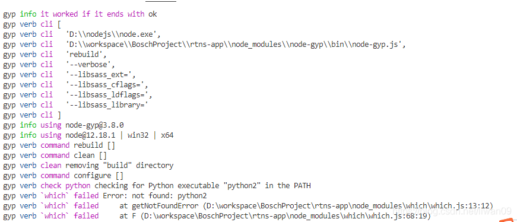
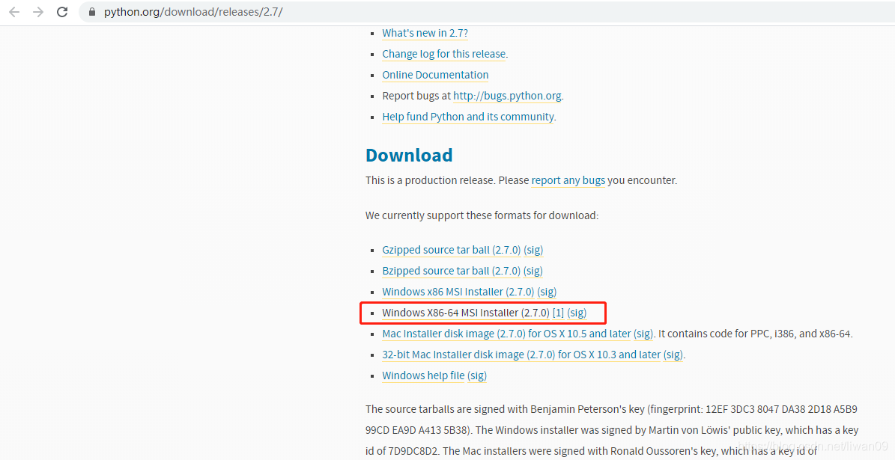
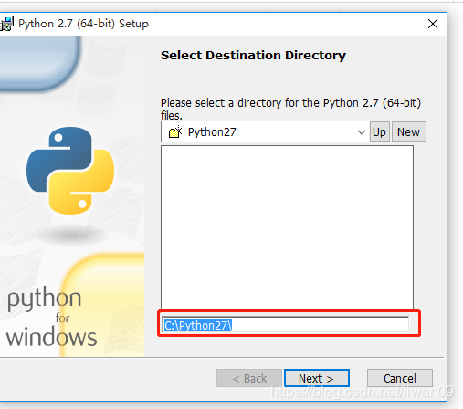
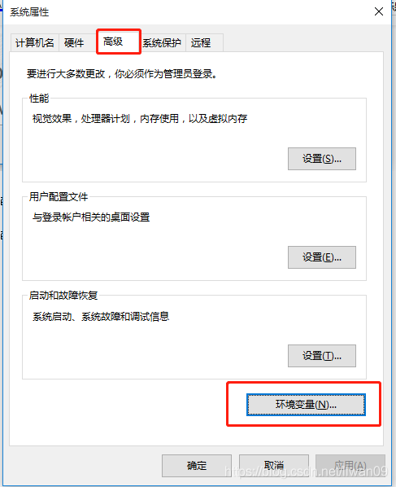
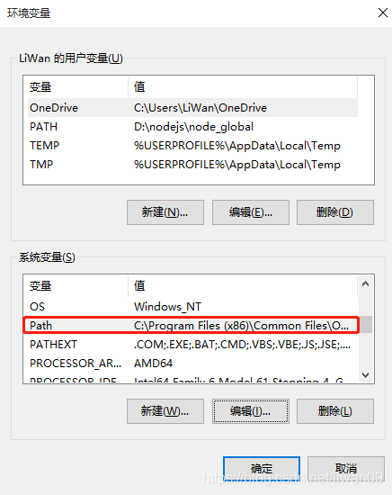

## npm install Error not found python2 解决方案

在ionic 项目执行 npm i 命令时，出现Error: not found: python2的错误，错误如下图

解决方案

1、下载python   https://www.python.org/download/releases/2.7/ 

2、安装python

3、设置python环境变量

1）电脑右击——属性——高级系统设置—高级—环境变量 

2）系统变量—Path 中添加环境变量 C:\Python27（python安装目录）

4、然后执行 npm rebuild node-sass重构一下

5、然后再执行 npm i 就可以了

