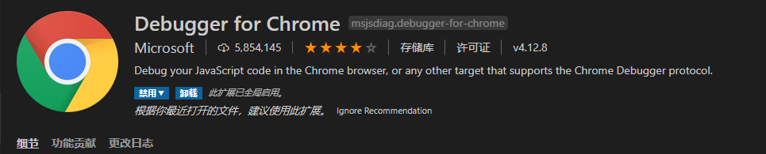
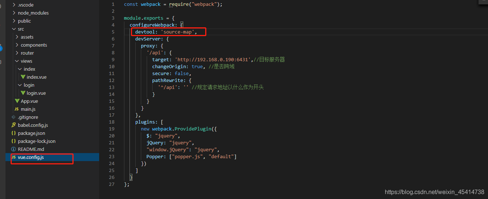
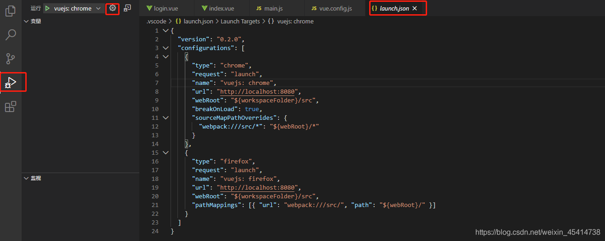
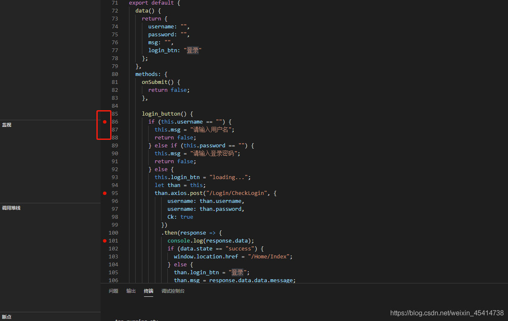
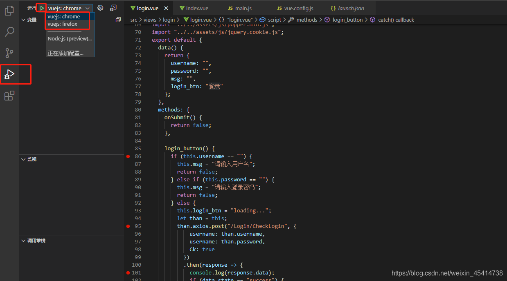
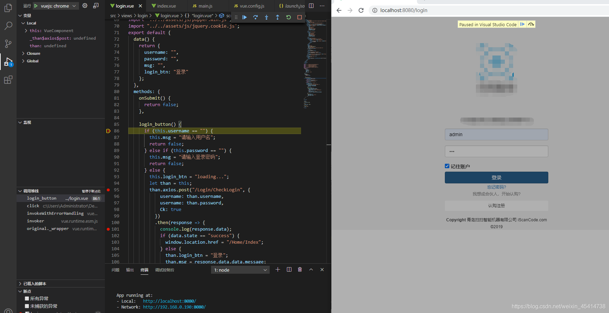

## vs code调试vue代码

注意：这个案例覆盖了 Chrome 和 Firefox。

先决条件

你必须安装好 Chrome 和 VS Code。同时请确保自己在 VS Code 中安装了 Debugger for Chrome 扩展的最新版本。



Debugger for Chrome 调试Chrome

Debugger for Firefox 调试Firefox

1. 打开 全局配置文件添加 devtool: ‘source-map’ 以Vue CLI 3为例




```javascript
module.exports = {
  configureWebpack: {
    devtool: 'source-map'
  }
}
```

2.从 VS Code 启动应用

我们这里假设端口号为 8080。如果与实际情况不符 (比如 8080 端口已经被占用且 Vue CLI 为你自动选取了另一个端口号)，可以修改相应的配置。

点击在 Activity Bar 里的 Debugger 图标来到 Debug 视图，然后点击那个齿轮图标来配置一个 launch.json 的文件，选择 Chrome/Firefox：Launch 环境。然后将生成的 launch.json 的内容替换成为相应的配置：

添加 Chrome 注意：必须安装插件




```javascript
{
  "version": "0.2.0",
  "configurations": [
    {
      "type": "chrome",
      "request": "launch",
      "name": "vuejs: chrome",
      "url": "http://localhost:8080",
      "webRoot": "${workspaceFolder}/src",
      "breakOnLoad": true,
      "sourceMapPathOverrides": {
        "webpack:///src/*": "${webRoot}/*"
      }
    },
    {
      "type": "firefox",
      "request": "launch",
      "name": "vuejs: firefox",
      "url": "http://localhost:8080",
      "webRoot": "${workspaceFolder}/src",
      "pathMappings": [{ "url": "webpack:///src/", "path": "${webRoot}/" }]
    }
  ]
}
```

3.设置一个断点，在你需要的地方加上断点



然后启动你的项目

npm run serve

####### 5.来到 Debug 视图，选择“vuejs：chrome/firefox”配置，然后按 F5 或点击那个绿色的 play 按钮。




随着一个新的浏览器实例打开 http://localhost:8080，执行你的程序这样你的断点就被命中了



