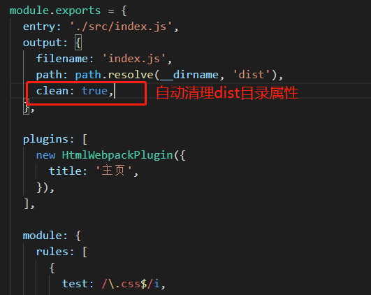

## 输出管理

#### 设置 HtmlWebpackPlugin 

安装 HtmlWebpackPlugin

```shell
npm install --save-dev html-webpack-plugin
```

在webpack.config.js 添加plugins节点

```javascript
const path = require('path');
const HtmlWebpackPlugin = require('html-webpack-plugin');

module.exports = {
  entry: './src/index.js',
  output: {
    filename: 'index.js',
    path: path.resolve(__dirname, 'dist'),
  },

  plugins: [
    new HtmlWebpackPlugin({
      title: '管理输出',
    }),
  ],
};
```

#### 自动清理 /dist 文件夹 

在webpack.config.js 添加




```javascript
output: {
    filename: 'index.js',
    path: path.resolve(__dirname, 'dist'),
    clean: true,
  },
```

