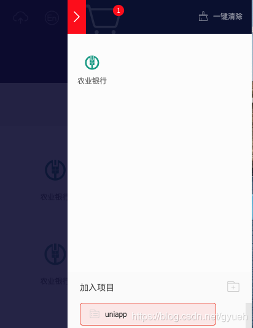
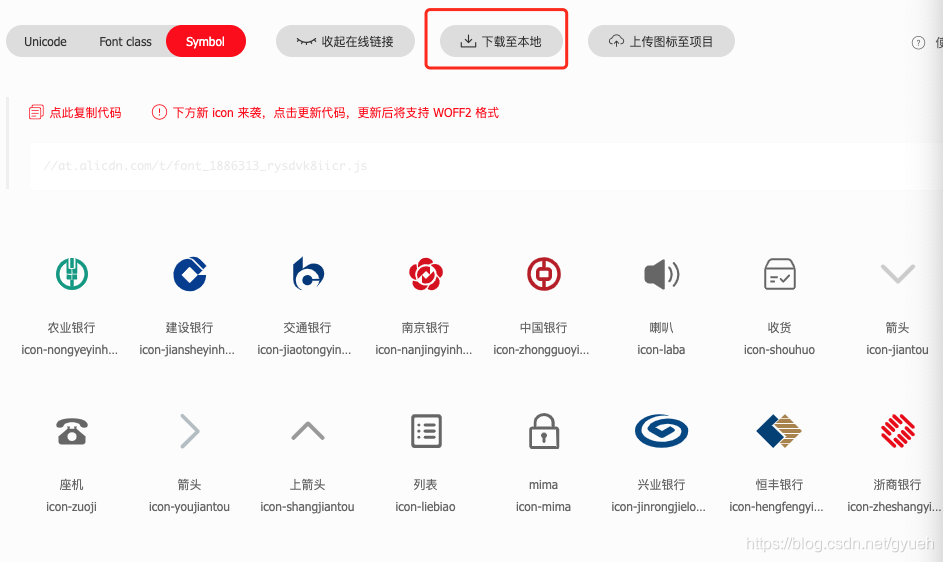
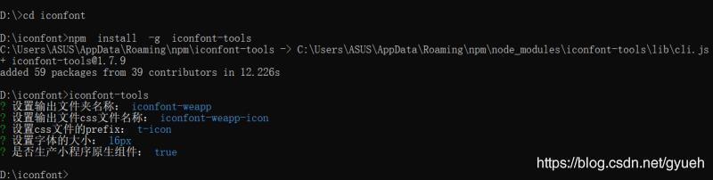
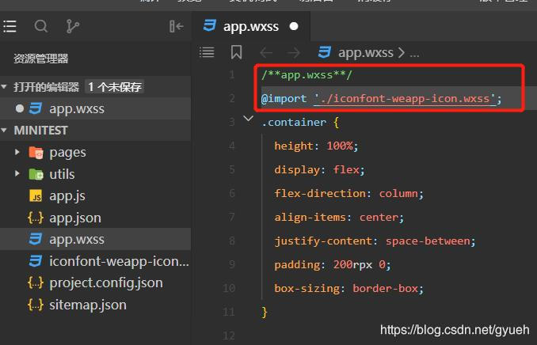

## 小程序引入iconfont

1. 进入https://www.iconfont.cn/官网

1. 将需要的图标添加到购物车，点击购物车将图标添加至相应的目标项目中



1. 打开目标项目，下载代码至本地



1. 将下载的文件进行解压，命名为iconfont

1. Window+R打开控制面版，输入cmd—点击enter键

1. 切换到iconfont文件夹

1. 输入命令行：npm install -g iconfont-tools----点击enter键

1. 运行命令行： iconfont-tools----点击enter键

1. 出现如图所示的内容，按图示输入文件名即可



1. 打开iconfont文件夹即可看到生成的目标文件 iconfont-weapp

1. 打开iconfont-weap文件夹

1. 复制iconfont-weapp-icon.wxss到小程序的项目文件夹里边

1. app.wxss里引入文件



1. 使用实例

```javascript
<cover-view class="t-icon t-icon-图标名"></cover-view>
//eg:
<cover-view class="t-icon t-icon-ABC"></cover-view>
```


注意：

使用cover-view标签在电脑端调试时iconfont图标会显示，但在真机上不显示，此时需要将cover-view标签改为view标签，其余部分内容不变。

eg:<view class="t-icon t-icon-ABC"></view>

1. 最终效果如图所示：


1. 修改图标的大小（通过设置width和height来修改）

```javascript
.t-icon {
    width: 24px; 
    height: 24px;
}
```
