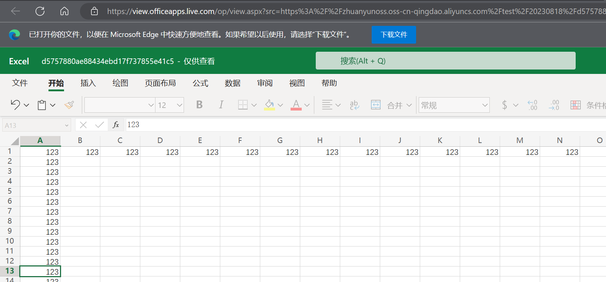

## 在线查看office文件



#### 代码:

```js
let url = 'http://localhost/xxx.xlsx'
let type = 'xlsx'
if (type == 'docx' || type == 'doc' || type == 'xlsx' || type == 'xls' || type == 'pptx' || type == 'ppt') {
  window.open('http://view.officeapps.live.com/op/view.aspx?src=' + url)
} else {
  window.open(url)
}
```

