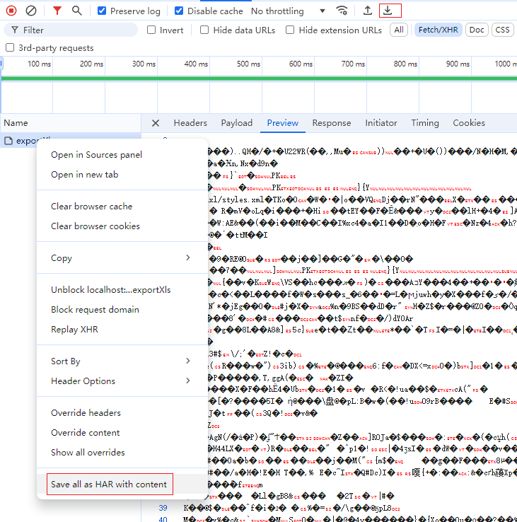

## 浏览器network二进制另存为

##### 1.点击下载图标或者Save all as HAR with content，保存为.har文件



##### 2.打开.har文件，找到当前请求的response > content

- 如果content中的mimeType = application/zip,并且encoding=base64，说明当前response返回的是二进制文件
- 找到content > text,需要把base64解码后保存为.zip

- 直接改后缀名为 `.zip` 或 `.xlsx` 并尝试打开

```json
{
  "log": {
    "entries": [
      {
        "request": {
          "method": "POST",
          "url": "http://localhost:8081/jeecg-boot/wp/report/exportXls",
          "httpVersion": "HTTP/1.1",
          "postData": {
            "mimeType": "application/json;charset=UTF-8",
            "text": "{}"
          }
        },
        "response": {
          "status": 200,
          "statusText": "",
          "httpVersion": "HTTP/1.1",
          "content": {
            "size": 5238,
            "mimeType": "application/zip",
            "compression": -40,
            "text": "xxxx这里是base64",
            "encoding": "base64"
          }
        }
      }
    ]
  }
}
```

##### 3.使用java把base64保存为zip文件

```java
public static void main(String[] args) {
    // 提供 Base64 数据
    String base64Data = "xxxxxxx"; // 替换为您的 Base64 编码内容

    // 调用解码方法
    try {
        decodeBase64ToZip(base64Data, "C:\\Users\\liugu\\Desktop\\output.zip");
        System.out.println("解码完成，文件已保存为 output.zip");
    } catch (IOException e) {
        e.printStackTrace();
        System.out.println("解码失败！");
    }
}

/**
 * 解码 Base64 数据并保存为 ZIP 文件
 * @param base64Data Base64 编码数据
 * @param outputFilePath 输出文件路径
 * @throws IOException 如果写文件失败
 */
public static void decodeBase64ToZip(String base64Data, String outputFilePath) throws IOException {
    // 解码 Base64 数据
    byte[] decodedBytes = Base64.getDecoder().decode(base64Data);

    // 将解码后的字节写入文件
    try (FileOutputStream fos = new FileOutputStream(outputFilePath)) {
        fos.write(decodedBytes);
    }
}
```

