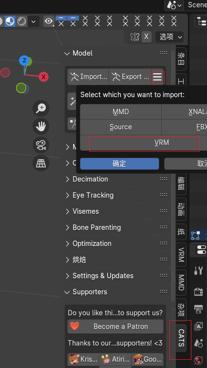

## VRoidStudio导入blender人物建模

##### 1.下载VRoidStudio 并导出 .vrm文件

> 下载地址: https://vroid.com/en/studio

##### 2.安装Cats

> 下载: https://github.com/absolute-quantum/cats-blender-plugin/releases

解决安装报错问题

- 解压下载的插件zip
- 打开文件`__init__.py`
- 找到`TESTING`删除
- 

##### 3.安装VRM

> 下载: https://github.com/saturday06/VRM-Addon-for-Blender/releases

##### 4.blender导入`vrm`

