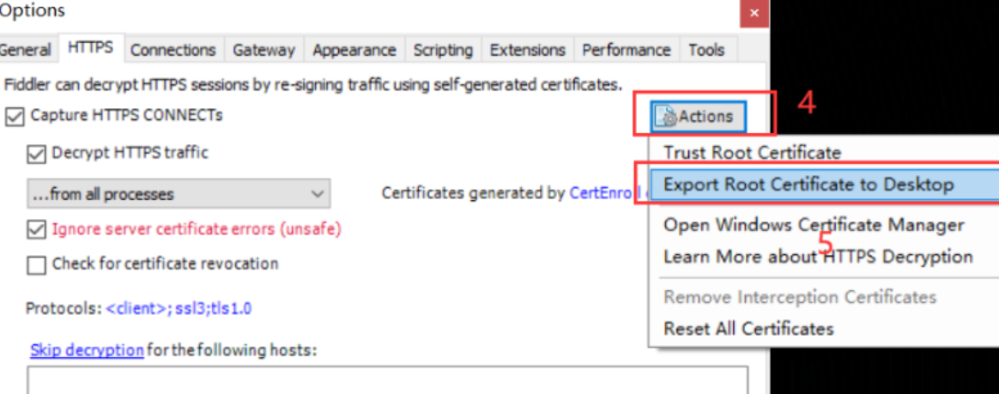

# Fiddler+雷电模拟器进行APP抓包 

 #### 1.雷电模拟器下载地址：
 选择3.0正式版（注意，高版本无法抓包，只能下载3.0正式版） https://www.ldmnq.com/other/version-history-and-release-notes.html?log=3

#### 2.打开Fiddler，点击工具栏中的Tools—>Options

#### 3、点击HTTPS，勾选Decrypt HTTPS traffic和Ignore server certificate(unsafe)

 
#### 4、点击Actions，点击Export Root Certificate to Desktop(此时电脑上桌面会生成 一个证书)

#### 5、https设置及connections设置，勾选选择项,然后点击确定

 

#### 6、安装好后，桌面双击打开雷电模拟器，点击设置

 

#### 7、选择网络设置，勾选桥接模式，点击安装驱动，点击确定，点击保存设置

 

#### 8、打开模拟器，设置代理。找到系统应用，点击设置，点击无线网络WLAN—>左键常按点击已连接网络—>修改网络
 

 #### 9、将步骤6导出的证书FiddlerRoot.cer文件复制到模拟器 共享文件夹中

 

