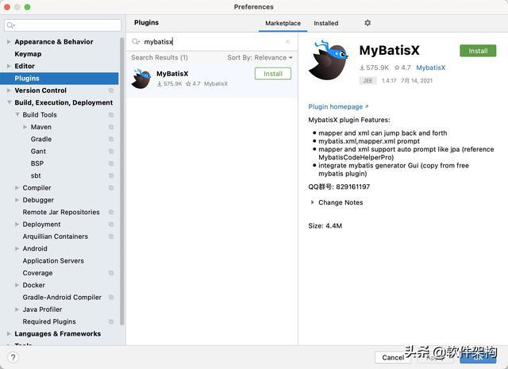
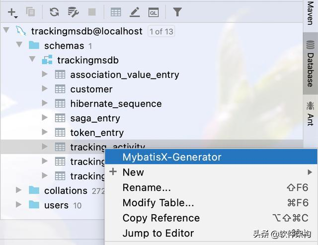
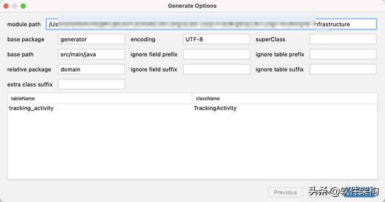
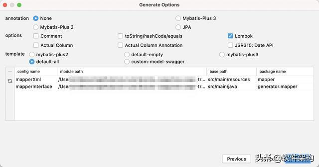
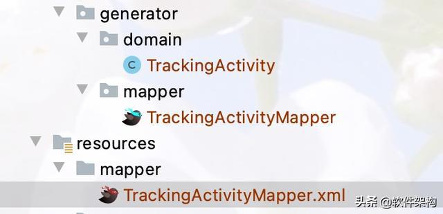
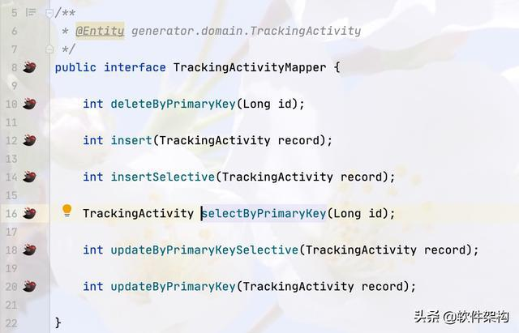

## idea插件MybatisX跳转mapper.xml
1. 安装MybatisX开发插件

安装方法：打开 IDEA，进入 File -> Settings -> Plugins -> Browse Repositories，输入 mybatisx 搜索并安装。安装完成之后，需要重启一下IDE。

2. 代码生成

在IDEA中右键单击要操作的数据表，选择MybatisX-Generator菜单项，进行代码生成，如图所示。

在弹出的Generate Options窗口中，进行代码生成的自定义设置。比如，module path、base package等设置代码生成的位置。

点击【Next】按钮，进一步设置代码生成的模板，根据自身需要进行选择。

如下是自动生成的代码，包括数据模型类、接口mapper和XML mapper文件。

三、支持跳转

至于mapper接口文件和XML mapper文件之间的跳转，点击左侧的小图标就可以完成了，非常方便。

