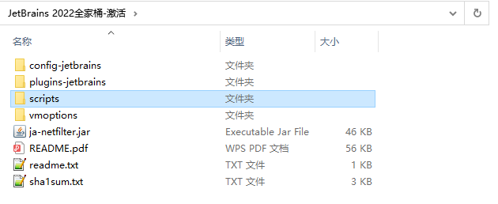
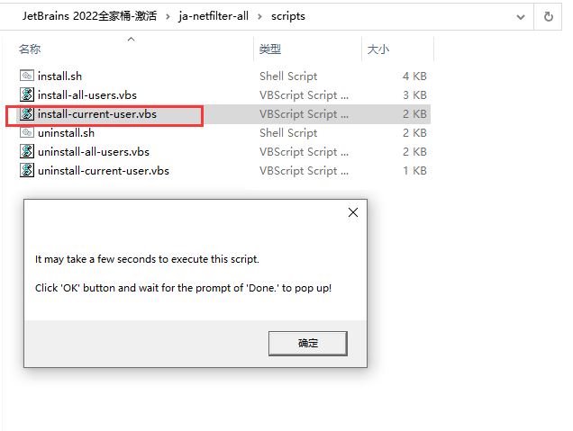
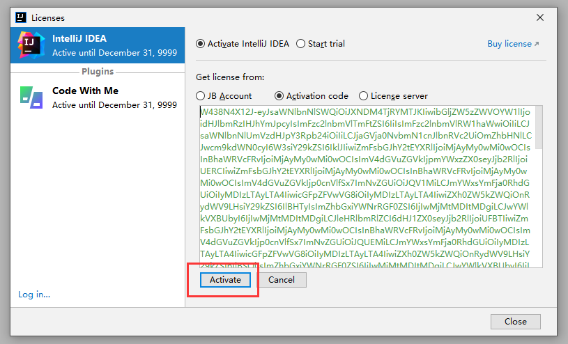
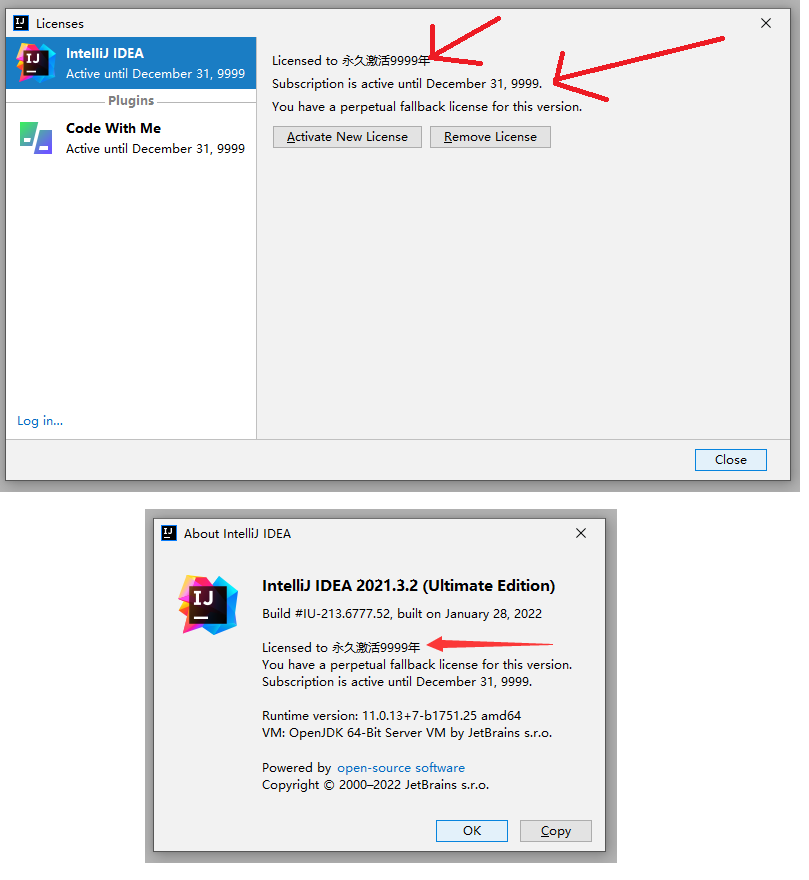

## idea破解

[JetBrains 2022全家桶-激活.zip](../../assets/1659272793127.zip)

scripts: 放置了相

关脚本，包含自动安装、卸载破解补丁脚本（Windows、Mac、Linux 对应系统的脚本都有）；

之前的 IDEA 版本，我们都是手动在 idea.vmoptions 配置文件引入破解补丁，但是有部分小伙伴反映找不到 idea.vmoptions 文件，这次，通过运行脚本可以直接引入补丁，针对小白，方便了很多。

vmoptions： 放置了 JetBrains 产品的 idea.vmoptions 配置文件。之前版本都是通过在这个文件中手动引入破解补丁，但是最新版本 IDEA 2022.x 官方加入了反制手段，在用户目录下已经找不到这个文件了，新版本我们直接引用这个文件夹下的 idea.vmoptions 配置文件；

运行激活脚本

注意：激活脚本文末获取！

将 ja-netfilter-all激活文件夹移动到电脑上某个位置，笔者做演示放置在了桌面上，你可以放到 D 盘或者其他路径下：

Mac/Linux/Windows 对于执行相对应的脚本

Windows 系统，点击运行 install-current-user.vbs 脚本，为当前用户安装破解补丁。

Mac/Linux 系统，点击运行 install.sh 脚本安装。

PS: install-all-users.vbs 为系统所有用户安装，不太推荐。unistall-*前缀的是卸载补丁脚本。

等待 Done 完成提示框出现，才算安装成功

告诉我们，运行此补丁大约花费几秒钟，或者1分钟，点击 确定，等待 Done 完成提示框出现，到这里，表示补丁安装成功。

运行脚本安装破解补丁完成后，一定要重启 IDEA，然后，填入下面的激活码，点击激活即可。

注意：运行此脚本因为需要添加 idea.vmoptions 文件的环境变量，可能会被杀毒软件误报为木马，大家允许运行即可。

实在不放心的小伙伴也可打开该脚本，自行看看源码

注意：激活脚本文末获取！

七、重启 IDEA, 填入指定激活码完成激活

运行脚本安装破解补丁完成后，一定要重启 IDEA，然后，填入下面的激活码，点击激活即可。

复制激活码后填入，点击 Activate 按钮完成激活：

6G5NXCPJZB-eyJsaWNlbnNlSWQiOiI2RzVOWENQSlpCIiwibGljZW5zZWVOYW1lIjoic2lnbnVwIHNjb290ZXIiLCJhc3NpZ25lZU5hbWUiOiIiLCJhc3NpZ25lZUVtYWlsIjoiIiwibGljZW5zZVJlc3RyaWN0aW9uIjoiIiwiY2hlY2tDb25jdXJyZW50VXNlIjpmYWxzZSwicHJvZHVjdHMiOlt7ImNvZGUiOiJQU0kiLCJmYWxsYmFja0RhdGUiOiIyMDI1LTA4LTAxIiwicGFpZFVwVG8iOiIyMDI1LTA4LTAxIiwiZXh0ZW5kZWQiOnRydWV9LHsiY29kZSI6IlBEQiIsImZhbGxiYWNrRGF0ZSI6IjIwMjUtMDgtMDEiLCJwYWlkVXBUbyI6IjIwMjUtMDgtMDEiLCJleHRlbmRlZCI6dHJ1ZX0seyJjb2RlIjoiSUkiLCJmYWxsYmFja0RhdGUiOiIyMDI1LTA4LTAxIiwicGFpZFVwVG8iOiIyMDI1LTA4LTAxIiwiZXh0ZW5kZWQiOmZhbHNlfSx7ImNvZGUiOiJQUEMiLCJmYWxsYmFja0RhdGUiOiIyMDI1LTA4LTAxIiwicGFpZFVwVG8iOiIyMDI1LTA4LTAxIiwiZXh0ZW5kZWQiOnRydWV9LHsiY29kZSI6IlBHTyIsImZhbGxiYWNrRGF0ZSI6IjIwMjUtMDgtMDEiLCJwYWlkVXBUbyI6IjIwMjUtMDgtMDEiLCJleHRlbmRlZCI6dHJ1ZX0seyJjb2RlIjoiUFNXIiwiZmFsbGJhY2tEYXRlIjoiMjAyNS0wOC0wMSIsInBhaWRVcFRvIjoiMjAyNS0wOC0wMSIsImV4dGVuZGVkIjp0cnVlfSx7ImNvZGUiOiJQV1MiLCJmYWxsYmFja0RhdGUiOiIyMDI1LTA4LTAxIiwicGFpZFVwVG8iOiIyMDI1LTA4LTAxIiwiZXh0ZW5kZWQiOnRydWV9LHsiY29kZSI6IlBQUyIsImZhbGxiYWNrRGF0ZSI6IjIwMjUtMDgtMDEiLCJwYWlkVXBUbyI6IjIwMjUtMDgtMDEiLCJleHRlbmRlZCI6dHJ1ZX0seyJjb2RlIjoiUFJCIiwiZmFsbGJhY2tEYXRlIjoiMjAyNS0wOC0wMSIsInBhaWRVcFRvIjoiMjAyNS0wOC0wMSIsImV4dGVuZGVkIjp0cnVlfSx7ImNvZGUiOiJQQ1dNUCIsImZhbGxiYWNrRGF0ZSI6IjIwMjUtMDgtMDEiLCJwYWlkVXBUbyI6IjIwMjUtMDgtMDEiLCJleHRlbmRlZCI6dHJ1ZX1dLCJtZXRhZGF0YSI6IjAxMjAyMjA5MDJQU0FOMDAwMDA1IiwiaGFzaCI6IlRSSUFMOi0xMDc4MzkwNTY4IiwiZ3JhY2VQZXJpb2REYXlzIjo3LCJhdXRvUHJvbG9uZ2F0ZWQiOmZhbHNlLCJpc0F1dG9Qcm9sb25nYXRlZCI6ZmFsc2V9-SnRVlQQR1/9nxZ2AXsQ0seYwU5OjaiUMXrnQIIdNRvykzqQ0Q+vjXlmO7iAUwhwlsyfoMrLuvmLYwoD7fV8Mpz9Gs2gsTR8DfSHuAdvZlFENlIuFoIqyO8BneM9paD0yLxiqxy/WWuOqW6c1v9ubbfdT6z9UnzSUjPKlsjXfq9J2gcDALrv9E0RPTOZqKfnsg7PF0wNQ0/d00dy1k3zI+zJyTRpDxkCaGgijlY/LZ/wqd/kRfcbQuRzdJ/JXa3nj26rACqykKXaBH5thuvkTyySOpZwZMJVJyW7B7ro/hkFCljZug3K+bTw5VwySzJtDcQ9tDYuu0zSAeXrcv2qrOg==-MIIETDCCAjSgAwIBAgIBDTANBgkqhkiG9w0BAQsFADAYMRYwFAYDVQQDDA1KZXRQcm9maWxlIENBMB4XDTIwMTAxOTA5MDU1M1oXDTIyMTAyMTA5MDU1M1owHzEdMBsGA1UEAwwUcHJvZDJ5LWZyb20tMjAyMDEwMTkwggEiMA0GCSqGSIb3DQEBAQUAA4IBDwAwggEKAoIBAQCUlaUFc1wf+CfY9wzFWEL2euKQ5nswqb57V8QZG7d7RoR6rwYUIXseTOAFq210oMEe++LCjzKDuqwDfsyhgDNTgZBPAaC4vUU2oy+XR+Fq8nBixWIsH668HeOnRK6RRhsr0rJzRB95aZ3EAPzBuQ2qPaNGm17pAX0Rd6MPRgjp75IWwI9eA6aMEdPQEVN7uyOtM5zSsjoj79Lbu1fjShOnQZuJcsV8tqnayeFkNzv2LTOlofU/Tbx502Ro073gGjoeRzNvrynAP03pL486P3KCAyiNPhDs2z8/COMrxRlZW5mfzo0xsK0dQGNH3UoG/9RVwHG4eS8LFpMTR9oetHZBAgMBAAGjgZkwgZYwCQYDVR0TBAIwADAdBgNVHQ4EFgQUJNoRIpb1hUHAk0foMSNM9MCEAv8wSAYDVR0jBEEwP4AUo562SGdCEjZBvW3gubSgUouX8bOhHKQaMBgxFjAUBgNVBAMMDUpldFByb2ZpbGUgQ0GCCQDSbLGDsoN54TATBgNVHSUEDDAKBggrBgEFBQcDATALBgNVHQ8EBAMCBaAwDQYJKoZIhvcNAQELBQADggIBABqRoNGxAQct9dQUFK8xqhiZaYPd30TlmCmSAaGJ0eBpvkVeqA2jGYhAQRqFiAlFC63JKvWvRZO1iRuWCEfUMkdqQ9VQPXziE/BlsOIgrL6RlJfuFcEZ8TK3syIfIGQZNCxYhLLUuet2HE6LJYPQ5c0jH4kDooRpcVZ4rBxNwddpctUO2te9UU5/FjhioZQsPvd92qOTsV+8Cyl2fvNhNKD1Uu9ff5AkVIQn4JU23ozdB/R5oUlebwaTE6WZNBs+TA/qPj+5/we9NH71WRB0hqUoLI2AKKyiPw++FtN4Su1vsdDlrAzDj9ILjpjJKA1ImuVcG329/WTYIKysZ1CWK3zATg9BeCUPAV1pQy8ToXOq+RSYen6winZ2OO93eyHv2Iw5kbn1dqfBw1BuTE29V2FJKicJSu8iEOpfoafwJISXmz1wnnWL3V/0NxTulfWsXugOoLfv0ZIBP1xH9kmf22jjQ2JiHhQZP7ZDsreRrOeIQ/c4yR8IQvMLfC0WKQqrHu5ZzXTH4NO3CwGWSlTY74kE91zXB5mwWAx1jig+UXYc2w4RkVhy0//lOmVya/PEepuuTTI4+UJwC7qbVlh5zfhj8oTNUXgN0AOc+Q0/WFPl1aw5VV/VrO8FCoB15lFVlpKaQ1Yh+DVU8ke+rt9Th0BCHXe0uZOEmH0nOnH/0onD

PS: 有部分小伙伴反应，重启 IDEA 填入激活码依然无法激活，重启系统才行，如果有小伙伴遇到这种情况，不妨试试看~

激活后补丁不要移动位置，不要删除

